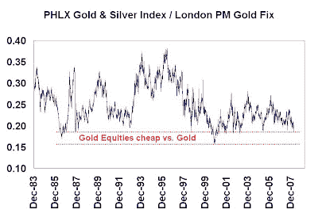

<!--yml

类别：未分类

日期：2024-05-18 01:11:58

-->

# 谦逊的市场学生：黄金股票相对于黄金现货有多便宜？

> 来源：[`humblestudentofthemarkets.blogspot.com/2008/03/how-cheap-are-gold-stocks-relative-to.html#0001-01-01`](https://humblestudentofthemarkets.blogspot.com/2008/03/how-cheap-are-gold-stocks-relative-to.html#0001-01-01)

我最近的一篇题为

["美国货币空头和商品多头的短期警告"](http://humblestudentofthemarkets.blogspot.com/2008/03/short-term-warning-for-us-dollar-bears.html)

必须触动了神经。我收到了关于黄金、黄金股票以及美国经济是否在走向崩溃的大量回应。

作为回应，我分析了黄金股票与黄金现货的相对价值问题。上面的图表显示了 PHLX 黄金与白银指数（XAU）——其历史比流行的 Amex 黄金虫指数（HUI）更长——与黄金现货的比率。由于该线接近其历史区间的底部，它表明与黄金相比，黄金股票是便宜的。

**合成黄金股票讲述了一个不同的故事：生产成本上升**

回到 2006 年，我写了一份研究报告（《如何观察黄金调整结束的迹象》，2006 年 3 月 15 日；如果你对详细信息感兴趣，可以给我发邮件，我会发送给你）详细说明了如何制作合成黄金股票。

从概念上讲，一个矿可以被看作是某种商品的一系列看涨期权，执行价格是生产成本。如果商品价格低于生产成本，矿场运营商有选择关闭或封存矿场直到价格上涨的选项。我根据这些原则建立了一个合成黄金股票的模型。该模型的关键特点包括：

+   一系列八年期的深度实值看涨期权，术语为 1、2、3…8 年，这模拟了一个八年寿命的矿，这是长寿黄金矿的常见估计；

+   执行价格等于现金生产成本的$250，每年根据当前通货膨胀率上升。（$250 似乎是 2006 年现有黄金股票现金成本的普遍估计）；

+   每年开采等量的黄金；

+   该头寸每年滚动一次，成本为 1.5%。

当然，合成黄金股票与实际的黄金股票之间有一些重要的区别：

+   黄金矿企拥有勘探上升空间和运营风险，而合成黄金股票则不具备；

+   金矿公司可能会通过远期销售和其他衍生品来对冲黄金价格；

+   实际黄金矿山在金价低时通过高级采矿，金价高时开采低级矿石，从而在一定程度上管理了生产成本。而合成黄金股票的假设成本则是固定的。

 **生产成本正在上升** 合成黄金在 2006 年之前（当然，这是样本外期间）跟踪实际指数相当好，但在此之后合成黄金的表现大幅超越了实际指数。深入研究模型后，我发现价格分歧是由实际黄金矿工所显示的生产成本上升所解释的。最近[David Galland](http://www.caseyresearch.com/displayArticle.php?id=1899)在 Casey Research 的分析证实了这一趋势，即主要生产商 Barrick 和 Newmont 的生产成本正在上升。

****那么答案是什么？黄金股票便宜吗？**

黄金矿工面临的生产成本高于历史经验，这削弱了黄金股票相对于金条而言价格低廉的观点，因为它们的利润较低。然而，高成本可以解释为公司为了保留储备和资产价值，在当前高价环境中开采低级矿石（这对多头有利），或者成本失控，挤压利润底线（这对空头有利）。

真相可能介于这两种解释之间。考虑到[NovaGold](http://www.novagold.com/section.asp?pageid=5414)在 Galore Creek 最近的经历，我更倾向于后者作为生产成本上升的一个更有可能的解释。**

****这是一个愚蠢的问题:**与其痛苦地纠结于生产成本上升的正确解释，为什么不直接购买合成黄金呢？这样投资者就可以定制并控制自己想要的的风险配置和黄金暴露程度。**

**（警告：个人投资者不要在家尝试。合成黄金是一种高度复杂的工具，如果应用不当，即使是专业人士也可能出错。）**
