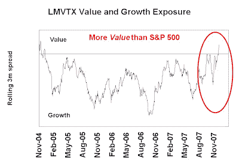

<!--yml

category: 未分类

date: 2024-05-18 01:16:09

-->

# 谦逊的市场学生：比尔·米勒变成了一个（吸气）价值经理了吗？

> 来源：[`humblestudentofthemarkets.blogspot.com/2007/12/is-bill-miller-becoming-gasp-value.html#0001-01-01`](https://humblestudentofthemarkets.blogspot.com/2007/12/is-bill-miller-becoming-gasp-value.html#0001-01-01)

（[点击查看](https://blogger.googleusercontent.com/img/b/R29vZ2xl/AVvXsEhszf9CosDbLmGnNwfqJ-efaZzrbGcgNmFfAHhUEmsQ8qH_bDSuKILUvFEFQtRb3bdBpakSUiFS79fLJqwjeqQE223lPLo4trNBnc7BV_3jhdgNNqJwSesD5pO2m1LGNde28KFu7Ff51WJv/s1600-r/LMVTX+GroVal.JPG)）

比尔·米勒的莱格·梅森价值信托（LMVTX）有着长期优秀的业绩，大多数经理都会羡慕。不幸的是，该基金在 2006 年落后于标普 500，看起来在 2007 年也会再次落后，除非最后一刻能实现复苏。

利用侧边栏中标题为《反向工程一个经理的宏观暴露》的技巧，我估算了他的风格（价值/成长）暴露。尽管 LMVTX 中有“价值”标签，但米勒长期以来一直被认为倾向于成长风格（还记得他在基金中持有大量 AOL 吗？）然而，该基金更倾向于价值风格，并且在价值超越成长时往往表现出色，在成长超越价值时表现不佳。

使用相同的分析方法，他的其他宏观暴露如下：

- 做多市场贝塔

- 做空石油和美元

- 做多新兴市场相对于美国市场

在未来的文章中，我将使用相同的技巧来分析其他投资者（对冲基金、共同基金等）在市场上的行为。
