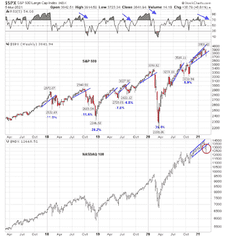

<!--yml

类别：未分类

日期：2024-05-18 02:03:32

-->

# 谦逊的市场学生：动量崩溃，市场现在超卖

> 来源：[`humblestudentofthemarkets.blogspot.com/2021/03/momentum-crashes-market-now-oversold.html#0001-01-01`](https://humblestudentofthemarkets.blogspot.com/2021/03/momentum-crashes-market-now-oversold.html#0001-01-01)

**前言：解释我们的市场时机模型**

我们维护了几种市场时机模型，每种模型的时间范围都不同。

**终极市场时机模型**

“是一个基于我们帖子中概述的研究的长期市场时机模型，

【构建终极市场时机模型】（https://humblestudentofthemarkets.com/2016/01/26/building-the-ultimate-market-timing-model/)

。这个模型倾向于每十年产生少数几个信号。

。

**趋势资产配置模型**

是一种资产配置模型，它基于全球股票和商品价格的输入应用趋势追踪原则。这个模型的时间范围较短，倾向于每年周转约 4-6 次。本质上，它试图回答的问题是：“全球经济的趋势是扩张（看涨）还是收缩（看跌）？”

我的内部交易者使用一个

**交易模型**

，这是价格动量（趋势模型是否变得更加看涨或看跌？）和超买/超卖极端（如果趋势超买，不要买入，反之亦然）的组合。订阅者会收到模型变化的实时警报，电子邮件警报的假设交易记录每周更新

【这里】（https://humblestudentofthemarkets.com/trading-track-record/)

。以下是从 2016 年 3 月开始的真实时间警报的交易模型的假设交易记录。

每个模型的最新信号如下：

+   终极市场时机模型：买入股票*

+   趋势模型信号：看涨*

+   交易模型：看涨*

**性能图表和模型读数因尊重我们付费订阅者而延迟了一周。**更新计划

：我通常在我的

【网站】（https://humblestudentofthemarkets.com/）

在周末发布，并在周三发推文观察@humblestudent。订阅者会收到交易模型变化的实时警报，以及那些电子邮件警报的假设交易记录显示

【这里】（https://humblestudentofthemarkets.com/trading-track-record/)

。

订阅者可以实时访问最新的信号

【这里】（https://humblestudentofthemarkets.com/my-inner-trader/)

。

**动量崩溃，标普 500 指数震荡**

几周前我就警告过，情绪过于乐观，需要调整。调整终于在过去的两周开始了。周标普 500 图表显示，指数下跌，但在 2021 年大部分时间 5 周 RSI 出现负面背离后，守住了上升趋势线支撑。那些高飞的动量股票，如纳斯达克 100（NDX）的表现就不那么幸运了。NDX 违反了其上升趋势线，表明技术上已经造成了重大损害。

（[点击查看](https://blogger.googleusercontent.com/img/b/R29vZ2xl/AVvXsEg6mhnueaAP3gaharieqv2tUi_SE-nPBmixF5Z1h4htIwUEmfpFmMJ_ybkkPpXatK3SBLE7JmhEcAkw09wG-U7bRWfIEY6Oz_Wqw5e6HXoNGPofb4hyH3it_dij4szN89gIzwoNyBj0Ople/s733/SPX+weekly.png)）

在最深跌幅时，标普 500 指数距离历史高点下跌了 5.7%。纳斯达克 100 指数的高波动性股票的跌幅更严重。该指数从峰值到谷值下跌了 11.3%，这明确表明成长型股票的领导地位已经丧失。由于大型科技股几乎占据了标普 500 指数的一半权重，这对于整体市场方向来说是一个重要的考量。

然而，短期市场行为表明一个超卖的市场正准备迎来一次救济性反弹。

全文可以在

点击[这里](https://humblestudentofthemarkets.com/2021/03/07/momentum-crashes-market-now-oversold/)

。
