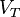
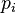
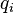
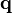

<!--yml

分类：未分类

日期：2024-05-18 03:49:44

-->

# 谦逊的市场学生：我的雷曼教训：模型多元化和灵活性

> 来源：[`humblestudentofthemarkets.blogspot.com/2013/09/my-lehman-lesson-model-diversification.html#0001-01-01`](https://humblestudentofthemarkets.blogspot.com/2013/09/my-lehman-lesson-model-diversification.html#0001-01-01)

媒体和博客圈充满了关于雷曼危机五周年纪念的文章。最让我印象深刻的是

[皮尤研究中心的调查结果](http://www.people-press.org/2013/09/12/five-years-after-market-crash-u-s-economy-seen-as-no-more-secure/)

显示了经济复苏的贫血和不平衡性质。许多受访者表示他们自己的情况仍然脆弱：

> 在美国经济面临自大萧条以来最严重的危机五年后，多数美国人（63%）表示，国家的经济体系今天与 2008 年市场崩溃前一样不安全。只有三分之一（33%）的人认为该体系现在比那时更安全。
> 
> 大量比例的人认为家庭收入和就业还没有从经济衰退中恢复。当被问及政府应对衰退的努力的影响时，更多的人认为经济政策已经使大银行、公司和富受益，而不是中产阶级、穷人或小企业。

**“无节制的美元发行”发生了什么？**

我们学到了什么？我学到的是，在崩溃之后，许多专家在崩溃的影响及其对崩溃的政策反应方面的预测是错误的，或者更客气地说，是“提前”的。考虑一下沃伦·巴菲特这样一位伟人的预言，他警告说货币印刷和预算赤字的影响：

[纽约时报评论文章于 2009 年 8 月 18 日](http://www.nytimes.com/2009/08/19/opinion/19buffett.html)

：

> 我们当前的问题是让我们的国家重新站起来并繁荣昌盛——“不惜一切代价”仍然是有意义的。一旦复苏实现，然而，国会必须结束债务占国内生产总值比例的上升，并使我们的债务增长与资源增长保持一致。
> 
> 无节制的碳排放可能会导致冰山融化。无节制的美元发行肯定会造成货币购买力的融化。美元的命运取决于国会。

**政策和市场反应**

自从那时以来发生了什么？联邦赤字飙升，美联储的资产负债表也在增长。全球金融数据下面的图表显示了政策反应：

市场反应如何呢？尽管美元在全球金融危机的背景下没有出现大幅贬值，但这主要是因为全球金融危机的性质。其他主要工业化国家（尤其是欧元区）也经历了自己的金融危机，全球央行行长进入了危机模式。欧洲央行、英格兰银行、日本银行等中央银行的资产负债表在应对措施中扩张到了 stratospheric levels（极高水平）。在这种情况下，难道不是应该在通货膨胀上看到效果，而不是在汇率上？消费者价格指数（CPI）衡量的通货膨胀一直非常温和。那么商品通货膨胀呢？难道它不应该表现为商品通货膨胀吗？嗯，有点。如下图所示，全球金融危机之后，商品价格（黑色）确实有所上涨，但股价（红色）也是如此。商品价格在 2011 年初达到顶峰，但股价继续上涨。

通货膨胀在哪里？

**通货膨胀一直处于休眠状态**

或许预测者是早的。一些分析师，如

[David Rosenberg](http://business.financialpost.com/2013/07/30/david-rosenberg-stagflation-looming-as-bernankes-legacy/)

，认为滞胀在我们的未来：

> 你不能在实际经济增长即使是适度正增长的情况下，长期保持实际短期利率为负，不产生今天的金融过度和未来的通货膨胀压力。这就是为什么我继续相信下一个主要主题——本·伯南克时代的遗产——将是滞胀。

沃伦·巴菲特在 2008 年表达了对滞胀的担忧，根据

[Bloomberg](http://www.bloomberg.com/apps/news?pid=newsarchive&sid=amCCz4wNzVCE&refer=insurance)

：

> “我们目前正在其中，”巴菲特说。“我认为`flation`部分将变得更加激烈，我认为`stag`部分将变得更糟。”

虽然他对滞胀的到来时间表示不确定：

> “明天不会到来，下个月也不会，甚至可能明年都不会，”77 岁的巴菲特说。

滞胀包含两个元素，经济增长放缓和通货膨胀。我理解滞胀预测中的经济增长放缓部分。美国经济的增长路径仍然贫血，这主要是因为这并不是一个典型的库存衰退后的复苏，而是一个需要家庭、企业和政府资产负债表去杠杆的资产负债表衰退。这个过程需要时间。

我不确定我理解预测中的通货膨胀部分。今天，在雷曼危机五年后，我们看到了很少的消费者价格通胀和资产通胀的迹象，商品价格通胀相对温和。我们还要等待多久？

**通货膨胀纯粹是货币现象吗？**

听起来，Rosenberg 和 Buffett 等人的思维背后的模型是

[米尔顿·弗里德曼的 MV=PQ 概念框架](http://en.wikipedia.org/wiki/Quantity_theory_of_money)

：

在哪里

 是在一段时间内，比如说一年，经济体中流通的[货币](http://en.wikipedia.org/wiki/Money_supply "Money supply") 总量。

 是货币的[交易速度](http://en.wikipedia.org/wiki/Velocity_of_money "Velocity of money")，即一个货币单位在所有交易中平均被花费的频率。这反映了金融机构的可用性、经济变量以及人们决定多快周转他们的钱。

 和 是第 i 次交易的 price 和 quantity。

 是 的列向量，上标**T**是[转置](http://en.wikipedia.org/wiki/Transpose "Transpose") 运算符。

 是第 的列向量。

如果你增加货币供应量，通过扩大美联储的资产负债表，保持 V（货币流通速度）和 Q（经济体中生产的数量）不变，价格上涨，你就会出现通货膨胀。这就是为什么，人们常说，通货膨胀是一种货币现象。

到目前为止，尽管美联储努力扩大货币基础，但流通速度已经崩溃，我们看到了很少的通货膨胀迹象。

**人口解释**

为了解决这个难题，研究滞胀的最后一次发作可能会有所帮助。

[史蒂夫·拉里·沃尔德曼](http://www.interfluidity.com/v2/4561.html)

最近提出了一种基于年龄人口结构对 1970 年代滞胀的解释，即滞胀是由于生产力停滞，而不仅仅是货币印刷。看看下面美国的生产力图表。它在 1970 年代停滞不前，但在当前的雷曼危机后期，它飙升到了新的高点。

沃尔德曼写道：

> 20 世纪 70 年代的“萎靡不振”并不是 GDP 增长的问题。NGDP 增长已经图表爆表（下面再详细讨论）。但实际 GDP 增长也很强，达到 38%，而 80 年代的增长率为 35%，90 年代的增长率为 39%，21 世纪的头 10 年增长率仅为 16%。
> 
> 20 世纪 70 年代停滞不前的是生产力，这使得工作小时数低于 GDP 的分子。婴儿潮一代大量涌入劳动力市场，为生产力统计数字带来了强烈的算术逆风。

简单地说，当时有太多的婴儿潮一代进入劳动力市场，结果生产力落后：

> 20 世纪 70 年代高痛苦指数的根本原因是人口结构，简单明了。经济的深层资本存量——包括固定资本、组织资本，以及阿诺德·克拉克所描述的“可持续专业化和贸易的模式”——根本无法应对新工人的激增。国家面临一个简单的选择：要么雇佣这些人，接受每工人生产率降低的后果，要么坚持生产率持续增长，忍受高失业率。我认为，明智的做法是我们优先考虑就业。但经济的供给侧出现了瓶颈。就业的人希望享受劳动带来的消费增加，从而对实际需求施加压力。结果就是高通胀，任何在如此短的时间内吸收婴儿潮时期出生的男性和女性劳动力 scenarios 都会如此。最终，20 世纪 70 年代是一个成功的故事，尽管是一个令人不安的成功故事。1973 年采取沃克尔政策是不会奏效的，除非忍受失业率过高和劳动力市场进入意愿的不良抑制。到了 20 世纪 80 年代初，羊已经 mostly 通过了蛇，因此迅速调整预期是有效的。

政策制定者实际上想避免更多的社会紧张和动荡（想想 20 世纪 70 年代初的反越南战争情绪），并为此付出了生产率增长缓慢和通胀上升的代价。在

[福布斯](http://www.forbes.com/sites/modeledbehavior/2013/09/09/the-audacity-of-high-inflation/)

上，卡尔·史密斯引用了亚瑟·伯恩斯为 20 世纪 70 年代的通货膨胀辩解的话：

> “从抽象角度看，美联储系统有能力在十五年前或之后的任何时间终止通货膨胀的初步阶段，并且它今天也有能力结束通货膨胀。在那段时间内的任何时候，它都可以限制货币供应，在金融和工业市场上创造足够的紧张，以迅速终止通货膨胀。它之所以没有这样做，是因为美联储本身也陷入了改变美国生活和文化哲学和政治潮流之中。

史密斯继续说道：

> 换言之，如果愿意容忍经济衰退，总是可以防止高通货膨胀的。然而，经济衰退是有后果的。政府预算——至少——会被重新分配以提供即时救济，如果不是直接削减的话。对基础研究、探索和最先进基础设施的公共投资被推迟。在私营部门，研发预算被大幅削减，新产品被推迟上市。小型企业，尤其是年轻的初创公司，大量倒闭。刚刚开始攀登社会经济阶梯，为他们的孩子提供更好未来的家庭会被击退。社会紧张局势上升。排外主义和种族中心主义运动蓬勃发展。刚刚步入劳动力的青少年一代，由于缺乏培训和经验而永久性地受到影响。

如果人口结构是 1970 年代滞胀的主要原因，那么滞胀可能不会出现在我们的近期未来。事实上，一个

[IMF 经济学家帕特里克·伊马姆的论文](http://www.imf.org/external/pubs/ft/wp/2013/wp13191.pdf)

(via

[商业内幕](http://www.businessinsider.com/monetary-policy-hindered-by-demographics-2013-9)

)表明，人口老龄化可能会使货币政策效果减弱。

[迈克尔·曼德尔](http://www.progressivepolicy.org/wp-content/uploads/2013/09/09.2013-Mandel_Can-the-Internet-of-Everything-Bring-Back-the-High-Growth-Economy-1.pdf)

写了一篇论文，认为由于技术创新，生产率增长很可能在不久的将来大幅上升。同样，

[伊扎贝拉·卡马斯卡](http://ftalphaville.ft.com/2013/09/13/1633312/peak-population-investing/)

齐声表示，全球人口峰值可能会产生通缩效应。

**投资含义**

谁是对的？大卫·罗森堡和沃伦·巴菲特在预测滞胀，或者至少，我们未来的通货膨胀上升？还是像沃尔德曼这样的人，他提出了 1970 年代滞胀的人口结构和生产率解释，其含义是生产率上升将有助于遏制通货膨胀？

对于政策制定者来说，这提出了一个难题。你相信谁？政策制定者有一个更困难的问题，因为政策取决于经济如何运作的基础模型。

对于投资者来说，这个难题可以很容易地解决，因为他们不必坚持任何一个单一的观点。答案是模型多样化。

老实说，我不知道谁是对的。然而，我内心的投资者相信他应该保持灵活性，并创建一个多样化模型的投资组合。

对我来说，雷曼危机后的投资教训是没有必要过于教条地对待你的经济和政治信仰。保持灵活性，学会多样化你的模型。

**Cam Hui 是 [Qwest Investment Fund Management Ltd](http://www.qwestfunds.com/) 的投资组合经理。**("Qwest")。博客中表达的观点和任何建议均属于作者，且不代表 Qwest 的观点和建议。Qwest 会审查 Mr. Hui 的博客，以确保其与 Mr. Hui 对博客读者公平、诚实和善意地行事的责任相符。"**本博客中表达的任何信息或观点均不构成购买或出售任何证券或其他工具的邀请。本博客中的任何内容都不构成投资建议，且可能包含的任何建议未基于对任何特定接收者的投资目标、财务状况或特定需求的考虑。任何证券或其他工具的购买或出售活动应基于您自己的分析和结论。过去的业绩不代表未来的结果。Qwest 或我可能持有或控制提到的证券或工具的多头或空头头寸。
