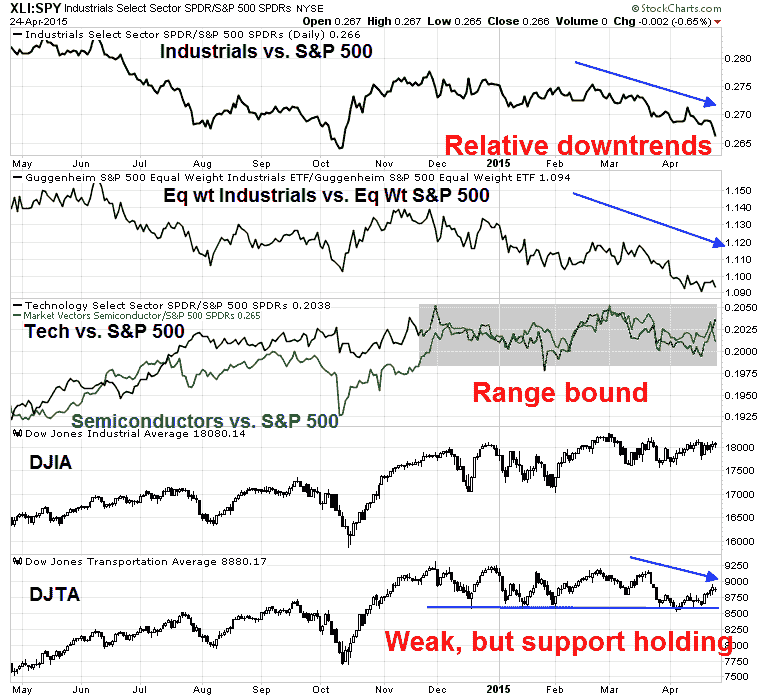

<!--yml

类别：未分类

日期：2024-05-18 03:22:35

-->

# 谦逊的市场学生：新高 = 最后的狂欢？

> 来源：[`humblestudentofthemarkets.blogspot.com/2015/04/new-highs-last-hurrah.html#0001-01-01`](https://humblestudentofthemarkets.blogspot.com/2015/04/new-highs-last-hurrah.html#0001-01-01)

**趋势模型信号摘要**

趋势模型信号：中性

交易模型：看跌

趋势模型是一个资产配置模型，它基于全球股票和商品价格的输入应用趋势跟踪原则。本质上，它试图回答这样一个问题，“全球经济的趋势是扩张（看涨）还是收缩（看跌）？”

我的内部交易者使用趋势模型的交易模型部分试图回答这样一个问题，“趋势是在改善（看涨）还是恶化（看跌）？”下图中，实际（而非回测）交易模型的信号由箭头表示。此外，我还有一个交易账户，该账户使用趋势模型的信号。那个账户的最后一份成绩单可以在

[在这里](http://humblestudentofthemarkets.blogspot.com/2015/04/trend-model-march-report-card-02-or.html)

。

**更新计划**

：我通常在

[我的博客](http://humblestudentofthemarkets.blogspot.com/)

在周末时，并在推特上@humblestudent 上发布任何一周的变化。

**历史新高是最后的狂欢？**

纳斯达克和标普 500 指数在周五收盘时创下了历史新高（ATH）。虽然新高通常被解释为看涨，因为它们是涌动动量的迹象，但动量因子最近并没有发挥作用，而 ATH 可能被视为牛市的警告信号。标普 500 和 COMPQ 最后一次同时创历史新高是在 1999 年 12 月 31 日 - 一个令人清醒的想法！

尽管迹象显示明显的力量，但我坚持认为美国股市正在形成一个中期顶部。最近，美银美林的史蒂芬·萨特迈尔警告说，根据过去的历史模式，在长期牛市中存在周期性顶部的风险。

在过去的几周里，我还写了一些关于股市价格趋势看起来已经延长，短期动量似乎不稳定。我的分析是基于詹姆斯·保罗森的一项研究

[韦尔斯资本管理](http://ig.cdn.responsys.net/i4/responsysimages/str2/__RS_CP__/20150406_EMP.pdf)

，这种情况下通常会在几个月内出现价格逆转（参见

[如何让你的第一次亏损成为最好的亏损](http://humblestudentofthemarkets.blogspot.com/2015/04/how-to-make-your-first-loss-be-your.html)

)。

[杰西·费尔德](http://advisoranalyst.com/glablog/2015/04/22/this-chart-suggests-a-bear-market-could-be-lurking.html)

也抓住了保罗森的研究，并增加了自己的分析：

> 我决定将道格·肖特（Doug Short）的估值模型（见下图表底部黑色线条）叠加在保罗森的趋势模型上，以查看那些既过度乐观又过度高估的市场发生了什么：
> 
> 在保罗森的研究中，有 13 次股票过度乐观的情况，其中 6 次也标志着股市显著高估的时候，即平均水平以上一个标准差。这些时间在图表上用红色线条标记——1906 年、1929 年、1937 年、1965 年、1998 年和 2007 年。***每一次这样的情况之后都紧跟着几乎立即到来的熊市。***（尽管互联网泡沫没有在 1998 年达到顶峰，但那年的股市从高点到低点下跌了 22%，根据广泛接受的标准，这构成了熊市。）

**基本面恶化**

除了这些关于可能的中期顶部的中期警告之外，我也看到最近许多备受尊敬的投资者和分析师变得更加谨慎。例如，投资传奇人物朱利安·罗伯逊（参见访谈

[点击这里](http://www.marketfolly.com/2015/04/julian-robertson-worried-about-bubbles.html)

) 担心股市泡沫。

此外，

[绿光资本的大卫·艾因霍恩](http://www.valuewalk.com/2015/04/greenlight-capital-2015-q1-letter/)

在他的一季度信中提到，虽然有很多可能的短线机会，但在当前市场中找到长线候选股却有困难：

> 候选的短线股票容易找到，但正如上面所提到的，长线的机会集合相当受限。我们过去几个月审阅的大多数投资论文最多只能被描述为后周期机会，其估值经常忽视历史经济敏感性。为实现目标结果所需的运营（在某些情况下是积极）执行难度必须达到三倍林迪难度级别。

尽管股票市场估值已经偏高，艾因霍恩还是警告说存在运营利润压缩的问题：

> 其中一些挑战是众所周知的，包括低能源价格直接影响该行业（以及许多从国内能源开发繁荣中受益的公司），以及美元走强减少外国收益的翻译影响。较少被讨论的是生产率崩溃及其对高峰利润率的影响。在周期底部，公司比产出更快地削减劳动力。较高的生产率导致了利润、收益和股价的改善。现在劳动力增加的速度超过了产出，大型公司如麦当劳、沃尔玛商店公司和塔吉特宣布提高工资，单位劳动力成本可能会进一步上升。总的来说，有较大的可能性是今年的收益实际上会缩水。我们认为，如果收益实际上已经达到周期顶峰，市场估值过高，并且通过增加更多短线头寸来降低我们的净敞口。

我之前曾指出 Ed Yardeni 的分析显示前向利润率预期正在下降（参见

[3 张图表解读财报阻力](http://humblestudentofthemarkets.blogspot.com/2015/04/2015-earnings-headwinds-in-3-charts.html)

）。Yardeni 是另一位之前看多的分析师，他基于过高的估值变得更加谨慎（他在

[博客](http://blog.yardeni.com/2015/04/inflation-warning-excerpt.html)

，但详细信息只有订阅者才能获得）。

事实上，随着财报季的全面展开，前向每股收益（EPS）持续下降。来自

[John Butters](http://www.factset.com/websitefiles/PDFs/earningsinsight/earningsinsight_4.24.15)

的 Factset 数据显示，业绩超额完成率达到了 73%（与 5 年平均水平一致）但收入超额完成率令人失望，为 47%（与 5 年平均水平的 53%相比）。换句话说，当前财报季的初步成绩单尽管分析师们降低了预期，但仅仅勉强及格。

我根据 Factset 数据融合的 2015 财年和 2016 财年每股收益预期计算的前向 12 个月每股收益（EPS）显示，上周小幅下降了 0.09%，而前一周下降了 0.29%。

从全球角度看，麦格理银行（通过

[Nick](https://twitter.com/NickatFP/status/590543930623557633)

）的研究表明，全球每股收益预期也在下降。

尽管存在这些警告信号，但我基本情景预测并不预测会出现全面熊市，而是类似 2010 年或 2011 年的调整。下图展示了不同国家经济周期的风格化描述，虽然可能会有少数关于确切位置的微小争议，但关键结论是，美国正处于经济扩张和衰退的中周期阶段，而熊市的主要催化剂——经济衰退，目前尚不在眼前。

**变得投机性**

基于行业领导力的分析显示，市场完全由风险偏好或投机情绪支撑。我在上篇文章中指出，消费品行业在相对表现上看起来有点不稳定（参见

[有人对美国消费者将大错特错](http://humblestudentofthemarkets.blogspot.com/2015/04/somone-is-going-to-be-very-wrong-on.html)

）。尽管这些股票相对实力有所恢复，但让我印象深刻的是，消费品行业的相对疲软是广泛且普遍的。

使用同样的相对强度测量技术，我开始寻找市场领导力的迹象，以判断市场认为经济增长的哪些领域具有潜力。

那么是什么支撑着这个市场呢？令人惊讶的是，是股市中高贝塔值的魅力板块（加上表现出一致相对强势的医疗保健板块）。

许多关键行业的相对强度，如金融、防守型板块（消费品和公共事业）和资源板块，也没有显示出领导力。金融股的沉重表现和其高贝塔值的表亲券商的表现令人失望。此外，来自

[Nautilus Research](https://twitter.com/NautilusCap/status/590865515951816704)

这种金融股的相对弱势对未来的股价是一个坏信号。缺乏防守型领导力是熊市不会马上发起主要攻势的信号。资源股的相对强势正在稳定，但它们似乎还没有准备好发起重大攻势，因为它们可能需要时间来巩固和整理。

那周期性行业呢？嗯！下图显示了工业股（由于重量级公司 GE 的影响，也是等权重的）、半导体（以及增长周期性科技股）以及交通板块的相对强度。特别是，我还关注着道琼斯运输平均指数，因为它的弱势可能是道氏理论卖出信号的信号。尽管道琼斯运输平均指数弱势，但它能够守住关键支撑位，表明市场仍然处于观望模式。

（[图片链接](https://blogger.googleusercontent.com/img/b/R29vZ2xl/AVvXsEhXo-1AfuZFTTVz2Ah4PRmPnOdyPGDs6qt2Klug4QJv_FDckEsn8Nh30oCxOpiHJmEh3gPPaN410orUqu2zgj6bWCN4_zZe-lS9u4QpJhkxrzKi3YQCq3Xev7BIpqNMPWlpQtJHfKdUNQ0/s1600/Cyclicals.png)）

所以让我们总结一下。市场的领导者主要是那些有魅力、高贝塔值的公司。经济的“引擎”，比如周期性工业和半导体、金融和消费者非必需品股票并没有领导市场。另一方面，防守型板块如消费品和公共事业也没有显示出领导力。换句话说，市场先生告诉我们不要对经济抱有太大期望，但由于缺乏防守型领导力，所以不要过于恐慌。

不断上升的风险偏好推动股价创新高，因为它们缺乏基本面支持。

[David Einhorn](http://www.valuewalk.com/2015/04/greenlight-capital-2015-q1-letter/)

大卫·艾因霍恩（David Einhorn）差不多是根据大傻瓜理论（我的话，不是他的，重点添加）来称呼市场的：

> 牛市论点是，在固定收益表现出现泡沫时，股市尚未达到泡沫水平，并且美联储将支持市场。至于前者，可能是正确的。但我们不喜欢**对泡沫下注**的提议，尽管可能仍会出现泡沫（或者，更明确地说，泡沫可能会扩大到当前的高涨股票之外的小组之外）。至于后者，尽管人们密切关注美联储任何成员的言论，但很清楚，除非情况显著恶化，否则美联储不会进一步放宽政策。它收紧的速度不如它将收紧这一事实重要。

到目前为止，其他衡量风险偏好的指标，如高收益债券，表明风险偏好仍然健康。然而，可能正在形成一个小的负面分歧，因为 SPX 达到了新的高点，而高收益债券的表现相对落后。这是我打算密切关注的一个指标。

**过热的情绪**

如果基本面开始恶化，而股市上涨的基础越来越多地基于风险偏好，我们需要关注市场情绪的变化。

[马克·赫伯特](http://www.marketwatch.com/story/investors-exuberance-is-at-a-frighteningly-high-level-2015-04-24)

他根据他的赫伯特股票新闻信件情绪指数（HSNSI）的读数有一些坏消息：

> 为了将当前的 HSNSI 读数放入语境，想想自 2009 年 3 月 9 日牛市开始以来的平均水平一直是 39.4%，仅略高于当前读数的一半。事实上，在过去十年中，只有两次 HSNSI 高于今天，而且在两次情况下市场都下跌了：
> 
> +   2013 年底/2014 年初：道琼斯工业平均指数在一个月内下跌了 1000 多点，跌幅为 7.3%。
> +   
> +   2015 年 2 月：道琼斯工业平均指数下跌了 600 点，跌幅为 3.2%。
> +   
> 确信无疑，这只是两个数据点。但它们与过去 15 年出现的模式一致。正如你在附表中看到的，当道琼斯指数像目前这样高时，跟随 0%及以下的读数后，其表现通常更好。

此外，

[城市卡梅尔](https://twitter.com/ukarlewitz/status/588881120382455808)

根据

[ISE](http://www.ise.com/market-data/isee-index/)

期权数据：

The CNN Money

[贪婪与恐惧指数](http://money.cnn.com/data/fear-and-greed/)

有些高估。虽然这个指数按照传统标准并没有显示拥挤的多头，但读数略微超买，达到过去六个月内反转的水平。

换句话说，市场情绪正在变得过热。警惕短期内的弱势。

**下周展望：难以过于乐观**

上周，我写道我们看到了一个失败的修正和反弹的模式（参见

[温顺的牛，温顺的熊？](http://humblestudentofthemarkets.blogspot.com/2015/04/wimpy-bulls-wimpy-bears.html)

)。我建议最可能的情况是一种“温和熊市”，股票价格会小幅下跌然后反弹。相反，价格弱势迅速反弹测试并突破历史新高，使得我的熊市变成了一只可爱的考拉熊（是的，它们有锋利的爪子但不太可能致人死亡）。

既然 SPX 和 COMPQ 都创下了历史新高，接下来会怎样？

在最近的一篇帖子中，

[Brett Steenbarger](http://traderfeed.blogspot.com/2015/04/questioning-strong-and-weak-markets.html)

将当前环境置于背景之中。他分析了三种趋势和动量指标，并发现 fade strength and buy weakness 策略是最优策略：

> 周五，我们有三个以上指标的买入信号超过了卖出信号，反映了近期市场的强势。回顾 2014 年 6 月，当这种情况发生（N=62）时，SPY 接下来五天的平均收益仅为+0.01%，而样本余下的平均五天收益为+0.26%。显然，强势读数并没有带来短期强势--尽管“超买”读数也没有可靠地导致市场下跌。强势未能带来后续强势，这再次反映了趋势和动量之间的区别[在最近的一篇帖子中概述](http://www.traderfeed.blogspot.com/2015/04/why-fomo-fails-trending-markets-are-not.html)。
> 
> 相反，当我们得到三个指标产生的卖出信号多于买入信号（N=49）时，SPY 接下来三天的平均收益为+0.33%，而样本余下的平均三天收益为+0.04%。市场弱势在短期内往往会逆转，尽管那种相对表现提升往往会随后的交易时段减弱。

尽管与新高相关的“正常”看涨价格动量读数，但广度动量读数一直在减弱。例如，来自

[IndexIndicators.com](http://www.indexindicators.com/indicators/breadth/)

的 SPX 股票 20 日新高一直很低。而且，指数在周五创历史新高时，这些读数还在减弱。我认为这种状况是缺乏买家，这将成为短期内进一步创新高的障碍。

从更短期视角来看，这幅股票 5 日新高图表显示它们达到了今年反转发生的水位。周五的回调为牛市增添了更多不祥之兆。

此时此刻很难过于乐观。我们下周有一系列二元事件可能引发波动。首先，市场巨头苹果公司在周一收盘后公布业绩。周三，我们有一季度美国 GDP，共识增长为 1.0%。周三下午，美联储将结束为期两天的 4 月会议并公布声明。

虽然苹果公司业绩是一个未知因素，但我会更密切关注 GDP 报告和美联储声明。

[新政民主党](http://community.xe.com/blog/xe-market-analysis/weekly-indicators-consumer-breakout-vs-hiring-breakdown-edition)

本周重申了他相信美国可能会出现“温和的工业衰退”的观点，尽管消费者支出状况良好。我将密切关注可能的经济发展疲软与美联储政策之间的互动。一方面，许多宏观经济指标正在下降。

另一方面，美联储将 1 季度的疲软视为“暂时的”，并看到了通胀压力上升的迹象。尽管一些美联储官员对美国货币政策对全球金融稳定性的影响表示担忧，但重要的是看看美联储 6 月会议声明如何平衡这些问题。尽管加息可能性不大，但 6 月加息仍有可能。然而，政策失误的风险很高。最近国际货币基金组织分析（通过

[商业内幕](http://www.businessinsider.com/imf-correlations-among-asset-classes-have-risen-since-2010-2015-4)

) 显示，资产类别价格波动变得越来越相关。再次出现加息焦虑可能会以高度无序的方式破坏市场。

底线：下周将会有很多由事件驱动的波动，但风险倾向于下行。我内心的投资者保持谨慎，但不恐慌。我内心的交易者保持看空。

**披露：**

持有 SPXU、SQQQ）
