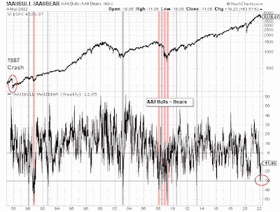

<!--yml

类别：未分类

日期：2024-05-18 01:47:07

→

# 谦逊的市场学生：恐慌足够缓解反弹吗？

> 来源：[`humblestudentofthemarkets.blogspot.com/2022/03/panicked-enough-relief-rally.html#0001-01-01`](https://humblestudentofthemarkets.blogspot.com/2022/03/panicked-enough-relief-rally.html#0001-01-01)

**序言：解释我们的市场时机模型**

我们维护几个市场时机模型，每个模型具有不同的时间范围。"

**终极市场时机模型**

是基于我们帖子中概述的研究的长期市场时机模型，

[构建终极市场时机模型](https://humblestudentofthemarkets.com/2016/01/26/building-the-ultimate-market-timing-model/)

。该模型倾向于每十年产生少数几个信号。

。

**趋势资产配置模型**

这是一个基于全球股票和商品价格输入的趋势跟踪原理的资产配置模型。该模型的时间范围较短，每年大约会转换 4-6 次。基于 Trend Model 的 out-of-sample 信号的模型组合的表现和详细信息可以找到

[在此](https://humblestudentofthemarkets.com/trend-model-report-card/)

。

我内部交易者使用一个

**交易模型**

，这是价格动量（趋势模型是否变得更加看涨或看跌？）和超买/超卖极端（趋势过度超买时不要买入，反之亦然）的组合。订阅者会收到模型变化的实时警报，每周更新假设交易记录的电子邮件警报

在此

。从 2016 年 3 月开始的真实时间警报的交易模型的假设交易记录如下。

每个模型最新的信号如下：

+   终极市场时机模型：买入股票*

+   趋势模型信号：中性*

+   交易模型：看涨*

**表现图表和模型读数因尊重我们付费订阅者而延迟一周。**更新计划

：我通常在我的

网站

周末发布观察，并在@humblestudent 上发布中旬观察。订阅者会收到交易模型变化的实时警报，并显示那些电子邮件警报的假设交易记录

在此

。

订阅者可以实时访问最新的信号

在此

。

**恐慌足够了吗？**

你恐慌足够吗？市场极度紧张。上周有关俄罗斯发动攻击引发乌克兰电厂火灾的新闻引发了一次风险厌恶事件。进一步的冷静分析显示，事件已经得到控制，没有辐射泄漏。对事件引发第二次切尔诺贝利灾难的担忧被夸大了。

两周前，AAII 每周投资者情绪调查显示牛熊差距已降至-30，但上周回升至-11。-30 的读数稀少，且只在 1990 年和 2008 年的熊市（粉色部分显示）出现过。甚至在 1987 年股灾之后，也未曾出现过这样的水平。在所有情况下，它们都预示着短期底部。

（[点击查看](https://blogger.googleusercontent.com/img/a/AVvXsEgwHa1IgmxSba1hy92PE-7x1b7FTo8m5m41_BVc3J5OorQJKwVooQzJnVYGDv728Akps5jkRFvgoa54DhRlIKax28gj5cPTzea7gt3qN7z-hhPQ5Rt7YDC9k0Q-aVfqxe6W8dHkHd2N6mtSqExHkOX9x60VS02sXeDammO4Tx1JKpT-eisNZlXt2D0KPg=s700)

投资者面临的关键问题是，当前情况是否代表了一个持久的市场底部，还是仅仅是一个熊市反弹。

全文可在此处找到

在此处阅读([`humblestudentofthemarkets.com/2022/03/06/panicked-enough-for-a-relief-rally/`](https://humblestudentofthemarkets.com/2022/03/06/panicked-enough-for-a-relief-rally/))

。
