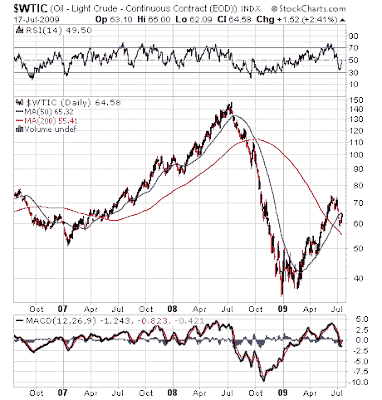

<!--yml

类别：未分类

日期：2024 年 05 月 18 日 00:50:15

-->

# 市场的谦虚学生：加拿大的凤凰

> 来源：[`humblestudentofthemarkets.blogspot.com/2009/07/phoenix-for-canadians.html#0001-01-01`](https://humblestudentofthemarkets.blogspot.com/2009/07/phoenix-for-canadians.html#0001-01-01)

根据我最近的

[帖子](http://humblestudentofthemarkets.blogspot.com/2009/07/phoenix-mini-report-card.html)

就凤凰股票而言，我的加拿大朋友要求我提供一份加拿大股票的凤凰名单（因为我住在加拿大）。

问题在于加拿大股市充斥着低价股，这是凤凰屏幕的一个关键标准。考虑到 S&P/TSX 综合指数的成员，29.8%的成员股价低于每股 10 美元，而标准普尔 500 指数的比例为 10.6%。即使我们将截止点降低到 5 美元，S&P/TSX 综合指数中有 8.7%的股票低于 5 美元，而标准普尔 500 指数的比例为 3.2%。

此外，加拿大市场充满了低价矿业股票，您可以考虑投机，这是一个

[示例](http://humblestudentofthemarkets.blogspot.com/2008/11/rorschach-test-for-investors.html)

（这并不是对股票买卖的建议）。

**对大宗商品和复苏的宏观判断**

凤凰策略的核心是通过购买高杠杆“堕落天使”股票来结合宏观判断进行复苏。为了利用这一复苏、长期商品牛市（我的主题）和堕落天使的主题，我提供以下内容。

下图显示了能源选择部门 SPDR（XLE）相对于标准普尔 500 指数的相对回报。XLE 仍然处于长期相对上涨趋势中，表明它仍然处于长期牛市阶段。

石油价格从 147 美元的高点回落，目前交易价格约为 64 美元，并显示出一些稳定的迹象。通过关注阿尔伯塔省的房地产开发商，如 Genesis Land Development (GDC.TO)，可以参与能源价格的复苏。

……以及 Melcor Development (MRD.TO)

这些股票确实符合堕落天使的标准，因为它们的股价在市场崩盘中遭受重创（GDC 的峰值至谷底下跌了 90%，MRD 下跌了 80%）。

除了石油价格的复苏之外……

（[点击查看](https://blogger.googleusercontent.com/img/b/R29vZ2xl/AVvXsEgZxdsU6tTYzWS-GPFt0henKmS-WsOXJHZQI_gPjNUjxC2jpTXLhamAYir7qz1MnHftygIMV9DBXlvxAWax4ig52Xv0tLBgySh9I7BEBxjF62BQrqGnrREJLC3RQy8VlWNLGu24jJw3fsFL/s1600-h/WTIC.png)）

…近期

[卡尔加里统计数据](http://www.bobtruman.com/SFH_DailyMonthly_Summaries/page_1869385.html)

作为阿尔伯塔省整体指标的住宅房地产市场，显示出温和复苏的迹象。不仅房价开始适度上涨，而且市场内部指标如库存和销售与挂牌比率也有所改善。

不言而喻，这些股票已经脱离了底部，并且仍然具有很高的投机性。它们代表着对油价和经济复苏的高风险/高回报的押注。

自担风险购买。
