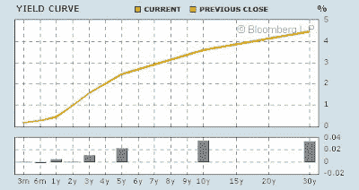
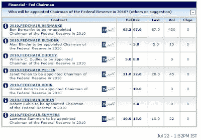

<!--yml

分类：未分类

日期：2024-05-18 00:49:59

-->

# 谦逊的市场学生：替换伯南克？

> 来源：[`humblestudentofthemarkets.blogspot.com/2009/07/replace-bernanke.html#0001-01-01`](https://humblestudentofthemarkets.blogspot.com/2009/07/replace-bernanke.html#0001-01-01)

本·伯南克的

[评论文章](http://online.wsj.com/article/SB10001424052970203946904574300050657897992.html)

在关于美联储如何撤出扶持的华尔街日报上引发了一场博客界的风暴。大部分的回应都不太礼貌（

在这里](http://alephblog.com/2009/07/22/duh/)

是较温和的一些)。关于这篇文章和他最近的证词，2010 年 1 月替换伯南克的呼声也越来越高。

是的，伯南克博士，我们知道美联储有多种工具可以收紧其非常宽松的量化宽松立场。问题在于，有政治意愿这样做吗？今天，我们有一个美联储主席，他把自己的学术生涯花在研究大萧条上，他似乎决心避免重演那一幕。

**收紧？你疯了吗？**

在另一方面，我们有一个急剧上升的收益率曲线，3 个月和 10 年之间的利差超过 300 个基点。教科书上的货币政策反应现在是收紧。

[点击查看](https://blogger.googleusercontent.com/img/b/R29vZ2xl/AVvXsEik4S1aXFxOrKFShjQc2hA_Dxh4zR-z6VCngI8dTMi2OZMmHKzLOq2LqW3Qm_OFadN5lBk2FpsbVqa7zoEqulzvP5RTiXthPMURbae9zXoXx2CtdrAwGugzcDsbS3UTstTlLHUQj4XV8fSi/s1600-h/Yield+Curve.JPG)

作为对评论文章的回应，也有人呼吁在 2010 年 1 月他的任期到期时替换伯南克作为美联储主席。这可能是要小心你想要的。

**谁才是替代人选？**

有政治勇气现在收紧吗？即使是 largely went silent 的保罗·沃尔克，面对脆弱的复苏，他会

另一方面

交易市场

，伯南克仍然是美联储主席的热门人选。

[点击查看](https://blogger.googleusercontent.com/img/b/R29vZ2xl/AVvXsEhjGmSUR5oiDXhJZzyr641PqEO7j5vY8mfqbTGRGjtsYA08fL2agFdgxaikM2YShKdK1WKxZhZ-hNTPbgQ02NDcaLlcSJe6evg2CNMHGDw9nifB0kywj-qxPVXOJMiArC3CGRFFZsOiwpVo/s1600-h/Intrade+Fed+Chairman.JPG)

在伯南克之后，下一个主要竞争者是旧金山联邦储备银行行长珍妮特·耶伦。她最近发表了一次

演讲

表明她希望美联储在扶持方面犯错误：

> 我会立刻亮出我的底牌。我认为主要风险是未来几年通货膨胀将过低，而不是过高。我把 2%作为与美联储的物价稳定和最大就业双重任务最兼容的通胀率的一个合理基准。

如果你不喜欢耶伦，那对于排在第三位的拉里·萨默斯你又会作何感想？

如果伯南克、耶伦和萨默斯是下任美联储主席的三大热门人选，这又说明了美国货币政策的未来走向？

对于那些感兴趣的人，我有一个免费的电子新闻简报，针对的是通胀和商品牛市的支持者。你可以进行注册

[在此处](http://humblestudentofthemarkets.blogspot.com/2009/04/for-commodity-bulls.html)

。
