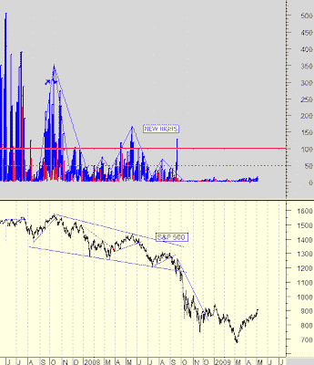

<!--yml

category: 未分类

date: 2024-05-18 00:53:55

-->

# Humble Student of the Markets: Respect this bear market rally

> 来源：[`humblestudentofthemarkets.blogspot.com/2009/05/respect-this-bear-market-rally.html#0001-01-01`](https://humblestudentofthemarkets.blogspot.com/2009/05/respect-this-bear-market-rally.html#0001-01-01)

The market action of this equity advance screams bear market rally, but I believe that traders need to respect the momentum inherent in this upswing.

**熊市反弹！**

我将这种走势称为熊市反弹

[之前](http://humblestudentofthemarkets.blogspot.com/2009/04/stabilization-is-not-recovery.html)

我仍然确信这次上涨并不代表新一轮牛市的开始。原因有很多。

+   In late April, Mish writing at his [Global Economic Analysis](http://globaleconomicanalysis.blogspot.com/2009/04/technical-indicators-scream-caution.html) blog outlined a number of technical indicators that suggest caution in the face of this advance.

+   内部人士正在疯狂抛售（详见故事[在此](http://www.bloomberg.com/apps/news?pid=20601213&sid=arl3VgxA0FAA&refer=home)）。

+   市场内部仍然疲弱。在 Stocktiming.com 网站上，Marty Chenard 指出，考虑到这次反弹的规模，新高的数量出奇地低：

**New Highs vs. S&P 500**

+   [Mark Hulbert](http://www.marketwatch.com/news/story/Yet-more-evidence-were-a/story.aspx?guid=%7BBB6269BA%2D4375%2D46E6%2DAAC4%2D1A9C05739F62%7D) 的时事通讯作家情绪指标也显示，市场情绪过于乐观——这是逆向熊市的信号。

**不要被牛市所伤**

然而，重要的是不要过于悲观。

在坏消息面前股价仍呈上涨态势是一个看涨的信号。考虑到美国银行普通股惊人的 17%涨幅（[新闻](http://www.bloomberg.com/apps/news?pid=20601087&sid=aBpBA6m4u4cQ&refer=home)报道它可能需要额外的 340 亿美元资本），这种涨势是值得关注的。

有很多财政和货币政策刺激已经投入市场。摩根大通 Chase 的资深经济学家 Michael Feroli 最近[警告](http://www.forbes.com/2009/05/05/consumer-spending-gdp-markets-economy-jobs.html)说：

> It was a 2.2% uptick in consumer spending that prevented economic troubles in the U.S. from getting worse in the first quarter of this year. However, the consumer economy's apparent strength is misleading because it was fueled by lower taxes and transfer payments from the government.

他的结论在长期是正确的，但在短期内是错误的。下面的图表显示了增加的

[MZM](http://research.stlouisfed.org/publications/usfd/page5.pdf)

在 2008 年第四季度。所有这些刺激措施都必须要有个去处……现在它正在显现出来。

Todd Harrison of

[Minyanville](http://www.marketwatch.com/news/story/The-year-W/story.aspx?guid=%7B2010ADF5%2D40B0%2D4C40%2DBD71%2D0E5FA251C9C6%7D)

这句话最能概括我的看法：

> 我们必须记住，走投无路的动物会无所畏惧。美联储和财政部已经向市场投入了大量的资源，并且似乎决心发明机制、印制货币并进一步淡化自由市场资本主义的定义。我在 2003 年痛苦地学到了要尊重那些议程，这个教训我一直带到了今天。

**接下来会发生什么？**

现在既然主流观点已经从“末日就在眼前”转变为“绿芽初露”，下一个转折点很可能出现在那些快钱开始思考在我们似乎已经稳定下来之后接下来会发生什么的时候。

持有长期头寸的交易者应该保持紧绷的止损，因为市场可能随时转跌。持有现金的交易者可能最好继续持有现金，不要追涨这个市场。
