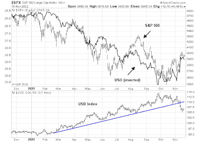

<!--yml

类别：未分类

日期：2024-05-18 01:36:31

-->

# 《市场的谦卑学生：情绪反复掩盖了熊市趋势》

> 来源：[`humblestudentofthemarkets.blogspot.com/2022/11/sentiment-whipsaws-are-masking-bear.html#0001-01-01`](https://humblestudentofthemarkets.blogspot.com/2022/11/sentiment-whipsaws-are-masking-bear.html#0001-01-01)

**前言：解释我们的市场定时模型**

我们维护了几个市场定时模型，每个模型的时间跨度不同。"

**终极市场定时模型**

"是一个基于我们在帖子中概述的研究的长期市场定时模型。

[构建终极市场定时模型](https://humblestudentofthemarkets.com/2016/01/26/building-the-ultimate-market-timing-model/)

。该模型每十年只会产生少数信号。

这个

**趋势资产配置模型**

是一个基于全球股票和商品价格的趋势跟踪原则的资产配置模型。该模型的时间跨度较短，大约每年会调整 4-6 次。基于趋势模型的样本外信号的模型投资组合的表现和完整细节可以在此处找到

[这里](https://humblestudentofthemarkets.com/trend-model-report-card/)

。

我的内部交易员使用的是

**交易模型**

，这是价格动量（趋势模型是否变得更加看涨或看跌？）和超买/超卖极端（如果趋势超买则不要买入，反之亦然）的综合。订阅者会实时收到模型变化的警报，并且每周会更新一次电子邮件警报的假设交易记录。

[这里](https://humblestudentofthemarkets.com/trading-track-record/)

。从 2016 年 3 月开始的实时警报交易模型的假设交易记录如下所示。

每个模型的最新信号如下：

+   终极市场定时模型：卖出股票*

+   趋势模型信号：中性*

+   交易模型：看跌*

**表现图表和模型读数已经延迟一周以尊重我们的付费订阅者。** *更新时间表*

：我通常在周末更新模型读数。

[站点](https://humblestudentofthemarkets.com/)

。我还在 Twitter 上 @humblestudent 和 Mastodon 上 @humblestudent@toot.community。订阅者会实时收到交易模型变化的警报，并且展示了那些电子邮件警报的假设交易记录

[这里](https://humblestudentofthemarkets.com/trading-track-record/)

。

订阅者可以实时访问最新的信号

[这里](https://humblestudentofthemarkets.com/my-inner-trader/)

。

**一场风险上涨的狂潮？**

我过去指出，2022 年的风险偏好在很大程度上可以归因于美元的变化。标普 500 指数与美元呈现出密切的反向相关性。现在美元已经明确违反了趋势线支撑，这是否意味着现在是投资者涌入风险交易的时候了？

什么基本面解释了美元的技术性 breakdown？美联储是否已经 signaling 它即将超过欧洲央行和其他主要央行，这将缩小利率差异并削弱美元？其他央行是否会比美联储更加鹰派？

全文可以找到

[在此](https://humblestudentofthemarkets.com/2022/11/20/sentiment-whipsaws-are-masking-the-bear-trend/)

。
