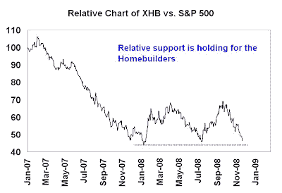

<!--yml

类别：未分类

日期：2024-05-18 01:02:27

-->

# 谦逊的市场学生：一些看涨的分歧

> 来源：[`humblestudentofthemarkets.blogspot.com/2008/11/some-bullish-divergences.html#0001-01-01`](https://humblestudentofthemarkets.blogspot.com/2008/11/some-bullish-divergences.html#0001-01-01)

当市场跌破十月的低点，媒体充斥着关于即将到来的故事的心理学真的太糟糕了。

大萧条 II：[`www.marketwatch.com/news/story/Well-Great-Depression-2-2011/story.aspx?guid=%7BB28B49B5%2DEFD1%2D4941%2DB57E%2DA2BA1545BA09%7D`](http://www.marketwatch.com/news/story/Well-Great-Depression-2-2011/story.aspx?guid=%7BB28B49B5%2DEFD1%2D4941%2DB57E%2DA2BA1545BA09%7D)

以及

经济和社会崩溃：[`benbittrolff.blogspot.com/2008/11/five-stages-of-collapse-where-are-we.html`](http://benbittrolff.blogspot.com/2008/11/five-stages-of-collapse-where-are-we.html)

。虽然无疑是一个熊市，这也是一个最大的挫折市场，交易员每天和每小时都在他们的位置上被剧震。

宏观先生：[`macro-man.blogspot.com/2008/11/two-observations.html`](http://macro-man.blogspot.com/2008/11/two-observations.html)

指出 S&P 500 在 11 月 13 日的一天内的波动范围大致相当于整个 2005 年的波动范围。

什么可能导致这样的剧震？我确定了许多积极的分歧，表明市场正在形成底部的过程中。然而，这些迹象是中期指标，并且不会阻止市场从当前水平进一步下跌。

**一切始于房地产市场**

这场危机始于房地产市场。过度房屋建设，过于激进的贷款实践——我们都知道这个故事。下面的图表显示了房地产开发商相对于标普 500 的相对回报。在这个最新的下跌阶段发生了一件有趣的事情，相对支持水平似乎已经保持。房地产开发商不再领先市场下跌。这可能是最糟糕的屠杀可能已经结束的早期迹象。

**金融业的麻烦**

正如我们所知，房地产市场的过度最终在银行部门显现出来。看看 KBW 银行指数（BKX）的相对图表显示，在这个最新的下跌阶段银行的表现优于标普 500。这是另一个积极的分歧，表明市场正在尝试在这些水平基础上底部并做出底部。

一些投资者可能对我的结论有争议，这是从上面的图表中阅读得出的。金融服务业，不仅仅是更狭窄定义的银行集团，继续表现逊于市场。

下面的图表显示了 XLF 相对于标普 500 的相对回报，并且 XLF 已经创下了新的相对低点。XLF 与 BKX 之间的差异可以追溯到 XLF 中(前)投资银行和经纪人的权重更大，这拉低了回报率。我认为这表示市场先生的担忧已经从银行业转向了衍生品，对于纯银行业的风暴最严重的部分可能已经过去，这对宏观前景来说带来了一些部分缓解。

**对多头来说还有其他一线希望**

我指出在

[过去的帖子](http://humblestudentofthemarkets.blogspot.com/2008/11/china-next-shoe-or-final-capitulation.html)

上海指数更加建设性的市场行动所显示的正面分歧。此外，

[Todd Harrison](http://www.minyanville.com/articles/AAPL-GOOG-markets-TGT-HD-AMZN/index/a/20043)

在 Minyanville 还提到了可能导致反弹的一系列催化剂，这可能会非常尖锐。

还记得标普 500 在 770 点的水平应该会有支撑，这是 2002 年的低点。
