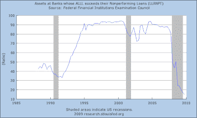

<!--yml

类别：未分类

日期：2024-05-18 00:35:32

-->

# 市场的谦卑学生：商业房地产的定时炸弹

> 来源：[`humblestudentofthemarkets.blogspot.com/2010/03/cre-time-bomb.html#0001-01-01`](https://humblestudentofthemarkets.blogspot.com/2010/03/cre-time-bomb.html#0001-01-01)

我之前写过关于经济前景的文章

[到处都是定时炸弹](http://humblestudentofthemarkets.blogspot.com/2010/03/time-bombs-everywhere.html)

。尽管潜在问题，如即将进行的另一轮住房重置，已经得到了很好的强调，但商业房地产（CRE）的定时炸弹现在也得到了很好的记录。最近，伊丽莎白·沃伦在

[CNBC](http://www.cnbc.com/id/36085517)

到 2010 年底，有一半的商业房地产抵押贷款将面临负债：

> 到 2010 年底，大约一半的商业房地产抵押贷款将面临负债，TARP 国会监督小组主席伊丽莎白·沃伦在周一的一次广泛访谈中表示。
> 
> “它们[大多数]集中在中型银行中，”沃伦告诉 CNBC。“我们现在有 2,988 家银行 —— 大多数是中型银行，在商业房地产贷款中存在这些危险的集中情况。”
> 
> 因此，经济将面临另一个“非常严重的问题”，在接下来的三年里将不得不解决，她说，补充说 2010 年事情不太可能恢复正常。

**严重的 CRE 问题**

2010 年 2 月，国会监督小组发布了一份名为

[商业房地产损失及对金融稳定的风险](http://cop.senate.gov/documents/cop-021110-report.pdf)

，其中包含一些令人不安的数据点。报告记录了日益上升的商业房地产空置率：

…下降的房地产价格：

…以及日益增长的商业房地产拖欠率：

**脆弱的银行体系**

所有这些情况都存在于脆弱的银行体系背景下。下图显示了贷款损失准备金或贷款和租赁损失准备金（ALLL）超过不良贷款（NPL）的银行百分比。如果 ALLL 大于 NPL，则银行将需要增加对 NPL 的准备金。

 [链接](https://blogger.googleusercontent.com/img/b/R29vZ2xl/AVvXsEjjOyPVY4P3w8RRogMtwtcP-KHf0C3uwUBRORytI_g_qlZDEveTteJD1D0JcEJbT1-b6rSx3zxMZlSxCJMgqbKAQcaBW3Kl5qftjDtDOXkLjTp8pGeQiXdHdcmWqyi5zieoEEJ-uCyyFdvS/s1600/alll.png)

一个已经脆弱的银行系统能否承受新一轮的贷款减记？

夜深人静时让我辗转难眠的清单上又多了一件事。
