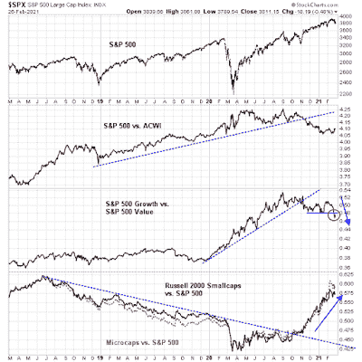

<!--yml

类别：未分类

日期：2024-05-18 02:03:55

-->

# 市场的谦卑学生：大轮换持续进行

> 来源：[`humblestudentofthemarkets.blogspot.com/2021/02/the-great-rotation-continues.html#0001-01-01`](https://humblestudentofthemarkets.blogspot.com/2021/02/the-great-rotation-continues.html#0001-01-01)

**前言：解释我们的市场定时模型**

我们维护几个市场定时模型，每个模型的时间范围不同。 "

**最终市场定时模型**

" 是基于我们在帖子中概述的研究的长期市场定时模型，

[构建最终市场定时模型](https://humblestudentofthemarkets.com/2016/01/26/building-the-ultimate-market-timing-model/)

。这种模型一般每十年只会生成少数信号。

The

**趋势资产配置模型**

是一种资产配置模型，基于全球股票和商品价格的输入，应用趋势跟随原则。这种模型具有较短的时间范围，一般每年会换手 4-6 次。本质上，它试图回答这个问题：“全球经济的趋势是扩张（看涨）还是收缩（看跌）？”

我的内心交易员使用一个

**交易模型**

，它结合了价格动量（趋势模型是否变得更加看涨或看跌？）和超买/超卖极端（如果趋势超买，则不买，反之亦然）。订阅者会收到模型变化的实时提醒，并每周更新电子邮件提醒的假想交易记录。

[这里](https://humblestudentofthemarkets.com/trading-track-record/)

以下是从 2016 年 3 月开始的实时提醒交易模型的假想交易记录。

每个模型的最新信号如下：

+   最终市场定时模型：买入股票*

+   趋势模型信号：看涨*

+   交易模型：中性*

**出于尊重我们的付费订户，表现图表和模型读数已推迟一周* **更新时间表**

：我通常会在我的模型读数上进行更新

[网站](https://humblestudentofthemarkets.com/)

在周末和周中会在@humblestudent 上发布观察结果的推文。订阅者会收到交易模型变化的实时提醒，并展示这些电子邮件提醒的假想交易记录。

[这里](https://humblestudentofthemarkets.com/trading-track-record/)

。

订户可以实时获取最新信号

[这里](https://humblestudentofthemarkets.com/my-inner-trader/)

。

**更多大轮换迹象**

上个市场周期的领导地位主要由三个主要主题占据，即美国优于全球股票、成长优于价值以及大盘股优于小盘股。领导地位在 2020 年开始发生变化。小盘股首先打破了相对下跌趋势。11 月的疫苗周一，辉瑞公司宣布其积极的疫苗结果，引发了另外两个因素的转变。

（[点击查看](https://blogger.googleusercontent.com/img/b/R29vZ2xl/AVvXsEhB1_4Rym2CTA7UhEzPjoD75cIZDz6hqbI-QlvTMSIR2FqCgs4Ifaw5mZ7I9E6YEOcDayVPEe6_KxDirSwsiRFL-LYTEf1CCnmgFONASHnvyxwamHLHW5_-yBpyPuDX1NUZ8UVhGSK3HGiD/s700/SPX+leadership.png)）

自那时起，小盘股相对于大盘股一路狂奔。上周，当价值/增长关系突破了一个关键的相对支撑位时，再次证实了“大轮动”的趋势。

完整的帖子可以在这里找到

在这里阅读更多：[Great Rotation 继续](https://humblestudentofthemarkets.com/2021/02/28/the-great-rotation-continues/)

。
