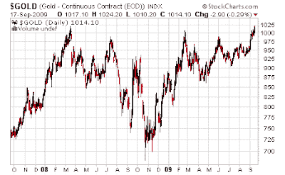

<!--yml

分类：未分类

日期：2024-05-18 00:46:40

-->

# Humble Student of the Markets: The Moriarty warning on gold

> 来源：[`humblestudentofthemarkets.blogspot.com/2009/09/moriarty-warning-on-gold.html#0001-01-01`](https://humblestudentofthemarkets.blogspot.com/2009/09/moriarty-warning-on-gold.html#0001-01-01)

当那些被付薪水的 precious metals 的欢呼队长开始变得谨慎时，你必须认真对待并注意。Bob Moriarty of

[321gold.com](http://www.321gold.com/editorials/moriarty/moriarty091109.html)

上周就这样做了：

> 黄金和白银表现良好，但它们也有些过头了。你不必一直 100%投资。如果你有一些利润，拿出一部分钱。如果你没有利润，那说明你过去九个月都没有读过我的文章。
> 
> 我们可能还没有到达精确的交易顶峰，但已经非常接近了。早卖一天总比晚卖一天要好。

上一次他

[在黄金方面发出警告](http://www.321gold.com/editorials/moriarty/moriarty030708.html)

是在 2008 年 3 月 7 日，就在金属价格崩溃之前。我

[指出](http://humblestudentofthemarkets.blogspot.com/2008/03/short-term-warning-for-us-dollar-bears.html)

了高风险状况，因此收到了很多恶毒的邮件。

这一次，

[Barrick’s de-hedging program](http://humblestudentofthemarkets.blogspot.com/2009/09/is-barrick-responsible-for-gold-at-1000.html)

或许股票的发行可能是对贵金属复杂体战术性谨慎的信号。

没有东西会直线上涨。警告。
