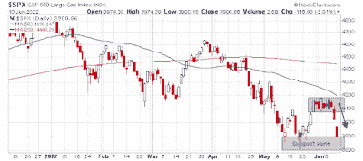

<!--yml

分类：未分类

日期：2024-05-18 01:43:17

-->

# 谦逊的市场学生：空头占据上风

> 来源：[`humblestudentofthemarkets.blogspot.com/2022/06/the-bears-gain-upper-hand.html#0001-01-01`](https://humblestudentofthemarkets.blogspot.com/2022/06/the-bears-gain-upper-hand.html#0001-01-01)

**序言：解释我们的市场时机模型**

我们维护了几个市场时机模型，每个模型的时间范围都不同。"

**终极市场时机模型**

"是一个基于我们帖子中概述的研究的长期市场时机模型，

[构建终极市场时机模型](https://humblestudentofthemarkets.com/2016/01/26/building-the-ultimate-market-timing-model/)

. 这个模型通常每个十年只会产生少数几个信号。

The

**趋势资产配置模型**

是一个基于全球股票和商品价格输入的趋势跟踪原则的资产配置模型。这个模型的时间范围较短，通常每年翻转 4-6 次。基于趋势模型的样本外信号的模型组合的性能和详细信息可以找到

[在此处](https://humblestudentofthemarkets.com/trend-model-report-card/)

。

My inner trader 使用的是

**交易模型**

, 它是一种价格动量（趋势模型是否变得更加看涨或看跌？）和超买/超卖极端（不要在趋势超买时买入，反之亦然）的混合。订阅者会收到模型变化的实时警报，每周更新假设的交易记录的电子邮件警报

[在此处](https://humblestudentofthemarkets.com/trading-track-record/)

. 自 2016 年 3 月开始的实时警报的交易模型假设交易记录如下所示。

每个模型的最新信号如下：

+   终极市场时机模型：卖出股票*

+   趋势模型信号：看跌*

+   交易模型：中性*

**性能图表和模型读数因尊重我们的付费订阅者而延迟一周.*更新时间表**

: 我通常在我的

[网站](https://humblestudentofthemarkets.com/)

周末发布，并在周三发布中间周观察@humblestudent。订阅者会收到交易模型变化的实时警报，并显示那些电子邮件警报的假设交易记录

[在此处](https://humblestudentofthemarkets.com/trading-track-record/)

.

订阅者可以实时访问最新的信号

[在此处](https://humblestudentofthemarkets.com/my-inner-trader/)

。

**跌破支撑**

关于广度推动的讨论就到这里。在 5 月底强劲的价格动量表现被称为广度推动之后，标普 500 指数横向整理了一个星期左右。指数周四果断跌破狭窄的交易区间，成交量为 93%的下跌日，这消除了先前广度推动信号的看涨含义。现在指数正在测试由 5 月低点定义的支持位。

 [链接](https://blogger.googleusercontent.com/img/b/R29vZ2xl/AVvXsEgulGQWRUVmMpR6P8tul7CrWfUQCW0jQmVWatSTToLK-0McZIFccpywWYVl4kBrSy06ONNzp4NVUIi1QN4KoGp5rh3RW0eJ5b7bs4EKNrFPxB1YXJ7iICWvNB_rAhbAxuWElGUlBFgz9t30LGB19hFTws9huKqfwOvCMnr3gaII5jsqhH62PANNArdzdQ/s700/SPX.png)

虽然转为看跌很容易，但情绪和市场内部指标显示相对较低的下行风险。

完整帖子可以找到

[在此处](https://humblestudentofthemarkets.com/2022/06/12/the-bears-gain-the-upper-hand/)

。
