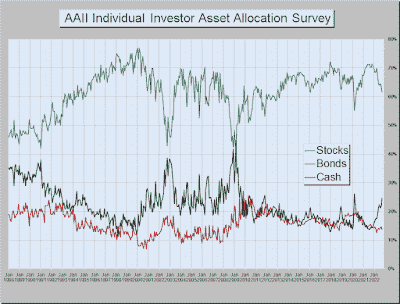

<!--yml

类别：未分类

日期：2024-05-18 01:37:05

-->

# 市场的学生：投资者投降的隐藏故事

> 来源：[`humblestudentofthemarkets.blogspot.com/2022/11/the-hidden-story-of-investor.html#0001-01-01`](https://humblestudentofthemarkets.blogspot.com/2022/11/the-hidden-story-of-investor.html#0001-01-01)

**序言：解释我们的市场时序模型**

我们维护几个市场时序模型，每个模型的时间范围都不同。"

**终极市场时序模型**

"是一个基于我们帖子中概述的研究的长期市场时序模型，

[构建终极市场时序模型](https://humblestudentofthemarkets.com/2016/01/26/building-the-ultimate-market-timing-model/)

。该模型通常每十年只会产生少数几个信号。

The

**趋势资产配置模型**

是一个基于全球股票和商品价格输入的应用趋势追踪原理的资产配置模型。该模型的时间范围较短，每年大约会转换 4-6 次。基于趋势模型的样本外信号的模型组合的表现和详细信息可以找到

[在此](https://humblestudentofthemarkets.com/trend-model-report-card/)

。

我的内部交易者使用

**交易模型**

，这是价格动量（趋势模型是否变得更加看涨或看跌？）和超买/超卖极端值（如果趋势超买不要买入，反之亦然）的组合。订阅者会收到模型变化的实时警报，基于电子邮件警报的假设交易记录每周更新

[在此](https://humblestudentofthemarkets.com/trading-track-record/)

。始于 2016 年 3 月的实时警报的交易模型的假设交易记录如下。

每个模型的最新信号如下：

+   终极市场时序模型：卖出股票*

+   趋势模型信号：中性*

+   交易模型：看涨*

**性能图表和模型读数因尊重我们的付费订阅者而延迟一周发布。**更新计划

：我通常在我的

[网站](https://humblestudentofthemarkets.com/)

在周末维护网站，并在@humblestudent 上发布周中的观察。订阅者会收到交易模型变化的实时警报，那些电子邮件警报的假设交易记录显示

[在此](https://humblestudentofthemarkets.com/trading-track-record/)

。

订阅者可以实时访问最新的信号

[在此](https://humblestudentofthemarkets.com/my-inner-trader/)

。

**坚韧的零售情绪？**

AAII 进行两项调查，彼此之间有所不同。每周的 AAII 调查询问受访者对市场的感受。每月的调查询问他们如何处理自己的资金。最新的每月资产配置调查显示，尽管股票权重有所下降，但远未达到 1990 年、2003 年和 2008 年熊市底部所见到的投降水平。这导致结论认为，零售投资者还没有放弃，这为股票价格进一步下跌潜力敞开了大门。

（[链接](https://blogger.googleusercontent.com/img/b/R29vZ2xl/AVvXsEi4hNOlFzxVfGFkoCMUXMO6uKPPAU_51YW4Yc8-Oc2OjE8IyPocN3tznC3nAyPu9EOVbJFkxCciZTD-4lKo47PPKv89bAjsxqiMQpxVLlbzNYy9TIJ3vMDSnS4wp0pA4QFTmbfpKvkaHImatG4axhP5odvhPfS_Qxe71AAE_1J0Wvsxe5XVxiVaDpp1FQ/s1000/AAII%20allocation.png)）

我不同意……

完整的帖子可以找到

（[在此](https://humblestudentofthemarkets.com/2022/11/06/the-hidden-story-of-investor-capitulation/)阅读隐藏的市场投资者投降故事）

。
