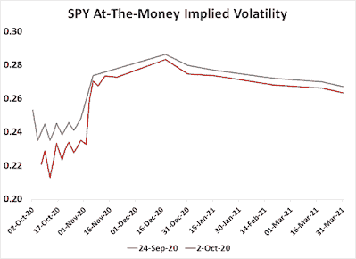

<!--yml

类别：未分类

日期：2024-05-18 02:10:57

-->

# 谦逊的市场学生：万物皆变...

> 来源：[`humblestudentofthemarkets.blogspot.com/2020/10/the-more-things-change.html#0001-01-01`](https://humblestudentofthemarkets.blogspot.com/2020/10/the-more-things-change.html#0001-01-01)

**序言：解释我们的市场时机模型**

我们维护了几个市场时机模型，每个模型都有不同的时间范围。 "

**终极市场时机模型**

"是一个基于我们帖子中概述的研究的长期市场时机模型，

[构建终极市场时机模型](https://humblestudentofthemarkets.com/2016/01/26/building-the-ultimate-market-timing-model/)

。这个模型通常每十年只会产生几个信号。

当

**趋势资产配置模型**

是一个资产配置模型，基于全球股票和商品价格的输入应用趋势跟踪原则。这个模型的时间范围较短，每年大约会转变 4-6 次。本质上，它试图回答这样一个问题，“全球经济的趋势是扩张（看涨）还是收缩（看跌）？”

我的内部交易者使用一个

**交易模型**

，这是一个价格动量（趋势模型是否变得更加看涨或看跌？）和超买/超卖极端（趋势超买时不买入，反之亦然）的混合。订阅者会收到模型变化的实时警报，并且每周更新那些电子邮件警报的假设交易记录

[在此](https://humblestudentofthemarkets.com/trading-track-record/)

。从 2016 年 3 月开始的真实时间警报的交易模型假设交易记录如下。

每个模型的最新信号如下：

+   终极市场时机模型：卖出股票*

+   趋势模型信号：看跌*

+   交易模型：看跌*

** 性能图表和模型读数因尊重我们付费订阅者而延迟了一周.* **更新计划**

：我通常在我的

[网站](https://humblestudentofthemarkets.com/)

在周末以及在周三发推文观察市场情况。订阅者会收到交易模型变化的实时警报，以及从 2016 年 3 月开始发送的假设交易记录

在此](https://humblestudentofthemarkets.com/trading-track-record/)

。

订阅者可以实时访问最新的信号

在此](https://humblestudentofthemarkets.com/my-inner-trader/)

。

**Plus ça change...**

周四晚上市场遭遇意外冲击，特朗普总统宣布他感染了 COVID-19。不同寻常的是，许多市场内部指标的行为保持不变。

*Plus ça change, plus c'est la même chose*. 万物皆变，但本质依旧。

鉴于这一发展，特朗普被迫隔离，他的竞选活动暂停或缩减。这使得他在选举前一个月的机会面临逆风。特朗普获胜的赔率在赌场市场上下降，但整体共和党的胜利赔率保持稳定，因为彭斯合同的赔率上升。*Plus ça change, plus c'est la même chose.*

同样令人困惑的是风险行为。在消息发布之前，期权市场正在为一场有争议的选举提高的可能性打折。11 月 3 日选举前夕，平均期权隐含波动率（IV）急剧上升，并在 12 月中旬之前保持高位。消息发布后，隐含波动率曲线的形状保持不变。*Plus ça change, plus c'est la même chose.*

[链接](https://blogger.googleusercontent.com/img/b/R29vZ2xl/AVvXsEju8Gr-bjd1Izfd-utWcu-rVMXzE951Vp7Agg8b7v4H-tkFuWFpzxh7xvSujV-UMkeK0WGVd-9FV6yk-dd4jdP7r2uldLigGl_Sy3B1jCbBlOb18jgCuGvQg7hPYYF12t0QSsuI8Mo-d_Pd/s909/SPY+IV.png)

市场的技术表现也相对稳定。上周标普 500 和纳斯达克 100 反弹，收复了各自的 50 日均线（dma）水平。两大指数全周都在区间内波动，受到上升阻力带和下降支撑带的限制。

全文可以在

全文请见[这里](https://humblestudentofthemarkets.com/2020/10/04/the-more-things-change/)

。
