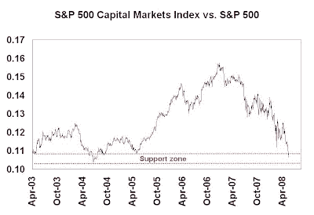

<!--yml

类别：未分类

日期：2024-05-18 01:08:56

-->

# 谦逊的市场学生：凤凰股的崛起（及市场）

> 来源：[`humblestudentofthemarkets.blogspot.com/2008/06/timing-rise-of-phoenix-and-market.html#0001-01-01`](https://humblestudentofthemarkets.blogspot.com/2008/06/timing-rise-of-phoenix-and-market.html#0001-01-01)

尽管我最近的市场悲观态度，我并不是一个永久的空头。事实上，我正在等待市场底部的迹象出现，以便买入

凤凰股**http://humblestudentofthemarkets.blogspot.com/2008/05/waiting-for-ride-on-phoenix.html)

，这种策略在过去带来了一些令人瞩目的回报。以下是我观察市场底部迹象的不同市场方向指标及其当前读数：

+   估值 - 中性/轻微看涨

+   投资者心理学 - 悲观

+   经济 - 看涨

+   技术 - 等待投降底部

估值：中性到轻微看涨**在我写下这些文字的时候，10 年国债收益率约为 4.2%，标普 500 指数的市盈率为 21.8 倍的报表收益和 14.6 倍的预期收益。在经济衰退期间，分析师无法很好地预测预期收益，所以我们排除预期市盈率。使用报表收益并将其结果输入到美联储模型中（该模型有[充分记录的问题](http://www.hussmanfunds.com/wmc/wmc070820.htm)），市场略微被低估。

我另一个寻找市场底部的经验法则是关注投资银行的估值。在经济压力期间，投资银行通常在市净率 1 的价格触底。像摩根士丹利（MS）和美林证券（MER）这样的主要投资银行现在的交易价格是净值的 1.3-1.4 倍，低于 4 月底的 1.5-1.8 倍。[点击查看](http://humblestudentofthemarkets.blogspot.com/2008/04/still-waiting-for-market-bottom.html)

尽管这些信号参差不齐，市场可能不会变得非常便宜，因为我们可能正处于市场横盘整理的时期（参见之前的[评论](http://humblestudentofthemarkets.blogspot.com/2008/05/decade-long-low-return-environment-for.html)）。基于这些考虑，我会把估值指标评为中性到轻微看涨。

投资者心理学：问题部门尚未稳定**我喜欢关注经济的薄弱环节，以便时机市场转变。这次衰退中的困难行业是金融和房地产。在经济放缓期间，就业率不可避免地下降。金融和投资银行可能接近稳定水平，但这些股票和其他问题板块的表现仍然不佳，没有尽头。

下面的图表显示了主要由投资银行组成的标普 500 资本市场指数相对于标普 500 的相对回报。该组织一直在与标普 500 相比处于自由落体状态，但正在接近过去出现技术支撑的区域。

**

同样，标普 500 金融股也在相对于标普 500 的自由落体状态中，但正在接近相对支撑区。

市场的其他问题领域就没那么幸运了。下面的图表显示了标普 500 房地产建筑商相对于标普 500 的情况。该组织仍在下降，并且尚未下跌到相对技术支撑区。  

对于标普超级综合人力资源和就业指数（临时和就业代理机构）的相对图表也是类似的。就业改善应该会很快反映在这些股票中。

**经济：市场反弹的条件已经具备**

康复的第一步是认识到存在问题。这是 2008 年 6 月 16 日的头条新闻。

[新闻周刊](http://www.newsweek.com/id/140553/page/1)

封面故事是经济衰退现象已经进入公众意识的一个指示。2008 年 3 月 24 日的商业周刊也有类似的“觉醒于衰退”的封面故事。过去，购买股票的绝佳时机是当公众认识到经济处于衰退中时，因为大部分的悲观情绪已经深入到投资者心理中。

我寻找的另一个经济信号是上升的收益率曲线。当前的

[收益率曲线](http://www.bloomberg.com/markets/rates/index.html)

确实呈上升趋势，表明央行正在采取宽松政策——对股市是一个利好信号。

**技术：抄底时机**

鉴于当前市场背景，标普 500 指数在未来几周内可能下跌并测试 3 月份的低点。这样的重新测试会成功吗？为此我转向了技术分析师。大多数技术分析师通过两个组成部分来识别中期底部：一次情绪恐慌的投降性卖盘，随后在随后的反弹中确认底部已经确立。

一个经典的恐慌性投降底部可能是一个成交量大的日子，市场大部分时间交易走低，然后收盘接近当天的最高点。那位风光无限的技術分析师乔·格兰维尔，在 2003 年 2 月正确地发出了市场全面买入的信号，已经被

[引用](http://www.businessweek.com/investor/content/may2002/pi20020515_9273.htm)

正如专注于抛物线以衡量这些极端走势。

在投降性底部之后，技术分析师通常希望看到一些形式的跟进强度。投资者商业日报

[文章](http://www.pif.ky/news/det.asp?vrcts=&az=zh&vrcta=70&ct=opi)

，在 9/11 事件两周后撰写，是寻找市场底部时需要注意什么的很好样本。

当我看到恐慌性底部、反弹的跟进以及大多数其他估值、经济和心理指标闪烁看涨信号时，我计划大胆前进，购买低廉的凤凰股票（当然要设置适当的止损）并坚持到底.**
