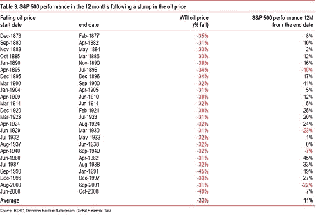

**趋势模型信号摘要**

[我的博客](http://humblestudentofthemarkets.blogspot.com/)

这里发生的是典型的羊群行为，市场不会让你在卖出后回头。

现在的情况是这样的。趋势模型仍然保持看涨的风险偏好读数，无论是我的内部投资者还是内部交易者。然而，油价的恐慌性抛售给未来收益路径带来了巨大的影响。此外，标普 500 指数违反了短期上升趋势，即 5 日移动平均线，这是市场技术人员密切关注的。乔什·布朗评论说，最近的一次记录，打破了所有 5 日移动平均线以上的天数，可能代表了推动买入的动量，这可能导致过度拥挤的多头：

# 这里的危险很明确——群体性的自满以及每个人都想买入或需要买入时，他们会把所有东西都投向市场，以结束痛苦的时刻。

> 来源：[`humblestudentofthemarkets.blogspot.com/2014/11/trust-bull-but-verify-trend.html#0001-01-01`](https://humblestudentofthemarkets.blogspot.com/2014/11/trust-bull-but-verify-trend.html#0001-01-01)

。

趋势模型信号：风险偏好

交易模型：看涨

趋势模型是一个资产配置模型，用于我的内部投资者。趋势模型的交易部分关注趋势模型的方向变化——它被我的内部交易者使用。趋势模型的交易部分的实际历史（非回测）买入和卖出信号显示在下面的图表中：

**罗纳德·里根的话...**

我通常会在

和

-->

[这里](http://humblestudentofthemarkets.blogspot.com/2014/11/trend-model-report-card-14-oct-351-1-yr.html)

日期：2024-05-18 03:28:34

市场学生：相信（多头），但验证（趋势）

美国感恩节长周末本不该是这样的。希特勒有一个习惯，在对手的领导提前离开的周末发动攻击，我想 1941 年 12 月 7 日早上，当日本舰队轰炸珍珠港时，夏威夷的感觉可能就是这样。但 OPEC 的决定早已被预先告知，它给能源和其他市场带来的波动程度非常令人惊讶。当周五在波动性引发的清淡交易中接近尾声时，我对趋势模型的读数含义有些困惑。

**更新时间表**

> 周末我会更新，并在周 tweet 任何变化，账号是 @humblestudent。此外，我一直根据趋势模型的信号交易一个账户。该账户的最后一份报告卡可以在
> 
> 的“未分类”类别更新趋势模型读数。

无论多头趋势何时反转，都可能产生糟糕的负面影响（加粗处强调）：

> 市场一直是逢低买入者的障碍。坚不可摧。除非他们愿意支付历史最高价，否则他们无法进场。从心理上来说，这是一个很高的入场门槛，尤其是如果他们一直建议客户谨慎的话。**这种突然转变可能会毁掉他们的职业生涯，尤其是如果它发生在重要的顶部。**

近期油价的市场动作，以及下周发生的一系列事件，可能会导致市场出现转折点。尽管趋势模型表明美国股指将继续缓慢上升，但当前状况让我不得不借用罗纳德·里根的话：

> 相信牛市，但验证趋势。

周末，有很多理由可以看涨也可以看跌。让我们一次又一次地分析看涨和看跌的案例。

**多头案例**

看涨案例包括：

+   股票的积极季节性；

+   美国扩张持续，没有看到任何衰退的迹象；

+   来自油价下跌的收益提升，不仅在美国，在全球都是；

+   全球友好的中央银行家。

**看涨理由 1：积极的季节性**

首先，12 月份对股市来说季节性是积极的。

[蒂姆·爱德华兹](http://www.indexologyblog.com/2014/11/25/a-santa-claus-rally-yes-virginia/)

标普道琼斯指数发现全球股票价格有以下季节效应：

> 至少在过去的几年里，12 月份为股票投资者带来了礼物。但是市场一年的好坏表现有没有影响呢？表 2 显示了在这些市场中，前 11 个月产生积极（“好”）或负面（“坏”）回报时的 12 月份平均表现。

由于股市通常表现“好”，爱德华兹推测，12 月份圣诞老人将为股市投资者而来。

**看涨理由 2：持续的美国扩张**

股市的关键基本面驱动因素之一是收益前景，其上升进程主要被经济衰退打断。正如

[Factset](http://www.factset.com/websitefiles/PDFs/earningsinsight/earningsinsight_11.28.14)

显示，股票价格与共识预期的 12 个月前收益高度相关。继 10 月份调整中看到的收益预估波动之后，前收益开始稳定并略有上升。

如果我们退后一步，美国经济扩张持续，没有看到任何衰退的迹象。

[新交易民主](http://community.xe.com/blog/xe-market-analysis/weekly-indicators-sharp-contrasts-edition)

在他的周度回顾中很好地总结当前经济状况：

> 本周语气有一点变化，因为指标更加尖锐地混合...
> 
> 目前，油价正在崩溃，这是一个强烈的正面因素。临时雇佣达到了历史高点。另一方面，有一些重要的、尽管微小的新负面因素。我认为第四季度不可能像第二季度和第三季度那样强劲增长——尽管这并不是什么大事。然而，除非天然气价格出现急剧逆转，否则 2015 年年初的增长看起来将会出现增长。

除非我们看到增长放缓的明确迹象，否则多方人士没有什么可担心的。

**看涨理由 3：能源价格下跌带来的每股收益增长动力**

对多方人士来说，油价下跌对收益的积极影响将是另一个顺风。上述 Factset 的前瞻性每股收益数据是在油价突然下跌之前编制的。如果油价保持在这些较低水平，我认为在未来几周内预期将开始上调每股收益预期。

> 油价的暴跌对全球股市来说是一个盛宴，前提是主要原因是原油供应的激增，而不是经济需求的崩溃。
> 
> 国际清算银行表示，在油价下跌 30%之后的一年里，世界股指的平均涨幅为 25%，与最新的下跌情况相当。实际涨幅为 19%。
> 
> 回溯到 1876 年的数据虽然不那么明确，但总的来说讲述了相同的故事。标准普尔 500 指数在华尔街的股票平均上涨了 11%。1901 年的股市反弹是非常强劲的。

|  |
| --- |
| 点击放大 |

花旗进一步分析显示，不同国家股市对油价下跌的敏感性。相对表现最大的赢家是美国和日本，依次排序，最大的输家是挪威、俄罗斯、加拿大和巴西。

油价的下跌应该对欧元区股市有利，主要因为欧元区国家主要是能源的净消费者。我已经在指出，欧洲股市代表了一种价值投资，正在看到积极动量的益处（参见

[两种会让你感到不安的反向投资策略](http://humblestudentofthemarkets.blogspot.com/2014/11/two-contrarian-plays-that-will-make-you.html)

)，我预期未来几天内，市场将进一步上调欧洲的每股收益(EPS)预期。这样的发展应该对欧元区股市构成另一个看涨因素。

事实上，摩根士丹利在欧洲发布了一份看涨报告，甚至在 OPEC 的消息出现在 tape(通过

[价值漫步](http://www.valuewalk.com/2014/11/europe-stocks-dividend-yield/)

):

> 分析师们认为现在不是削减对欧洲风险敞口的时候，原因有很多。分析师指出，尽管欧洲 ETF 和共同基金流出达到历史显著水平，但欧洲过去 6 个月的表现在全球股市中排名垫底，与全球股票的估值接近历史低点：

**看涨理由 4：鸽派中央银行家**

最后但并非最不重要的是，看涨者得到了全球宽松的中央银行政策的支持（参见我上周的评论

[不要与趋势（或中央银行家）作对](http://humblestudentofthemarkets.blogspot.com/2014/11/dont-fight-tape-or-central-bankers.html)

)：

> 实际上，中国人看到了日本银行地方的派对，决定自己举办一个。先派对，后付款。

以及：

> 日本银行的派对还不够。中国银行的派对还不够。欧洲央行决定也想加入派对的行动。所以我们现在有了中央银行家的街头派对。

**熊市案例**

尽管有看涨的背景，但有很多理由要保持谨慎：

+   估值过高；

+   技术条件指向暂停或回调；

+   来自高收益市场（HY）的潜在危险，由能源引发；

+   可能来自能源价格下跌的中央银行宽松政策的逆风。

**看跌理由 1：股市过于昂贵**

对看涨案例的最长期问题是股市估值水平过高。在最近的一篇帖子中，我展示了美国股市从价值和增长的角度来看都是昂贵的（参见

[股票有多便宜？（成长型投资者版）](http://humblestudentofthemarkets.blogspot.com/2014/11/how-cheap-are-stocks-growth-investor.html)

)。

此外，我们看到了硅谷泡沫的迹象，硅谷是股市中高贝塔的部分（通过

[Wolf Street](http://wolfstreet.com/2014/10/09/priming-the-startup-scene-and-ipo-market-for-burnout/)

)：

只要正向动量主导，即所谓的更大傻瓜理论，估值过高不应该是一个问题。但是

[Todd Schneider](http://toddwschneider.com/posts/techcrunch-bubble-index/)

指出，衡量创业公司宣布的数据显示，硅谷风险投资家的信心开始下降：

以及通过资金价值：

现在考虑一下，最新的美国银行摩根大通基金经理调查显示，经理们在全球和美国部门层面都对科技股过度配置。恶化动量和拥挤的多头头寸可能是剧烈下跌的成分。

**看跌理由 2：脆弱的技术条件**

另一个短期内对股市保持谨慎的理由是技术指标和情绪模型发出的红旗。我已经指出，SPX 在其 5 日移动平均线（5 dma）以上的时间已经创下了纪录。最终，在周五交易的最后一小时，指数跌破了 5 dma 水平。由于在假期缩短的交易日内，这种突破既不令人信服也不明确，我们需要在周一的交易时间内寻找技术确认。跌破 5 dma 可能是市场横向整理或回调的信号。

此外，一些情绪模型也亮起了红灯，至少是黄灯。下面这张 Rydex 情绪的图表讲述了故事。顶部面板是 SPX 自 1998 年以来的走势，当时 Rydex 数据首次可用。中间面板显示了 Rydex 看熊与看牛资产的比例，底部面板显示了流向看熊 Rydex 和货币市场资产与看牛资产的比例。

从这张图表中，我可以得出许多观察结果。首先，Rydex 投资者的长期趋势通常是正确的。在科技泡沫期间，他们看涨并纷纷将资金投入看涨基金。当市场转淡时，他们一直扮演卖家角色，直到 2003 年市场触底，此时他们转变为边际买家。当 2009 年市场触底时，Rydex 投资者正确地转为看涨，并将资金投入看涨基金。因此，从熊/牛资产比率的角度来看，我不会过于担心图表中间面板所示的熊/牛资产历史低点。

然而，我可以提出一个论点，即当看熊/看牛资产比率（中间面板）达到短期极端值，而看熊/看牛流量比率（底部面板）也达到极端值时，交易员可以找到有用的信号。我用虚线垂直标记了自 2007 年市场高峰以来，表明过度看涨情况发生的时间。红线表示市场要么停滞不前，要么回撤，而蓝线表示市场继续反弹。尽管信号数量不多，但这个指标在过去比错误的时候更多。

本周，这个 Rydex 指标发出了警告信号。当我把这个情况与 5 日移动平均线（5 dma）的突破结合起来时，它可能预示着股价近期将走弱。

从长远来看，我同样对最新的保证金债务数据（通过...）表示担忧。

[Doug Short](http://www.businessinsider.com/nyse-margin-debt-oct-2014-2014-11)

）。正如下面图表所示，股市往往在保证金债务从历史高点触顶并转跌时表现出触顶的倾向。这些市场高峰可以用保证金债务衡量的股市过度投机以及从历史高点回撤的动量停滞来解释。

历史上，保证金债务滚动通常在市场高峰几个月前领先。当前这一幕有点不寻常，因为保证金债务在 2014 年 2 月达到顶峰，开始下降后又上升。然而，我们过去在市场高峰时也看到过类似的模式。尽管如此，保证金债务这一模式仍然令人担忧，需要密切关注。

在泡沫部门最后但并非最不重要的是，我给大家展示了 Business Insider 的

[20 under 20: Meet the teen traders trying to take over the finance world](http://www.businessinsider.com/20-under-20-in-finance-2013-11?op=1)

。这些孩子不仅交易普通股票，还涉足衍生品和复杂产品，如*颤抖*

[CFDs](http://www.investopedia.com/articles/stocks/09/trade-a-cfd.asp)

，

[蝴蝶期权价差](http://www.investopedia.com/terms/b/butterflyspread.asp)

，

[铁鹰价差](http://www.investopedia.com/terms/i/ironcondor.asp)

等等。

**熊市理由 3：高收益的金丝雀**

另一个令人担忧的原因是高收益（HY）或垃圾债券市场正在酝酿麻烦。HY 市场是风险承受能力的重要晴雨表。令我困扰的是，HY 利差正在扩大，表明风险承受能力降低：

高收益分析师马丁·弗里德森早在去年 11 月就预测垃圾债券将发生大崩溃，违约潮将于 2016 年开始（ via

[Bloomberg](http://www.bloomberg.com/news/2013-11-12/default-wave-of-1-6-trillion-looming-for-junk-fridson-says.html)

)：

> 根据纽约市弗里德森视觉有限公司首席执行官马丁·弗里德森的说法，全球将有近 1.6 万亿美元的垃圾债券在 2016 年至 2020 年间违约，该公司是一家专门研究投机性债务的研究机构。
> 
> 有历史证据表明，违约率将在 2014 年至 2016 年之间激增并持续，这意味着四年内的累计率为超过 30%，弗里德森在一份报告中估计， Standard and Poor’s Capital IQ Leveraged Commentary and Data 总违约的价值将达到 1.576 万亿美元。根据弗里德森的说法，这是 7520 亿美元的市场价值，弗里德森从 1976 年起就从事公司债务交易。
> 
> “当违约潮最终来袭，它将非常巨大，”弗里德森在电子邮件中说。“没有人意识到当它最终来临时，会有多少困境债务可供投资。”

现在油价暴跌，能源公司在 HY 市场中的权重逐渐增加，能源违约有可能把市场推向边缘。

高收益的崩溃可能会变得很糟糕，并蔓延至信用市场之外（ via

[CNBC](http://www.cnbc.com/id/102223823)

，强调 added):

> “这是我反复看到的事情，”Newedge USA 宏观组负责人、美国策略主管拉里·麦克唐纳说。“当高收益债券表现不如股市时，就会发生重大的信用事件。这是煤矿中的金丝雀。”
> 
> 根据对冲基金使用的量化分析工具 Kensho 的数据，自上一个世纪之交以来，高收益债务的价值在 60 天内至少下跌了 10%的情况出现了 12 次。（瑞士信贷高收益债券基金被视为基准。）
> 
> ***在这些信用事件发生 60 天后，花旗集团的股票中位回报率为负 8%。美国银行股价的中位回报率为负 6%。摩根大通的股票下跌了 5%。***
> 
> ***这可能看起来并不那么糟糕，但那些只是“中位数”回报，还包括高收益下跌仅 10%的情况。这些股票和高等级债券价格的下跌可能会更糟。***

伊莎贝拉·卡米斯卡来自

[FT Alphaville](http://ftalphaville.ft.com/2014/11/24/2050942/lies-damned-lies-and-liquidity-expectations/)

也指向了像 HY 这样的薄市场的流动性风险。因此风险是“全球金融系统委员会”（CGFS）一篇论文的主题

[发布](http://www.bis.org/publ/cgfs52.pdf)

在同一天，关注相似主题，并得到了纽约联储主席威廉·达利利的批准。“卡米斯卡观察到，由于更高的资本要求，许多银行已经退出了他们的市场制造业务：

> 一个关键观察是，许多市场制造业务已经转向了更多订单驱动或经纪模式，这意味着大额交易的执行需要更多时间，许多市场制造商更不愿意吸收大额头寸。
> 
> 这种结果是，市场流动性现在越来越依赖于少数大型机构的投资组合分配决策。

引用的论文指出：

> 此外，尽管可靠的数据通常不可用，但交易似乎仍然高度集中在大多数企业债券市场中的少数几只流动性较高的债券上，一些市场进一步集中的迹象已经显现。***一个例子是美国企业债券市场，其中 12 个月换手率至少为 50%的证券的比例***（即交易量之和占证券总发行量的至少一半）***从 20%下降到不到 5%***（见图 5，右侧面板）

更糟糕的是，感知流动性取决于 ETF 提供商，他们承诺实时流动性，但在市场出现混乱时可能没有足够的资本来支持这些承诺（我在看着你，JNK 和 HYG）：

> 债券 ETF 通过为通常交易量较小的基础证券提供市场价格，改善了流动性较差市场的价格发现。当基础债券和相关衍生品市场的流动性不足时，ETF 允许市场制造商对冲库存风险，并且 ETF 通常也被投资者用于被动或指数链接策略的再平衡流动。然而，ETF 债券基金的流动性建立在授权参与者——通常是提供即时服务的债券市场的同一交易商——为 ETF 股票提供市场的意愿和能力之上。
> 
> 流动性冲击可能因此通过它们对关键市场制造商的风险承受能力的影响，传播到债券市场的不同部分。在当前的关头，随着共同基金和 ETF 吸引了来自机构投资者和零售投资者的显著流入，全球债券市场的逆转可能引发赎回，当基金出售资产以满足现金需求时，可能会放大债券估值的下降。值得注意的是，债券共同基金在过去（例如，在之前的货币政策紧缩期间）已经管理了显著的流出，这通常没有扰乱金融市场。然而，过去大量赎回发生的时候，基金持有的规模要小得多，无论是绝对值还是与交易量和交易商库存的相对值。**然而，目前的市场制造趋势表明，赎回可能对债券市场的流动性产生比过去更大的影响。**

过度杠杆的能量公司依赖 HY 市场进行融资，油价崩溃，债券市场流动性差以及风险偏好减少，这些都是债券市场崩溃的要素。此类事件可能不会局限于信贷市场，并可能导致风险传播到整个金融系统。换句话说，垃圾债券市场的抛售可能会变得非常糟糕——并且很快。

等等！还有更多。

（出自[詹姆斯·法罗](http://signalinea.com/why-a-credit-crisis-in-the-energy-sector-may-be-coming-at-the-worst-time/)

（通过

（出自[乔什·布朗](http://thereformedbroker.com/2014/11/29/plot-twist-the-oil-crash-kneecaps-high-yield-which-halts-buybackpalooza/)

)提醒我们股票回购与垃圾债券融资之间的联系是多么紧密。如果回购开始枯竭，它将开始阻碍 EPS 的增长，因为 EPS 中的“S”停止缩减：

> 随着原油市场的持续大屠杀，我一直认为高杠杆的参与者将会有债务问题，这将有助于行业整合。但是，除了主权国家之外的信贷市场状况，我们可能会看到完全不同的事情。能源部门占据了高收益（HY）债券市场的一个很大部分，它即将受到重大打击...早晚会发生。如果脆弱的高收益市场在这种情况下再受到一次推动，我们可能会看到市场真正的恐慌。看起来能源债务可能一段时间内无人问津，如果不久采取行动，可能会把高收益市场也拖下水。而那部分行动，应该包括停止作为股票回购用途的债务发行狂欢。
> 
> 但是等等...股票回购一直是推高股价的主要助力。
> 
> 是的。
> 
> 为什么没有人谈论这种大量非生产性债务发行（未用于扩张/资本支出，而仅仅是多倍扩张）可能带来的潜在后果呢？

**看跌理由 4：中央银行家和石油如何结合？**

到目前为止，我们已经看到全球中央银行家的政策倾向于鸽派。中国央行和日本央行已经宣布了刺激性政策。欧洲央行可能终于准备好加入这场盛宴。我认为在未来几周内会出现一些潜在的问题。

首先，

【加文·戴维斯】（http://blogs.ft.com/gavyndavies/2014/11/26/fault-lines-within-the-ecb/）

强调了 ECB 内部的深刻哲学差异。简单地说，德拉吉是新凯恩斯主义者，而魏德曼及其盟友是奥地利经济学家：

> 这场争论是根本性的，由来已久。德拉吉采用了美国学术界和中央银行占主导地位的新凯恩斯主义方法。他的最新讲话背后的哲学与 2011-13 年间的本·伯南克没有真正区别。相比之下，代表鹰派的人物如魏德曼和欧洲央行执行董事会成员伊夫·默施最近的言论直接来自欧洲经济学的奥地利学派。难怪这些差异如此难以弥合。

因此，在这个争论中，德拉吉的举措被淡化为目标和建议，而不是实际的政策。下周欧央行将开会，市场似乎期待更多关于 QE 的宣布，所有眼睛都将关注法兰克福如何解决这些分歧。此外，下跌的能源价格将有助于欧元区经济的增长，并为 ECB 鹰派延迟 QE 政策提供借口。

目前已经看到了魏德曼盟友劳滕施拉格（通过...）对进一步刺激的反对迹象

[彭博社](http://www.bloomberg.com/news/2014-11-29/lautenschlaeger-rebuffs-qe-as-germans-step-up-opposition-in-ecb.html)

（引号中内容，重点已加）：

> 欧洲央行执行董事会成员萨宾·劳滕施拉格表示，目前欧元区量化宽松不是正确的政策选择，加剧了官员们对应对放缓通胀的正确反应的分裂。
> 
> “对政府债券广泛购买计划的成本和收益、机会和风险的考虑并没有给出积极的结果，”德国前联邦银行副行长劳滕施拉格今天在柏林的一个活动上表示。“财政政策中很少有共同的能力。只要这种情况存在，欧洲央行购买政府证券就不可避免地与一个严重的激励问题联系在一起。”
> 
> 劳滕施拉格的评论表明，她已成为欧洲央行行长马里奥·德拉吉在引入量化宽松政策辩论中的最高级别对手。***她的立场与德国央行行长延斯·魏德曼的立场相呼应，魏德曼曾表示，量化宽松使人们对政府需要对其经济进行结构调整的需求分散了注意力***。

如何

~~德国~~

萨宾，你真是个奥地利人！

此外，本周五我们将发布美国就业报告。在低油价的情况下，美联储和市场将对报告做出何种反应？油价的好消息（超过预期）对股市是好消息还是坏消息？当前的环境只是创造了更多的波动和不确定性。

此外，伊扎贝拉·卡曼斯卡在

[FT Alphaville](http://ftalphaville.ft.com/2014/11/24/2050482/on-the-hypothetical-eventuality-of-no-more-petrodollars/)

指出花旗的一份报告，关于石油美元减少对债券收益率和中央银行资产负债表的负面影响。报告的一部分写道：

> 石油美元积累的速度与油价高度相关。当布伦特原油和 WTI 分别交易于 110 美元和 90 美元时，正如过去三年中的大部分时间一样，主权财富基金资产迅速增长。实际上，我们发现油价与主权财富基金资产管理规模（见图表）之间存在强烈的实证关系。WTI 超过 100 美元对应着资产管理规模增长+10%，而当前水平的 WTI 则预示着更加谦虚的 5%的增长率。

卡曼斯卡评论说：

> 他们指出，关键的含义是，随着 WTI 跌破 80 美元，布伦特原油正好处于这一水平，不应该期望在 2015 年石油美元投资者会购买另外 5000 亿美元的资产。他们补充说，如果原油价格持续在当前水平，那么这些投资者停止看到资金流入的可能性就越大，这可能会使油价的下跌有效地抵消日本银行和欧洲央行进一步的资产负债表扩张。

换句话说，石油美元再投资涉及石油出口主权财富基金购买美国国债资产，这主要是因为主权财富基金本质上比较保守。石油美元的减少将意味着对国债和其他主权债务的需求减少，这将会推高利率。

那么低油价对经济的刺激效果又如何呢？花旗报告指出，石油美元主权财富基金的需求性质与消费者需求非常不同，它们会对利率工具的需求产生不同的影响（强调 added）：

> 虽然这是事实，但重要的是低原油价格节省的资金最终如何投资，与主权财富基金和外汇储备管理者的投资相比。在这方面，我们怀疑石油美元投资者通常进行的是本质上固定收益友好的保守投资，而低汽油价格节省的资金往往增长面向消费者的公司的营业收入和那些具有显著运输成本的公司利润。因此，被抛弃的石油美元很少再回到固定收益市场。

**是时候叫停了**

定期读者知道，我一直根据趋势模型的信号管理一个账户。在

[上个月的成绩单](http://humblestudentofthemarkets.blogspot.com/2014/11/trend-model-report-card-14-oct-351-1-yr.html)

对于该账户，我写道：

> 作为一个概念证明，我开始管理一个小的账户，交易主要美国市场平均值的长、反向和杠杆 ETFs，以及偶尔的板块和行业 ETFs。交易决策基于趋势模型信号以及一些短期情绪指标。

我的趋势模型依然看涨，我内心的投资者也是。然而，我提到的“短期情绪指标”显示不确定性正在上升，因此风险水平也在上升。下周我们将关注几件关键事件，这些事件必须得到解答：

1.  油价会发生什么，股市和债市会怎么反应？

1.  欧洲央行会做什么，因为它会影响欧元区疲软的增长前景？

1.  失业救济申请已经连续两周未达到预期，周五的非农就业报告将告诉我们美国扩张的步伐如何？市场会怎么反应？

即使趋势保持风险偏好和看涨，但我内心的交易者认识到短期风险已经显著上升。在这种情况下，他倾向于在四分卫处叫停，并将投资组合调整至中立位置。他想等待并观察市场对下周所有事件的反应，然后再确定是看涨还是看跌。

实际上，我内心的投资者告诉我“相信牛市”，因为中期前景依然积极，但我的内心交易者告诉我“验证趋势”，因为市场可能接近一个转折点。
