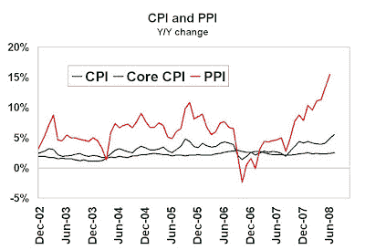

<!--yml

类别：未分类

日期：2024-05-18 01:05:40

-->

# 市场学生：关注智能基金在长期债券头寸

> 来源：[`humblestudentofthemarkets.blogspot.com/2008/09/watch-smart-funds-on-their-long-bond.html#0001-01-01`](https://humblestudentofthemarkets.blogspot.com/2008/09/watch-smart-funds-on-their-long-bond.html#0001-01-01)

进一步解释我的

[最新博文](http://humblestudentofthemarkets.blogspot.com/2008/09/smart-funds-still-early-in-inflation.html)

显示智能基金在商品交易（通胀）以及美国长期债券交易（去通胀）上做多，有必要进一步解释。我相信支撑这一立场的关键宏观观点是：

+   长期趋势是通胀上升，官方通胀率被低估

+   周期趋势是通胀下降，为债券市场的反弹奠定基础

**官方通胀率被低估**

美联储关注核心通胀，这一统计数据一直低于其他通胀衡量标准。下面的图表显示了 CPI、核心 CPI（或 CPI 剔除食品和能源）、PPI 的进展情况。

（[点击这里](https://blogger.googleusercontent.com/img/b/R29vZ2xl/AVvXsEhQIlWxAwyEXIHOQFAzavOvDcYPgkB3f3pDzcr9zDME7xiOLev5Mw6tz5NwJX4YcXU8cQMmBBxJHXFXQA9KwG4GAgf-ve-Hp0rIiZOzRCUdVxSzoXc-nuRvt1sOKjaeRwaUQ_uJkvpPgEwV/s1600-h/CPI+and+PPI.JPG)）

正如图表所示，核心 CPI 始终低于其他通胀衡量标准。PPI，或者说是其中之一，对商品价格更为敏感，而这些价格一直在上涨。此外，PPI 没有 CPI 所具有的幸福感和其他调整。

[Boskin 委员会](http://www.ssa.gov/history/reports/boskinrpt.html)

。其他人也

[评论](http://www.bloomberg.com/apps/news?pid=newsarchive&sid=a2SUCQ3Bslk0)

甚至 CPI 的标题也存在问题，并不能反映真实的生活成本变化。

即使你关注 Greenspan 最喜欢的一个通胀指标——PCE，达拉斯联邦储备银行对其的衡量

[修剪均值 PCE](http://www.dallasfed.org/data/pce/index.html)

似乎一直高于核心 PCE。

**通胀压力周期性缓解**

最近，经济疲软的迹象日益增多。

[灰皮书报告](http://www.reuters.com/article/ousiv/idUSN0326885520080903)

表明经济增长放缓。

[重编 M3 增长](http://www.nowandfutures.com/key_stats.html)

在急剧下降。美联储 various Fed officials have been

[信号](http://www.reuters.com/article/ousiv/idUSN0326885520080904)

通胀压力缓解，因此加息压力减轻。对这些信号，债券市场做出了

[回应](http://www.marketwatch.com/news/story/bond-market-shows-inflation-expectations/story.aspx?guid=%7B151FDC2C%2D90D5%2D4840%2DA557%2DD9B3ADD2F7A1%7D)

和 TIPS 与 10 年期国债之间的利差正在缩小。

**投资者应该做什么？**

互惠基金通常比一般的摇摆交易者拥有更长的投资期限。明智的基金管理者一直表示：“我们不会被官方的通货膨胀率所愚弄，从长远来看，我们预计通货膨胀将持续在高位。然而，在短期内，由于经济疲软，债券市场可能会迎来反弹。”

观察美国股市底部的一个关键因素将是留意明智的基金管理者是否改变了对长期债券的立场。
