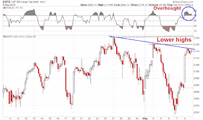

<!--yml

类别：未分类

日期：2024-05-18 03:21:48

-->

# 谦逊的市场学生：我从 Bundegeddon 学到的

> 来源：[`humblestudentofthemarkets.blogspot.com/2015/05/what-i-learned-from-bundegeddon.html#0001-01-01`](https://humblestudentofthemarkets.blogspot.com/2015/05/what-i-learned-from-bundegeddon.html#0001-01-01)

**趋势模型信号摘要**

趋势模型信号：中性

交易模型：看跌

趋势模型是一个资产配置模型，它基于全球股票和商品价格的输入应用趋势跟踪原则。本质上，它试图回答这个问题，“全球经济的趋势是扩张（看涨）还是收缩（看跌）？”

我的内部交易者使用趋势模型的交易组件来回答这个问题，“趋势是在改善（看涨）还是恶化（看跌）？”下图中，实际（非回测）交易模型的信号由箭头表示。此外，我还有一个使用趋势模型信号的交易账户。该账户的最后一份成绩单可以找到

[这里](http://humblestudentofthemarkets.blogspot.com/2015/05/trend-model-april-report-card-playing.html)

.

**更新计划**

: 我通常在

[我的博客](http://humblestudentofthemarkets.blogspot.com/)

在周末更新，并在每周 tweet any changes at @humblestudent.

**派发迹象**

我已经连续几周警告美国股市出现派发迹象，这些迹象仍在继续。我写过一篇关于强劲的长期趋势与疲软的短期趋势交汇是 complacency may be getting its comeuppance (参见

[趋势跟随启示录的三个秘密](http://humblestudentofthemarkets.blogspot.com/2015/04/3-secrets-from-book-of-trend-following.html)

和

[如何让你的第一次亏损成为最好的亏损](http://humblestudentofthemarkets.blogspot.com/2015/04/how-to-make-your-first-loss-be-your.html)

."). 一种说明这种效应的图形方法是查看月度标普 500 图表上的

[MACD 柱状图](http://stockcharts.com/school/doku.php?st=macd+histogram&id=chart_school:technical_indicators:macd-histogram)

，这是衡量长期和短期趋势分歧的指标，已经变为负值。过去 20 年（由垂直线标记）的每一次这种情况都看到市场下跌，MACD 作为领先、同时或滞后指标。

标普 500 指数的短期图表也显示出令人不安的派发迹象。标普 500 指数已经打破了去年 10 月开始的的关键上升趋势，并似乎正在形成圆顶形态。此外，我们在

[平衡成交量](http://stockcharts.com/school/doku.php?st=obv&id=chart_school:technical_indicators:on_balance_volume_obv)

，这是一个基于成交量的积累和派发衡量指标。

另外，Urban Carmel

tweet([`twitter.com/ukarlewitz/status/596735291978850304`](https://twitter.com/ukarlewitz/status/596735291978850304))

在周五白天以下观察：

还可见 Andrew Nyquist 的

帖子([`stocktwits.com/andrewnyquist/message/36660210`](http://stocktwits.com/andrewnyquist/message/36660210))

关于负面宽度分歧，这是另一个分布的迹象。

**一个摇摆不定的增长前景**

周五的上涨是由英国选举中保守党意外赢得多数席位和就业报告 neither too hot nor too cold 的组合引发的，市场将其解读为美联储会暂时保持观望。尽管就业报告中看到了积极因素，

[New Deal democrat](http://bonddad.blogspot.com/2015/05/april-jobs-report-much-better-but.html)

警告称，他仍然看到了工业衰退的迹象，这是基于他对报告中领先指标部分的解读：

> 但就业报告的领先部分正在发出警报。制造业工作时间缩短。加班时间减少。从零到 5 周的失业率显著增加。对前几个月的修订为负。这是就业报告中的领先指标连续第三个月呈现负面趋势。在我的“每周指标”专栏中，过去一个月我一直说美国正处于浅层制造业衰退。今天的报告证实了这一点。

此外，上周小规模 Bundegeddon 恐慌中上升的债券收益率对房地产市场不利。债券收益率直接影响抵押贷款利率，这是 New Deal democrat 定期监控的长期领先指标的另一个组成部分。在他最新的

每周高频率经济发布总结([`community.xe.com/blog/xe-market-analysis/weekly-indicators-watch-interest-rates-edition`](http://community.xe.com/blog/xe-market-analysis/weekly-indicators-watch-interest-rates-edition))

，他确认了对美国经济风险的评估：

> 在过去几个月中，主题是同时指标较差，长期和短期领先指标 generally positive，反映出由于美元强劲和石油市场疲软导致的浅层工业衰退，但国内消费者经济具有韧性。本周的一大亮点是利率的变动。如果利率大幅上涨，它们将开始拖累房地产市场，这将使得货币供应成为唯一的积极长期领先指标，因为企业利润已经下降。

还有其他一些声音强调了就业报告的银色衬里之上的乌云。华尔街日报的 Greg Ip 指出

[华尔街日报](http://blogs.wsj.com/economics/2015/05/08/even-with-the-april-bounceback-its-a-weak-start-to-2015/?utm_content=bufferce895&utm_medium=social&utm_source=twitter.com&utm_campaign=buffer&mg=blogs-wsj&url=http%253A%252F%252Fblogs.wsj.com%252Feconomics%252F2015%252F05%252F08%252Feven-with-the-april-bounceback-its-a-weak-start-to-2015%253Futm_content%253Dbufferce895%2526utm_medium%253Dsocial%2526utm_source%253Dtwitter.com%2526utm_campaign%253Dbuffer)

指向了经济放缓的迹象：

> 仔细观察，就业数据仍然向经济基本面发出令人担忧的信号。因为工资单调查中的数据很少直接进入基于支出的 GDP 测量，它可以作为对更广泛的经济全面数字的一个有用的“校验”。根据 Macroeconomic Advisers 的 Chris Varvares 的说法，总工作时间是预测当前季度和下一个季度产出的一个良好指标。
> 
> 那么，好消息就是 4 月份私营部门每周工作的总小时数，这个衡量标准既包括就业人数也包括他们的工作小时数，比 3 月份增长了 0.2%。坏消息是，与 2 月份相比，工作小时数仍然较低。如附近的图表所示，过去三个月的工作小时数以 1.3%的年率增长，低于前三个月。去年同期，工作小时数也有类似的下降，但到 3 月份开始恢复。

道格·肖特（Doug Short）的最新更新

[四大经济衰退指标](http://www.advisorperspectives.com/dshort/updates/Big-Four-Economic-Indicators.php)

3 月份的数据已经公布。综合得分已经连续两个月为负，3 月份有四个指标中的两个为负。工业生产和实际收入的增长放缓拉低了整体得分，相比之下 2 月份的实际销售数据极为负面，3 月份则强劲反弹。这些数据可能是有回溯性的，而 1 季度的疲软已经是众所周知的事实，但它们仍然描绘了一个接近停滞速度的经济的景象。

[Gavyn Davies](http://blogs.ft.com/gavyndavies/2015/05/03/global-growth-report-card-is-the-world-slowdown-temporary/)

也警告说全球经济增长放缓：

> 因此，根据我们的模型，全球经济增长速度已经进一步放缓。我们用主要发达经济体及中国的活动增长作为全球活动的代理，其增长速度已从一个月前的 3.7%降至 4 月底的 3.0%。这个全球活动的衡量标准现在已经跌破自 2014 年中以来确立的大约 4%的速度。

根据戴维斯的说法，美国经济强劲扩张的可能性正在下降，经济衰退的风险开始上升，尽管这些读数远远没有达到恐慌按钮的水平。

对于股市来说，一切都归结于盈利增长的前景，目前仍然不明朗。

[Ed Yardeni](http://www.yardeni.com/Pub/peacockfeval.pdf)

报告称，尽管大型市值标普 500 公司的前瞻性每股收益（EPS）预估已经恢复上升趋势，但中等市值标普 400 和小型市值标普 600 公司仍在看到 EPS 预估向下调整。在另一份

[博客文章](http://blog.yardeni.com/2015/05/analysts-continue-to-lower-s-500.html)

，他公开对估值拉伸和向下调整的预估感到担忧：

> 尽管美元可能在 3 月 13 日达到了顶峰，原油价格可能在 1 月 13 日触底，但覆盖标普 500 的行业分析师仍在下调 2015 年和 2016 年的盈利预期。他们现在预计今年和明年的每股收益分别为 119.02 美元和 134.18 美元，较去年末的预期下降了 5.9%和 5.2%。对于今年，他们在过去两周内下调了 Q2-Q4 的预期，因为第一季度业绩超出了预期，到目前为止已经出现了 4.7%的“上调”走势，这在业绩季节期间是典型的。
> 
> 在美国找到很多合理价格的增长股越来越难，鉴于标普 500 板块的最新高估值排名：能源（28.8% vs. 14.2 年前），消费品必需品（19.7%，17.4），消费品非必需品（19.0%，17.4），医疗保健（17.8%，16.2），材料（17.2%，16.7），标普 500（17.2%，15.3），公用事业（16.4%，16.1），信息技术（16.2%，14.4），工业（16.2%，16.3），金融（13.9%，13.5），电信服务（13.4%，13.1）。

顺便说一下，约翰·巴特斯（John Butters）的最新更新

[法思特](http://www.factset.com/websitefiles/PDFs/earningsinsight/earningsinsight_5.8.15)

财报季显示，在 447 家公司已经报告且财报季几乎结束的情况下，每股收益的达标率为 71%，但收入达标率仅为 45%。多年来，公司管理层已经学会了玩每股收益预期的游戏，但收入达标率并不表明强劲的增长。

**从“Bundegeddon”学到的教训**

我对分布迹象的主要看法是，技术分析告诉我们股价即将下跌。我们只需要一个触发因素，其原因未知。

上周德国国债的意外下跌，说明了一个熊市触发因素是如何突然出现的（更长的总结

[这里](http://www.telegraph.co.uk/finance/economics/11590314/Violents-bond-moves-signal-tectonic-shifts-in-global-markets.html)

）。事后看来，所有的迹象都存在。欧洲债券收益率在收益率曲线的较短端出现了负值。尽管这种情况让许多人感到困惑，但快钱正在涌入欧元区主权债券，尤其是德国国债，作为一种抢跑欧洲央行量化宽松计划的方式。随后我们看到了由通胀担忧引发的混乱去杠杆，并因债券市场的流动性不足而加剧。

[约瑟夫·科特希尔](https://twitter.com/jsphctrl/status/596251519374258176)

的 FT Alphaville 做出了一个恰当的类比，用纽约市屋顶酒吧打烊时间来形容这种情况：

> 纽约的屋顶酒吧非常不错。尤其是在喝了一两个（或三个）马提尼之后。问题出现在打烊时间。一个小型电梯在整个晚上逐渐将清醒的顾客送上 40 层左右。突然间，每个人都喝得醉醺醺的，他们都想一次性离开。

德国国债的抛售引发了与 2003 年日本国债收益率飙升的比较。

**债券市场的潜在风险**

到上周末，小型恐慌似乎已经结束，德国国债收益率已经回吐了部分涨幅。他们下周还会继续下跌吗，还是这只是暂时的停顿？我不知道，但这种在“无风险”债券中的抢购出口的行为是股市多头的教训。事情可能会比你想象的更快地转向南方。

我所知道的是，与 600 年的历史相比，债券收益率异常低（ via

[商业内幕](http://www.businessinsider.com/chart-of-interest-rates-since-16th-century-2015-5)

)：

美联储主席

[珍妮特·耶伦](http://www.reuters.com/article/2015/05/06/us-usa-fed-yellen-idUSKBN0NR1JI20150506)

上周警告说，如果长期债券收益率开始上升，股价将面临风险：

> 我会强调，目前股市估值普遍很高。那里有潜在的危险...
> 
> 我们还看到了高收益债务利差的压缩，这确实看起来像是一种追求收益的行为...
> 
> 当美联储决定开始加息时，这些期限溢价可能会上升，我们可能会看到长期利率的急剧上升。所以我们试图...尽可能清楚地传达我们的货币政策，不要让市场感到意外。

顺便说一下，还有许多关于估值和利率的其他警告。

[沃伦·巴菲特](http://www.businessinsider.com/buffett-says-stocks-overvalued-with-normal-rates-2015-5)

指出，与债券相比，今天的股市看起来很便宜，但如果利率正常化，他们就不会看起来这么便宜了。最近，长期市场牛人 Abby Joseph Cohen 承认

[股票不再那么有吸引力](http://www.newsmovingmarkets.com/2015/05/goldmans-abby-cohen-us-stock-valuations.html)

。

在最近

[演讲](http://www.businessinsider.com/jeff-gundlach-ny-yacht-club-presentation-2015-5?op=1)

，Jeff Gundlach 还警告说固定收益市场的多头拥挤。投资者为了追求收益率而延长他们的持有期，这增加了他们投资组合对利率变化的敏感性。

信用质量也在下降，这是为了追求收益率而另一个迹象。

尽管有关数据依赖的言辞，但美联储在首次开始加息后历史上倾向于继续加息。当一切逆转时，要小心！

高收益债券利差也往往在利率上升时大幅扩大。

最近的 Bundegeddon 事件是否可能是今年真正事件的彩排？如果我们得到一个或多个数据点，或者美联储的言论，指向即将加息，会发生什么？如果我们看到希腊违约但没有 Grexit，固定收益市场会怎么反应？

到目前为止，信用市场风险偏好仍然健康，但高收益债券的行为将是信用市场金丝雀的重要指标。

从技术和宏观角度来看，风险偏好引发的下跌已经具备了条件。所有这些并不意味着熊市阶段明天就会开始，或者任何时候都会开始。这只是意味着风险提高了，我们需要一个催化剂，就像国债期货那样出人意料地出现。

**没有情绪支持股价**

如果市场出现下跌，目前投资者情绪模型的读数不利于股价。下图显示了 AAII 熊市-牛市差值（黑色）和 Rydex 熊市-牛市比率（绿色）。读数从拥挤的多头位置撤离，进入中立。然而，它们远未达到在主要市场底部看到的恐慌水平。

The

[NAAIM 暴露指数](http://www.naaim.org/newsresources/naaim-exposure-index/)

显示出经理们略微看涨，但仍然处于中立区域。

市场情绪指标，如 VIX 期限结构，仍然显示出相当程度的 complacency（比值大于 1 表明恐惧情绪上升）。上周我们确实看到了短暂的恐慌情绪，当时 VIX 指数触及其上布林带，这是市场超卖并保持超卖的“坏超卖”读数的一个信号。

观察这些指标在 2011 年市场抛售期间的表现将会很有启发性。

同样，CNN Money

[恐惧与贪婪指数](http://money.cnn.com/data/fear-and-greed/)

在中立区域徘徊。它还没有向上或向下突破，反映出对方向的不确定性。

**下周展望：顶部的范围？**

上周，我们看到了由 Bundegeddon 引发的股价下跌。当我在周四开始做空市场时，市场已经稳定。周五早上，英国大选中大卫·卡梅伦意外赢得多数席位以及有利的就业报告引发了反弹，尽管 GBP 的反弹被英国保守党政府下的欧盟成员公投的前景所缩短。

接下来会发生什么？我的解读是股市回到了波动不定的横盘整理模式。上方潜力有限，风险回报比偏向于下方。

如下图所示，SPX 在短短两天内移动到了一个接近平衡的超买读数，在过去几周它已经触顶（见 RSI(5)顶部的面板）。更标准的 RSI(14)指标保持在一个紧密的范围内，拒绝过度超买或超卖，但读数位于当前范围的上端，市场在此位置出现回调。此外，SPX 显示出越来越高的低点，表明动力正在减弱。

此外，这个来自

[IndexIndicators](http://www.indexindicators.com/indicators/breadth/)

只是许多例子中看到的一个， breadth 和 momentum 指标的快速逆转。考虑到最近弱多头和弱空头的模式，上涨潜力有限。

如果我们把视角缩小到 SPX 的小时图以获得更战术性的视角，我们会看到一个熟悉的 RSI(5)超买读数的模式，在最近过去它一直努力看到更多的上涨动作。我们还会看到我早期识别的短期下跌趋势，即不断走低的高点。如果市场要进一步反弹，它将不得不应对位于 2120 点的第一个阻力位，然后是创纪录的高点进一步阻力。

（[图表链接](https://blogger.googleusercontent.com/img/b/R29vZ2xl/AVvXsEgRO5sXt70aIa04102XyxyFQag7w4srfQhOCkBkODeJB5JkEWnz-G_MQuuPx0hZExXprDcfjStazMDmubGL9ziDg9m-oz2-mpW_ol5NE_b7JIqOEZ2743keBN5u8AJq36KfqcW3nomTS30/s1600/SPX+60m.png)）

我的内部投资者仍然保持谨慎，但不过度恐慌。市场可能对一个未知规模的下跌敏感，由一个未知的触发因素引发。德国债券收益率的飙升不是他最关心的五个市场风险之一，因此 Bundegeddon 事件教会他熊市触发因素可能来自任何地方。

我的内部交易者略微偏向看跌。尽管已经

[周四稍早时候做空](http://this%20chart%20from%20indexindicators%20is%20just%20one%20of%20many%20examples%20of%20the%20swift%20reversal%20seen%20in%20breadth%20and%20momentum%20indicators./)

，他认识到这一直是一个宽容的市场——只要你没有因恐慌而从多头或空头位置出局。他保持空头立场，并正在等待一个熊市触发器，以信号主要股指下跌的开始。

**披露**：持有 SPXU，SQQQ
