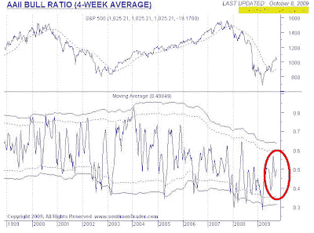

截至九月底的新闻信件作者也传达了同样的信息 - 没有出现看涨极端迹象。晨星公司也得出结论认为

最新数据显示，尽管股票反弹，但个人投资者还不是特别看涨。

日期：2024-05-18 00:45:03

我认为“泡沫”这个词被过度使用了。目前情绪模型的读数显示，投资者缺乏看涨情绪可能会对近期市场的任何弱点起到支撑作用。尽管从基本面来看存在很大的风险，但交易者可能还为时过早地考虑在这里做空市场。

# 上周，Barry Ritholz 写道：

> 

谦逊的市场学生：牛市在哪里？

来源：[`humblestudentofthemarkets.blogspot.com/2009/10/where-are-bulls.html#0001-01-01`](https://humblestudentofthemarkets.blogspot.com/2009/10/where-are-bulls.html#0001-01-01)

尽管基本面不佳，但信件作者指出看涨情绪似乎仍然掌控着市场。在一篇题为

一个泡沫市场？绝对是。

[基金投资者仍然没有买入股票市场的反弹](http://www.bloomberg.com/apps/news?pid=20601087&sid=aEMeIGVXfVFc)

> 大多数牛市行情并不会在被人讨厌时结束，它们在过度受欢迎和过度爱戴时停止并逆转。
> 
> 在

市场是否正在形成泡沫？

我们还没有到那一步。

显示，尽管股票反弹，但个人投资者还不是特别看涨。

[Mark Hulbert 的调查](http://www.marketwatch.com:80/story/contrarian-analysis-of-stock-market-2009-09-29?link=kiosk)

[最被讨厌的华尔街反弹](http://humblestudentofthemarkets.blogspot.com/2009/09/possible-market-crash-but-not-yet.html)

之前

[AAII 调查](http://www.sentimentrader.com/subscriber/charts/WEEKLY/SURVEY_AAII_BULLRATIO_4WK.htm)

我曾基于他们对共同基金流动数据的研究，表达了对股票市场状况的担忧。

显示，尽管股票反弹，但个人投资者还不是特别看涨。

**又是市场泡沫吗？**

泡沫？不。

分类：未分类
