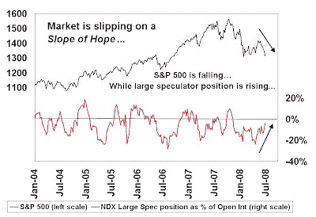

<!--yml

类别：未分类

日期：2024-05-18 01:08:17

-->

# 谦逊的市场学生：恐慌在哪里？

> 来源：[`humblestudentofthemarkets.blogspot.com/2008/06/where-is-fear.html#0001-01-01`](https://humblestudentofthemarkets.blogspot.com/2008/06/where-is-fear.html#0001-01-01)

标普 500 自 5 月中旬以来一直处于下行轨迹，现在该指数正在试探 3 月触及的低点。然而，情绪读数过于乐观，表明美国股市的进一步低点将在短期内出现。

首先，尽管

[AAII 情绪](http://www.sentimentrader.com/subscriber/charts/WEEKLY/SURVEY_AAII_BULLRATIO_4WK.htm)

是悲观的，但它并没有达到去年 3 月看到的悲观的极端水平。

纳斯达克 100 期货和大额投机者的净头寸一直是一个很好的逆向指标。如下图所示，最新的

[CFTC 交易者承诺数据](http://www.cftc.gov/marketreports/commitmentsoftraders/index.htm)

显示，纳斯达克 100 的大额投机者不仅没有在这个市场上放弃，他们还在买入这个跌幅。

****纳斯达克 100 期货和大额投机者净头寸**

其他[评论员](http://www.bloomberg.com/apps/news?pid=20601213&sid=ahHs.UEaziG8&)也指出，被称为“恐慌指标”的 VIX 指数并没有像 3 月和其他中期底部那样急剧上升：

**
