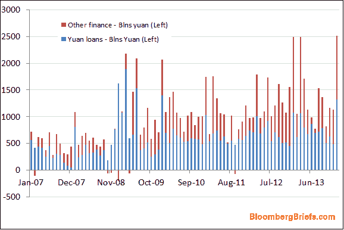

<!--yml

类别：未分类

日期：2024 年 05 月 18 日 03:43:21

-->

# [市场谦逊的学生：北京会再次眨眼吗？](https://humblestudentofthemarkets.blogspot.com/2014/02/will-beijing-blink-yet-one-more-time.html#0001-01-01)

> 来源：[`humblestudentofthemarkets.blogspot.com/2014/02/will-beijing-blink-yet-one-more-time.html#0001-01-01`](https://humblestudentofthemarkets.blogspot.com/2014/02/will-beijing-blink-yet-one-more-time.html#0001-01-01)

周二，

[横跨曲线](http://acrossthecurve.com/?p=12475)

发布了一则警报，提及了

[彭博社报道](http://www.bloomberg.com/news/2014-02-26/crisis-gauge-rises-to-record-high-as-swaps-avoided.html)

关于中国信贷压力上升的警报：

> 中国的信贷市场指标正触发警报，银行在互相放贷时变得谨慎，而投资者更倾向于最安全的政府债券。
> 
> 两年期主权收益率和类似期限的利率互换之间的利差，作为金融压力指标，于 2 月 19 日达到 121 个基点，创下了彭博数据自 2007 年以来的最高纪录。两天后，为了锁定一年期上海银行间拆放利率的成本，达到了 94 个基点，为八个月以来的最高水平，超过了基于回购协议的相似合同，因为它们涉及政府证券作为抵押品。
> 
> 亿万富翁投资者乔治·索罗斯（George Soros）和比尔·格罗斯（Bill Gross）将中国当前的情况与 2008 年金融危机前的美国情况相提并论。当时，交易员通过监测伦敦银行同业拆借利率与隔夜指数互换之间的差异来评估放贷意愿。根据野村控股有限公司的说法，中国第二大经济体总理李克强为遏制杠杆在全球第二大经济体中的蔓延而提高借贷成本，需要谨慎处理，以避免破坏对金融体系的信心。

此外，我最近强调了一种通过监视

[人民币离岸债券](http://www.investopedia.com/terms/d/dim-sum-bond.asp)

(DSUM)到 7-10 年期国债(IEF)组合交易（参见

[2014 年可能如同 1929 年](http://humblestudentofthemarkets.blogspot.com/2014/02/how-2014-could-be-like-1929.html)

）。事实上，DSUM/IEF 组合已明显突破了从 2012 年 7 月开始的相对上升趋势：

此外，

[人民币兑美元汇率急剧下跌](http://www.businessinsider.com/the-chinese-yuan-continues-to-weaken-2014-2)

。简言之，信贷和外汇市场开始因中国而感到恐慌。

**北京会如何反应？**

在过去，每当中国经济接近边缘并凝视深渊时，领导层都会眨眼，并以基础设施支出和信贷创造等老一套工具拯救经济。事实上，尽管有关改革和允许市场力量在经济中发挥更大作用的言论，中国仍然继续这样做。

改革在哪里？

还记得所有对于信贷过度增长以及约束影子银行系统所导致的通缩影响的担忧吗？

[彭博社](http://www.bloomberg.com/news/2014-02-15/china-january-new-loans-aggregate-financing-exceed-estimates.html)

最近报道称，信贷增长依然未受遏制：

> 1 月份中国的新信贷记录将有助于经济保持势头，同时凸显出官员们试图限制违约和坏账引发的金融动荡风险的挑战。
> 
> 中国社会融资总规模，即信用最广泛的度量，达到了 2.58 万亿元人民币（约合 4250 亿美元），中国人民银行在 2 月 15 日的声明中说。新增本币贷款为 1.32 万亿元，为 2010 年以来的最高水平。受到违约风险关注的信托贷款，约为去年同期的一半。

这张图表来自

[亚洲机密](http://asiaconf.com/2014/02/16/xi-risks-china-hard-landing/)

中国社会融资增长的图表形式更具有图形化：

那么，对于即将到来的两个信托产品违约所引发的金融传染的担忧又如何呢？（参见关于中国尾风险的讨论）

[2014 年可能重演 1929 年的情景](http://humblestudentofthemarkets.blogspot.ca/2014/02/how-2014-could-be-like-1929.html)

). 北京再次眨眼，救助了另一个信托产品（通过

[零息边缘](http://www.zerohedge.com/news/2014-02-17/china-folds-reforms-bails-out-2nd-shadow-banking-default-after-last-drop-blood-threa)

).

[亚洲机密](http://asiaconf.com/2014/02/16/xi-risks-china-hard-landing/)

为缺乏适当的政策响应而感到不安：

> 近几周来，关于中国紧缩和去杠杆的过度炒作不少。的确，银行间利率和企业债券收益率在过去一年中显著上升。但如果考虑到中央银行向银行间市场注入资金和未对冲的外汇购买——即中央银行购买外币以维持部分美元挂钩——很显然，根本没有净紧缩。
> 
> 至于去杠杆，周末发布的我国贷款数据应该足以驳斥这一说法。1 月份的贷款是四年来最高的。更令人担忧的是，总社会融资——包括影子融资在内的信用广泛度量——增加到 2.58 万亿元，分析师预期的 1.9 万亿元相形见绌。尽管利率不断上升，中国对信贷的依赖依然如故。

他们建议的解决政策是让市场力量更快地占据主导地位：

> 事实上，中国国家主席习近平还没有做足够的事情来刺破国家的信贷泡沫。他需要迅速做三件事情：1)允许财富管理产品违约，以便风险得到合理定价；2)加速去年年底制定的结构性改革；3)将北京对 GDP 增长的底线从 7%降低到更现实的 6%。如果没有这些措施，习近平面临着未来不久可能出现更大规模的经济危机的风险。

**改革再次受挫？**

尽管最近

[房地产市场贷款减少引发市场紧张](http://www.bloomberg.com/news/2014-02-24/china-s-stock-index-futures-drop-on-property-financing-concerns.html)

，北京展现出一贯的推动改革议程的模式，但在关键的经济部门边缘徘徊，不愿意痛下决心。如果历史能提供任何指导，那么中国领导人在改革上会继续表现得强硬，但当它们遭遇根深蒂固的利益时，这些举措最终会被弱化。

在我写下这些文字的时候，亚洲股市大体呈现积极态势，上证综合指数和恒生指数都有所上涨。美国股指期货也处于绿色状态。尽管信贷和外汇市场充满了焦虑，股市仍然在赌北京还会再次屈服。

**Cam Hui 是 Qwest Investment Fund Management Ltd.（“Qwest”）的投资组合经理。博客中表达的观点和任何建议均代表作者个人观点，并不反映 Qwest 的观点和建议。Qwest 审阅 Hui 先生的博客，以确保它与 Hui 先生对博客读者的公平、诚实和善意义务相符。”

本博客中表达的任何信息或观点均不构成购买或出售任何证券或其他工具的邀请。本博客中的任何内容都不构成投资建议，且可能包含的任何建议未基于对任何特定接收者的投资目标、财务状况或特定需求的考虑。任何证券或其他工具的购买或出售活动应基于您自己的分析和结论。过去的表现不代表未来的结果。Qwest 或我可能持有或控制与本博客中提到的证券或工具相关的多头或空头头寸。*
