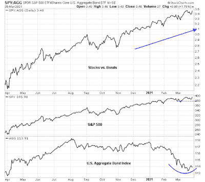

<!--yml

类别：未分类

日期：2024-05-18 02:02:35

-->

# 谦逊的市场学生：组合再平衡会让股市下跌吗？

> 来源：[`humblestudentofthemarkets.blogspot.com/2021/03/will-portfolio-rebalancing-sink-equities.html#0001-01-01`](https://humblestudentofthemarkets.blogspot.com/2021/03/will-portfolio-rebalancing-sink-equities.html#0001-01-01)

**序言：解释我们的市场时机模型**

我们维护了几个市场时机模型，每个模型的时间范围都不相同。"

**终极市场时机模型**

"是基于我们帖子中概述的研究的长期市场时机模型，

[构建终极市场时机模型](https://humblestudentofthemarkets.com/2016/01/26/building-the-ultimate-market-timing-model/)

。这个模型倾向于每个十年只产生少数几个信号。

The

**趋势资产配置模型**

是一个基于全球股票和商品价格输入的应用趋势追踪原则的资产配置模型。这个模型的时间范围较短，每年大约会周转 4-6 次。本质上，它试图回答这样的问题：“全球经济的趋势是扩张（看涨）还是收缩（看跌）？”

我的内部交易员使用一个

**交易模型**

，这是价格动量（趋势模型是否变得更加看涨或看跌？）和超买/超卖极端值（如果趋势超买，不要买入，反之亦然）的混合。订阅者会收到模型变化的实时警报，以及电子邮件警报的假设交易记录每周更新

[在此](https://humblestudentofthemarkets.com/trading-track-record/)

。以下是从 2016 年 3 月开始的真实时间警报的交易模型假设交易记录。

每个模型的最新信号如下：

+   终极市场时机模型：买入股票*

+   趋势模型信号：看涨*

+   交易模型：看涨*

**性能图表和模型读数因尊重我们的付费订阅者而延迟了一周。**更新时间表

：我通常在我的

[网站](https://humblestudentofthemarkets.com/)

在周末以及在@humblestudent 上发布中期观察。订阅者会收到交易模型变化的实时警报，以及那些电子邮件警报的假设交易记录显示

[在此](https://humblestudentofthemarkets.com/trading-track-record/)

。

订阅者可以实时访问最新的信号

[在此](https://humblestudentofthemarkets.com/my-inner-trader/)

。

**当日主题：再平衡**

上周我与其他一位投资专业人士讨论了组合再平衡可能对短期资产价格产生的影响。本季度股票大幅优于固定收益投资，平衡基金管理者将不得不通过卖出股票和买入债券来再平衡他们的组合。

重新平衡效应有多重要？似乎所有的交易台都在谈论它。为了增加混乱，摩根大通的衍生品分析师 Marko Kolanovic 发布了一份研究笔记，称“将不会有每月卖出，实际上可能会有股票在月底买入。缺乏这些流动，以及对‘月/季度末’效应的普遍预期，可能会导致在短期内市场走高，其他条件相同。”

真实情况是什么？

完整的帖子可以找到

[在此处](https://humblestudentofthemarkets.com/2021/03/28/will-portfolio-rebalancing-sink-equities/)

.
