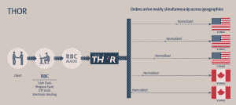

<!--yml

category: 未分类

date: 2024-05-18 14:22:16

-->

# IEX: 合同论—— Mahwah 狙击手与朋友们

> 来源：[`sniperinmahwah.wordpress.com/2014/03/30/iex-de-contractibus/#0001-01-01`](https://sniperinmahwah.wordpress.com/2014/03/30/iex-de-contractibus/#0001-01-01)

**公平与合同**

在接下来的几天里，我将发布一篇标题为“从事高频交易”的文章，我在其中总结了两年在高频交易海洋世界以及近期电子市场的新微观结构中的沉浸学习所得。根据乔尔·哈斯布鲁克（Joel Hasbrouck）的经典著作《经验市场微观结构》，术语“市场微观结构”首次出现在 1976 年马克·加曼（Mark Garman）的一篇[论文](http://econpapers.repec.org/article/eeejfinec/v_3a3_3ay_3a1976_3ai_3a3_3ap_3a257-275.htm)中：“*我们从交换理论的通常方法出发，通过（1）假设市场参与者之间的异步、时间离散的市场活动[…]*” (加曼)。但我发现的一个迷人之处是，最早研究交易所“微观结构”的是 13 世纪的经院哲学家和神学家——这些神学家在这个地区（法国南部和意大利）同时创造了“风险”、“价值”和“套利”这些词汇。市场社会学家胡安·帕尔多-瓜尔拉（Juan Pardo-Guerra，伦敦政治经济学院）最近在推特上问了一个很好的问题：“*我想知道：高频交易是否是在一种新亚里士多德式的货币和流动性观念下运作的？*”这也是我心中一直有的问题，我认为通过阅读这些编写了几千本关于各种亚里士多德概念的书籍的神学家们——包括“货币”和“交换”这些概念——可以找到一些答案。

我不会详细说明神学家（和上帝）在市场/交易所（研究）历史上的重要性。我们只需记住，他们通过与商人（代理人）紧密合作，以及仔细阅读和分析商人使用的合同，研究了人与人之间的商品交换。他们对合同进行了深入分析（试图理解市场的“宏观结构”，而不仅仅是具体合同的技术特点）。一本非常有趣的著作是彼得·奥利维（Petrus Joannis Olivi，1248-1298）于 1293 年左右创作的《合同论》（*Tractatus De Contractibus*，合同论），任何研究交换本质的学术都应该阅读这本书，这是非常重要的一块知识，可以帮助理解市场电子微观结构的一些问题（例如：经院学者研究了*pretium iustum mathematicum*，即“事物的真正数学价格”，因为你可以“无限分割”货币，所以这个价格是可无限分割的——想想价格最小变动单位的问题）。

在《合同论》中，你可以读到这句话（第一章，第三部分，第 46 条）：“…*因为这种共同的声明或咒语具有共同评估有价物品的力量，而且由于这种无知，欺诈行为在这里不能像在隐秘的合同中那样发生*…”。这本书没有英文版（2012 年出版了一本非常好的[法文版](http://www.lesbelleslettres.com/livre/?GCOI=22510100840450)），但简而言之，Olivi 认为，一种商品的价格需要通过公开喊价（*communis proclamacio*）由同等信息的代理商进行评估；共同和公开的价格评估限制了欺诈的风险，因为所有代理商都意识到真正的价格。这就是 Olivi 将我们今天所说的“lit 市场”（在此市场中，订单簿（和价格）对每个人都是可见的）与仅由两人协商的“秘密合同”（我们今天称之为“场外交易”）区分开来的原因。“*contractibus occultis*”Olivi 所谈论的是一个价格形成不透明、不公开的时间和空间。换句话说，简单地说，“*contractibus occultis*”就是一个暗池。

**IEX**

大约五个月前，当我阅读 Olivi 的论文（其中公平性是一个重要议题）时，通过 Twitter 发现了这份[文件](https://s3.amazonaws.com/iextrading/docs/Form+ATS-Redacted.pdf)。这令人惊讶，因为这种官方文件并不常见。Form ATS 是证券交易委员会（SEC）要求在新的**替代交易系统**启动时必须提交的法律文件：“*替代交易系统必须提交的用于通知证券交易委员会其活动形式的表格*”。替代交易系统的所有者必须详细说明平台如何运作，提供哪种类型的订单，如何进行其他交易场所的路由等。换句话说，这是一种合同。

**IEX**是由一个名为 IEX 的新暗池发布的。这是一个相对透明的暗池，因为他们决定在自己的网站上披露该表格。我之前从未听说过 IEX，但是事实是我能够通读整个表格，而且作为一位非职业交易员（我从 2012 年初开始从事 HFT 工作），我几乎理解了每一个词。由于市场微观结构非常复杂（我曾经试图阅读《国家市场系统监管规则》，但在某个时候我怀疑监管机构自己是否理解他们所写的内容），因此我认为阅读这样一份清晰的文件以及看到一个暗池试图简化一个因《国家市场系统监管规则》而变得更加复杂和技术的微观结构是值得注意的。

我在 2013 年的末尾联系了 IEX，以了解更多关于他们模型的信息。几天前，该平台在高盛的加里·科恩（Gary Cohn）[公开支持](http://www.bloomberg.com/news/2014-03-22/goldman-sachs-endorses-iex-stock-market-built-to-fight-predators.html)新的暗池交易时达到了顶峰（尽管他们有自己的暗池名为 Sigma-X）。IEX 成为新闻的原因之一是，新的暗池似乎是为了应对高频交易的新范式而设计的。自 2007 年以来，高频交易一直是备受讨论的话题。我不会讨论高频交易本身是好是坏*本身*，但不可否认的是，作为一种实践，高频交易引发了一些关于公平性的问题，IEX 决定解决其中的一些问题。以下是一些关键点。

**空间**

在新的高频交易世界中，时间和空间至关重要。交易所现在位于不同的数据中心，传输时间在一个订单可以在毫秒级完成填充的生态系统中非常重要。因此（一些）交易员现在与这些数据中心共同位置，以更接近匹配引擎；通过共同位置算法拥有“直接市场接入”（DMA），这样他们可以从交易所/匹配引擎接收最新的价格。但是，没有与交易所共同位置且居住在加利福尼亚的交易员在他的屏幕上会看到在新泽西/芝加哥数据中心不再存在的价格。即使美国证券交易委员会（SEC）通过 SIP 创建了最佳买卖报价（NBBO），其中全国价格向数百万用户报告，但众所周知，NBBO 运作得并不好（参见我关于 2013 年 8 月 SIP 和纳斯达克崩盘的[帖子](https://sniperinmahwah.wordpress.com/2013/08/26/nasdark-2-de-lespace-et-du-temps/)）。因此，股票可能会有两个不同的价格（这并不是什么新鲜事，中世纪学者对此进行了大量研究），并且价格取决于与交易所的接近程度（这也是老生常谈，在旧交易场中，一切都是关于接近——为了听到和看到）。

但市场的碎片化、技术复杂性、不完善的全国最佳买卖报价（NBBO）以及其他因素，让高频交易（HF）员可以在 NBBO 价格和直接市场接入（DMA）价格之间玩一些游戏。因此，IEX 平台被设计为向所有交易员提供平等的接入机会：IEX 不提供共置服务；所有算法都在同一个点上——位于 Equinix 数据中心内的 Secaucus，Bats-DE 将于 2015 年搬迁至此——匹配引擎则位于 Weehawken 的 Savvis 数据中心。两栋楼之间的电缆长度定义了它们之间 350 微秒的延迟。这关乎公平。更重要的是，IEX 以最快的方式计算出自己的 NBBO：“*包括交易所和经纪商的暗池在内的某些交易场所，将使用落后于直接数据流的证券信息处理器（SIP）。结果是，这些场所可能会以相对于直接数据流的暗池定价过时的价格执行订单。这可以让那些认识到 SIP 定价与直接数据流暗池报价之间的价格差异的更快市场参与者，产生无风险利润*”，IEX 的首席运营官 John Schwall 说。“*我想补充的是，通过允许共置和使用比高频交易（HFT）更慢的市场数据*，”IEX 的首席执行官 Brad Kastuyama 说，“*一个交易所或暗池会失去在两个参与者之间公平定价交易的能力，尤其是对一个快速和一个慢速的参与者*。”

虽然 IEX 不提供共置服务，但为了确保基于从交易所获取的最新市场数据 IEX 执行其订单 true NBBO，暗池订阅了所有美国交易所的直接市场数据流，这样它就可以计算出“*真正的 NBBO*”。尽管行业中有些人将他们称为“较慢的交易所”，但他们在计算 NBBO 方面实际上非常快。Katsuyama 说：“*我们所有的参与者都依赖我们为他们提供公平价格。较慢的参与者，长期投资者，最依赖我们为他们公平定价交易。因此，为了对所有参与者公平，我们在确保我们快速方面投入了大量时间和金钱*”。所有高频交易公司都有资格在 IEX 上交易（他们可以提供有利的套利机会），但大多数这些公司似乎已经决定不加入这个新平台——是因为他们的（套利）策略无法再奏效了吗？还是因为 IEX 的技术微观结构在定价方面不允许他们比 IEX“更快”？尽管如此，似乎像 Virtu 这样的高频交易公司正在 IEX 上进行高频交易做市。

桥田说：“当人们问我关于‘好’高频交易和‘坏’高频交易时，对于‘好’高频交易，我总是用一个例子来说明，那就是在 ETF 和 underlying 股票之间制造市场，或者在两个不同国家上市的同一家公司的股票价格差异之间进行套利（这称为交叉上市股票）。正如我们网站所显示的，Virtu 在 IEX 交易。他们是我们总交易量的一小部分（最近的报道显示高盛是 IEX 最大的交易员），但在 ETF 和交叉上市股票方面，他们分别是第二和第一。数据显示，Virtu 在 IEX 上为合法的套利机会提供流动性，发挥着积极的作用。其他拒绝加入 IEX 进行交易的高频交易公司——你可以自己得出任何结论。我无法评论 Virtu 在其他交易所的行为，但在 IEX，他们为我们的参与者生态系统提供服务，应该为此得到认可。”

**时间**

联合位置关乎空间，也关乎（当然）时间。最近在 Twitter 上，像@[scottavdiros](https://twitter.com/ScottAvdiros)（一家高频交易公司的一位匿名高管）、[@RemcoLenterman](https://twitter.com/RemcoLenterman)（来自 IMC & FIAEPTA）、[@JaffrayW](https://twitter.com/JaffrayW)、[@DaveLauer](https://twitter.com/DLauer)、[@marascio](https://twitter.com/marascio) 以及其他一些人，就“延迟套利”进行了大量讨论。有人说，延迟套利其实并不存在，这只是用来讨论不同类型套利的一个名称。但最早思考延迟套利的人之一是西塞罗，大约在公元前 80 年左右（当时的技术是：船只）。经院学者们对商品套利进行了大量研究（当时的技术是：更快的马）。“闪交易”这个词可以在 1870 年的芝加哥报纸上找到（当时的技术是：更快的电报/股票行情机）。2014 年，我们有高频交易和微秒（当时的技术是：优秀的代码、强大的计算机、神经网络、微波传输——我就说到这里，名单太长了）。

“延迟套利”和人类交易所一样古老，换句话说，所有的套利都是延迟套利，例如空间套利。这就是为什么，在一个每个毫秒都很重要的世界里，IEX 决定稍微放慢时间流的脚步：交易员必须等待。“*延迟存在于 IEX 入站 Point of Presence (POP) 网关和匹配引擎/智能路由器之间。因此，每个经纪人的订单、取消和执行在 POP 和核心匹配引擎/路由器之间需要花费 350 微秒。这种延迟确保（1）IEX 能够在其订单簿从直接馈送更新之前，任何参与者都有机会“摘取”陈旧的报价，并且（2）没有任何参与者能够从 IEX 获取执行并与其他场地的可路由订单赛跑。因此，我们在所有场地的执行率接近 100%*”，John Schwall 说。在新的电子市场微观结构中，将订单从一个地方路由到另一个地方是一个关键问题——在这里，IEX 平台通过在平台用于出站路由时防止“延迟套利”来保护免受套利。

在一个交易所分散在各个场地的世界里，订单路由（如 Reg NMS 所定义）很重要，平台需要具备良好的智能订单路由（SOR）。IEX 的许多员工——包括首席执行官 Brad Kastuyama ——以前在 RBC 资本市场工作，他们开发了一种名为 Thor 的 SOR。“*Thor 旨在实现跨所有场地的同时到达，以消除延迟套利。意识到 Thor 只为 RBC 的客户解决了套利问题，导致意识到团队如果建立一个允许客户通过任何经纪人交易时消除不必要的套利的交易场所，我们可以取得更大的成功*”。设计 Thor 的团队中的一些人随后离开了 RBC，18 个月后 IEX 问世。

**订单类型**

市场的碎片化和去 mutualization 导致了订单类型的激增。每个交易所都可以提出不同类型的订单，其中一些是为了与新的高频交易（HFT）世界保持一致而设计的——参见 DirectEdge。关于订单的复杂性有很多可以说（Haim “Whistleblower” Bodek 写了一些非常有趣的[论文](http://haimbodek.com/research.html)关于这一点）——似乎有些订单在平等访问订单簿价格方面被认为是公平的。此外，回扣的作用也存在争议。IEX 决定简化事物：只有四种订单类型，没有制造商-消费者模型。

“*我们不支付回扣（固定费用定价）使得我们的订单类型**套装更加简单。没有设计用来产生回扣的订单类型。**我们有市场订单、限价单、全成交或取消订单以及中间点挂单。最受欢迎的**订单类型是中间点挂单……我们的订单约有 80%**在中间成交……为双方提供 0.005 的改进”。*更多统计数据可以在[这里](http://iextrading.com/insight/stats/)找到，*以及[Form ATS](https://s3.amazonaws.com/iextrading/docs/Form+ATS-Redacted.pdf)文件详细说明了订单类型。*也请查看[`iamaninvestor.org`](http://iamaninvestor.org)。

**监管套利与公平性**

“*未来令人激动，但历史视角也同样重要。IEX 将交易过程带回到了它可能在过去 10 年监管变革的意外后果之前本应所在的地方*” iex 业务发展部新上任的负责人 Jay Fraser 说。[他补充道](http://www.wallstreetandtech.com/electronic-trading/exclusive-iex-hires-jay-fraser-to-expand/240166847)。“监管变革的意外后果”创造了不同类型的套利——有些人称它们为“监管套利”或“技术套利”等。新规定增加了这些附带损害。有些人认为 IEX 想消除所有类型的“套利”，但这并不完全正确——IEX 只是想避免不必要的延迟套利，并简化价格形成。

没有托管位置，没有回扣，但借助他们的 SOR 和自己的 NBBO，IEX 是对新高频交易范式附带损害的一种有趣尝试——即使高频交易公司受到 IEX 的欢迎：他们可以提供在相关工具（股票期货、ETF、交叉上市股票等）上的有益套利。套利可能是一个对市场微观结构研究的考古学家最有趣的问题——交易员可以用几乎所有东西进行套利。如我下面所写，套利的根源似乎可以追溯到这些 13 世纪的经院哲学家，他们是最先谈论“风险”的人。在接下来的几个月里，我将尝试更深入地研究“风险”、“套利”和“公平性”之间的联系。

**闪电男孩**

高频交易界的人都知道，迈克尔·刘易斯（Michael Lewis）的新书《*Flash Boys*》（[闪购男孩](http://www.amazon.com/Flash-Boys-Wall-Street-Revolt/dp/0393244660)）将在几小时后出版。作为一名首先从事书籍出版的业者，我联系了 W.W. Norton 出版社的一些同事，以获取该书的校样（我已经翻译并出版了 Norton 出版社的几本书籍），但得到的回答是否定的：这本书已经“锁定”。但有些传言称，IEX 的首席执行官 Brad Katsuyama 在书中被描述为“明星”，IEX 将被介绍为一个可以平衡竞争环境（该平台可能打算进入“公开市场”）的新交易所。更甚者，迈克尔·刘易斯将于今天稍后出现在[*60 分钟*](http://www.cbsnews.com/news/stock-market-rigged-says-michael-lewis-in-new-book/)节目上。因此，在接下来的几小时内，我们应该更多地了解 IEX。毫无疑问，关于市场微观结构的 Twitter 讨论（在过去的几天里非常有趣）将从今晚开始变得激烈。我们必须关注。

###### 这篇文章献给我的朋友 Marius Laumonier，他于 2014 年 3 月 29 日 00:23 以及几毫秒后出生。
