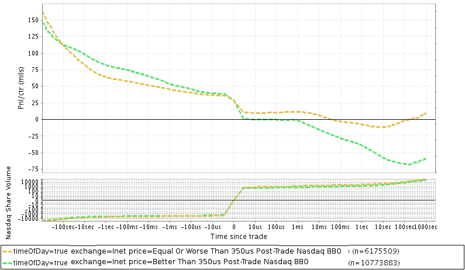
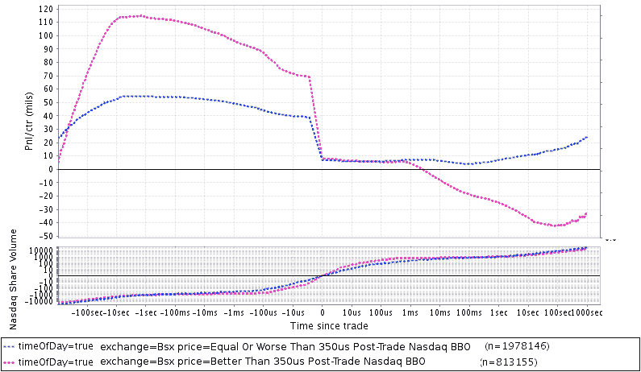

<!--yml

分类：未分类

日期：2024-05-18 06:42:49

-->

# [IEX PEG 订单：股票市场的最后一眼？](https://mechanicalmarkets.wordpress.com/2015/10/05/iex-peg-orders-last-look-for-equity-markets/#0001-01-01) | 机械市场

> 来源：[`mechanicalmarkets.wordpress.com/2015/10/05/iex-peg-orders-last-look-for-equity-markets/#0001-01-01`](https://mechanicalmarkets.wordpress.com/2015/10/05/iex-peg-orders-last-look-for-equity-markets/#0001-01-01)

最近，Matt Levine [挑战](http://www.bloombergview.com/articles/2015-09-16/the-flash-boys-exchange-is-growing-up)了他的读者描述 IEX 的速度障碍如何可能被操纵：

> 对于***我***来说，很难想出一种操纵它的方法。你们都很聪明，请告诉我如何操纵它。奖品也许是你可以操纵它。

我曾经[讨论过](https://mechanicalmarkets.wordpress.com/2015/08/11/iex-ideology-and-the-role-of-an-exchange/)IEX 平台的一些问题。在这篇文章中，我将为其中一些问题添加详细说明。虽然将一个交易所标记为“可以操纵”的说法是主观的，但 IEX PEG 订单让我想起了其他市场的争议。我没有看过 IEX 的源代码或系统设计，因此这篇文章是一种推测。

所有发送到 IEX 的订单都经过 350 微秒的“鞋盒”延迟，即录入时。但是，交易所不会对诸如 PEG 订单之类的算法订单类型应用延迟。这种行为旨在防止邪恶的交易者在看到其他交易所的报价变化后，迅速向 IEX 提交侵略性订单，希望击中定价在现在过时价格的订单。[1] IEX 的意图是好的。但是，如果鞋盒延迟没有精细调整，可能会产生一些不良的副作用。

# 最后一眼

许多现货外汇交易所的订单受到所谓的“最后一眼”的约束，在匹配后，休息方可能会在决定是否进行交易之前稍作等待。最后一眼有助于银行提供流动性的提供商避免被“抢购”，并通过让他们在市场不利时退出填充来给他们提供选择价值。它可能为合法的商业目的提供服务，但很容易理解为什么这种做法是[有争议的](http://www.bloomberg.com/news/articles/2015-03-03/barclays-last-look-at-currency-trades-said-to-face-u-s-review)。例如，BlackRock 已经[表示](http://www.bloomberg.com/news/articles/2015-02-24/eliminate-phantom-liquidity-in-currency-markets-blackrock-says)最后一眼导致了“幻觉流动性”。

IEX PEG 订单提供了类似“条件”的最后一眼。与交易员自行决定取消订单不同，PEG 订单只有在收到订单后 350 微秒内 NBBO 移动时才会选择退出执行。[2] 这种限制使它们比真正的最后一眼不那么有价值，但它们的选择价值仍然非常重要。有多重要？我估计值约为半个滴答。为了给一个大致的想法，这里是纳斯达克交易的交易情况，根据纳斯达克是否在 350 微秒后以相同价格提供报价进行分组：

顶部面板：与交易时间的距离相比，每股平均市场定价利润或损失，从交易的被动方的角度来看。交易按其价格与（整数股）纳斯达克 BBO 350us 后交易的价格比较分组。简而言之，如果纳斯达克在类似 IEX 取消其 peg 订单的情况下撤回其订单，纳斯达克将防止所有“优于 350us 后交易纳斯达克 BBO”组的交易。剩下的组（“等于或低于 350us 后交易纳斯达克 BBO”）在收到约 3000 万美元的退款后将非常盈利。只有可见执行。 “市场价格”是最新的 100 股的平均价格。图表是在 2014 年 8 月的 8 天内，不包括费用和退款。底部面板：纳斯达克交易的股票与交易时间（包括基准交易）。

这是纳斯达克 BX 上同质交易的情况，同样按其与纳斯达克（Inet）BBO 350us 后交易的价格比较分组：

其他非托管交易所（如[BatsZ](https://mechanicalmarkets.wordpress.com/wp-content/uploads/2015/10/aug2x_batsz_vsinetbbo350uspostfill.png)或[EdgeX](https://mechanicalmarkets.wordpress.com/wp-content/uploads/2015/10/aug2x_edgex_vsinetbbo350uspostfill.png)）我所检查的类似。

这些图表只是对 IEX 提供的期权价值的暗示，并且在精神上最接近 IEX 主要的 peg 订单，这些订单（我认为）只在 350us 后交易的 NBBO 交易。 [3] 中点 peg 和 D-Peg 从领先优势中获得的边缘更难以估计，但我预计它相当可观。

可能有人认为我描述的边缘效应只是因为 IEX 成功地防止了 peg 订单被“挑选”。并非如此。当一个订单的对立面对于本应导致该订单重新定价的事件做出反应时，该订单就会被“挑选”。IEX 使用对立面在提交订单时所没有的信息来重新定价 peg 订单。股票市场是去中心化的，部分不同步——IEX 声称已经解决了所有竞争条件，但他们只解决了一个，并且通过这样做，他们创造了其他问题。 [4]

# peg 订单边缘的来源

高级交易员可能会通过简单地发送 peg 订单而不是正常坚定的订单，利用 IEX 提供的期权价值。如果他们足够快，成为 IEX 接收的第一批 peg 订单，那么估计的 5000 万美元的边缘可能会使亏损策略变得极具盈利性。

这些资金来自哪里？我认为主要来自两个群体：

**1)** 其他交易所上的所有挂起订单：

**A)** IEX 的挂单价格使用其他交易所的报价。原本在经济上不可行的挂单订单现在通过使用关于这些报价未来状态的信息变得有利可图。

**B)** 这些挂单将在 IEX 上广泛传播。

**C)** 发送到 IEX 的订单本可以路由到其他交易所，但现在将与其他传播的挂单交易。

**D)** 这将导致在其他每个交易所的被动订单获得更少、更有毒的成交。

**E)** 市场制造商可能会放宽他们的报价以补偿这种逆向选择。

**2)** IEX 上的高阿尔法激进订单：

**A)** 激进的交易员可能会引起或预测其他交易所上的价格变动。

**B)** IEX 会看到在这些收到激进订单之后发生的价格变动，并撤销那些本来可以执行的挂单。这种流动性的枯竭可能会伤害到迈克尔·刘易斯想要保护的同一群交易员。[流动性枯竭](https://mechanicalmarkets.wordpress.com/2015/08/11/iex-ideology-and-the-role-of-an-exchange/#2iex2)可能会对交易造成损害，将交易从赢/输的情况转变为赢/修正的情况。

**C)** 激进的交易员可以在将订单发送到其他交易所之前，提前 350 微秒将订单发送到 IEX，以泰尔的精神进行操作。这将防止 IEX 利用未来的信息来撤销挂单。推迟订单并不总是一个选项；如果激进的交易员是一个对交易做出反应的执行算法，它不能推迟任何订单。如果它这样做，一个竞争性的执行算法（或 HFT）可能会清除可用的流动性。泰尔式的延迟可能适合人类交易员，但对于绝大多数由计算机执行的成交量来说并不 helpful。

# 非预期使用

精确地知道这些订单将如何表现，先进的交易员可以比其他用户更有效地将它们整合到他们的策略中。我敢打赌，简单地将其他交易所发布的报价复制到 IEX 上并用挂单进行操作是有利可图的。IEX 允许交易员从其他交易所复制流动性，而不必承担通常伴随的风险。而且，这种收入的大部分将由高速交易员赚取。当存在这种结构性效率时，最快的订单会抓住利润。对于 HFT 来说，每股 50 美元的边缘是非常有吸引力的，我预计许多交易员将很快参与到争夺“挂单队列”第一名的竞争中（如果他们还没有的话）。

我相信还有很多其他例子，条件执行通过速度障碍改变了交易的状况，将交易从赢/输转变为赢/修正。 [5][6]

# 理解交易的时序

从某种角度看，IEX 的速度障碍听起来并不那么显著；350 微秒不及眨眼时间的一百分之一。但是，不管喜欢与否，如今大部分交易都是由计算机完成的，包括代表基本交易者的交易。市场专业人士知道，在数百微秒内可以发生很多事情，而这样的速度优势可以保证盈利。IEX 也清楚这一点。联合创始人丹·艾森（Dan Aisen）[表示](http://blog.quantopian.com/the-genesis-of-an-order-type-by-daniel-aisen/)，“350 微秒是一个巨大的领先优势。”

选择性应用速度障碍在经济上等同于交易所分发一个秘密数据流，为选定的交易员提供关于订单簿变化的提前通知。一个简单的系统更新可以解决这个问题。IEX 可以使自己的挂单不会以过时的价格执行，而不使用对手方尚不知道的信息。

外汇交易员理解与最后查看流动性互动的后果，并将他们的订单路由到其他地方。股票市场则不同。或许最后查看会缩小零售交易员的价差。但在我们将它引入我们的股票市场之前，我们应该仔细考虑。

[1] 一个粗略的例子，展示了 IEX 希望避免的情况：

1.  纳斯达克为一只股票设定了最佳买卖报价（NBBO），为 10.00/10.01。

1.  IEX 在其买入价上有一个主要挂单，目前休息在 10.00。

1.  有人向纳斯达克发送了一个大额卖出订单，清除了买入价并在 10.00 留下了部分数量。新的 NBBO 是 9.99/10.00。

1.  高速交易员 A 看到这一点后，迅速向 IEX 发送了一个以 10.00 卖出的订单。

如果 IEX 在得知 NBBO 改变之前就收到了交易员 A 的卖出订单，那么它们将以 10.00 的价格执行该订单对抗挂单。这对挂单来说将是坏事。因此，IEX 将高速交易者的订单延迟了 350 微秒，这足以让它们看到 NBBO 已经改变，并将挂单价格重新调整为 9.99，防止它被“抓取”。

[2] 大部分情况下是这样的。D-Peg 订单在其收到传入订单后 350 微秒调整价格，以响应 NBBO 的报价数量。如果你感兴趣，D-Peg 的机制现在已经公开。它们在这份[PDF](http://www.sec.gov/rules/other/2015/investors-exchange-form-1-exhibits-a-e.pdf)的第 210 页，这是 IEX 交易所[申请](http://www.sec.gov/rules/other/2015/investors-exchange-form-1.htm)的一部分。

[3] 以下是一些与 IEX 主要挂单不同的数据差异：

1.  NBBO 与纳斯达克 BBO 不同。包括具有反转定价的交易所（Bx, EdgeA, BatsY）在内，这应该会使这一优势更大。

1.  不同的交易所和不同的订单类型有不同的交易者群体。

1.  纳斯达克到 IEX 系统的市场数据消息需要一定时间传输。细节可能会让你感到无聊，但 IEX 的速度优势会因交易所而异。从 Carteret 到 Weehawken 的商品[光纤](http://hudsonfiber.com/downloads/HFN_world-map-8.5x11.pdf)消息单程大约需要 180 微秒。在[无线](http://www.nasdaqtrader.com/content/Productsservices/trading/CoLo/ExpressConnectFS.pdf)网络上，从 Carteret 到 IEX 在 Secaucus 的 POP 的消息可能需要大约 90 微秒。因此，高频交易可能比 IEX 提前 90 微秒收到纳斯达克的消息，这意味着 IEX 在响应纳斯达克方面可能有 260 微秒的领先优势（350 微秒 - 90 微秒）。对于在 Secaucus 的 4 个 Bats 交易所，IEX 将基本上有完整的 350 微秒领先优势。对于 NYSE 交易所，IEX 应该有较小的优势。如果任何高频交易者愿意将市场数据无线发送到 NJ，那么 IEX 从芝加哥的 CHX 接收市场数据可能会比他们晚很多。如果 IEX 通过无线网络获取其市场数据，这将使它们对来自每个交易所的消息有完整的领先优势，并且根据他们的标准，这将是一个微小的[费用](http://images.qnasdaqomx.com/Web/NASDAQOMX/%7B7a771fbc-7e3f-4ec7-9bb0-fba9938b7fb9%7D_MMWfaqs_August_2015_-_clean.pdf)。

[4] 对于有软件经验的读者，这里有一个类比：

假设你有一些多线程软件。软件处理两类事件的流，A 和 B。有时，类型 A 的事件稍微在类型 B 之前发生，但类型 A 的事件处理往往较慢。由于这种缓慢，软件经常先完成类型 B 的事件。这导致事件被处理顺序错乱，后果不堪设想。你的测量显示，类型 A 的处理通常比类型 B 慢 100 微秒，但不会超过 300 微秒。因此，你决定延迟所有类型 B 事件 350 微秒，因为这将确保它们永远无法战胜任何首先发生的类型 A 事件。你为自己的聪明感到非常自豪，并告诉你的客户他们的同步问题已经解决了。

如果“类型 A”事件是导致您重新定价挂单的 NBBO 变化，而“类型 B”事件是所有其他客户订单，那么这个类比与交易所速度障碍的想法非常接近。当然，问题在于现在“类型 B”订单有了速度劣势，这意味着，如果在他们收到后价格很快变动，他们无法与挂单匹配。在软件中有方法可以正确处理这些情况。只是向选择的事件添加一个常数延迟并不是其中之一。

[5] 这里有一个只有高频交易才会尝试的非常愚蠢的策略：

1.  股票的 NBBO 由纳斯达克设定为 10.00/10.05。

1.  高频交易观察到纳斯达克的一个隐藏交易价格为 10.03。

1.  高频交易知道在 10.03 很可能仍然有隐藏的流动性可用，因为休息的隐藏订单通常较大。

1.  隐藏交易的被动方不会在市场数据中分布。但高频交易有一个模型，估计有 70%的可能性休息的一方是买入价。

1.  如果高频交易（HFT）对该估计更有信心，它可以向 Bats 提交一个中间价买入订单，可能会以 10.025 的价格成交，低于隐藏订单刚刚支付的价格。然而，估计出错的可能性高达 30%——如果有人向 Bats 发送大量卖出订单以检查隐藏流动性，并在不久之后清扫纳斯达克的买入价，高频交易将会面临有毒的成交。

1.  高频交易改为向 IEX 提交一个中间价买入 peg 订单。

1.  现在，如果他们的猜测错误，他们受到了保护。当 IEX 收到同样的积极订单以检查隐藏流动性时，它会将其保留 350 微秒。在持有该订单的同时，IEX 看到纳斯达克的买入价被清扫，并撤销了高频交易的中间价订单。

1.  如果高频交易的猜测正确，并且有人向 IEX 和纳斯达克发送大量卖出订单，纳斯达克的隐藏订单将以 10.03 的价格成交，保持显示的买入价不变。高频交易的订单将在 IEX 以 10.025 的价格执行，这比隐藏订单收到的价格更好。

在市场状况恶化后，peg 订单远离成交的同时，IEX 使用非延迟数据帮助 peg 订单积极交易休息流动性，有可能会在其自己的交易所上“挑选”订单。我之前[写过博客](https://mechanicalmarkets.wordpress.com/2015/08/11/iex-ideology-and-the-role-of-an-exchange/#3iex2)关于这个“簿记复检”功能。“簿记复检”可以为希望在特定未来事件之前移除流动性的复杂交易者提供条件性。
