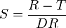

<!--yml

类别：未分类

日期：2024-05-18 14:02:54

-->

# 改进的关键性能统计数据 – 量子金融家

> 来源：[`quantumfinancier.wordpress.com/2010/09/10/improved-key-perfomance-statistics/#0001-01-01`](https://quantumfinancier.wordpress.com/2010/09/10/improved-key-perfomance-statistics/#0001-01-01)

为了改善博客上读者的体验，我将为回测结果引入一个新的性能统计报告。在决定我将使用什么时，我使用了读者反馈，并且查看了我关注的其他博客上他们在使用什么。这样我认为读者能够轻松比较博客圈中看到的不同的想法。作为一个指导原则，从现在起，我将使用与[DVixl 平台](http://dvindicators.cssanalytics.com/product/dvix/)（强烈推荐的产品）产生的输出相对类似的统计输出。此外，我将在表中插入另外三个其他度量。它们如下所述。

**Sortino Ratio（索提诺比率）**

这个比率是策略的风险调整回报的衡量。在我看来，这是流行的夏普比率的一个改进版本。夏普比率是使用平均回报除以回报的标准差计算的。虽然它的简洁性很有吸引力，但它并不是一个完美无缺的衡量（没有任何一个）；它惩罚上升和下降的波动。从直观的角度来看，只惩罚下跌的波动更有意义，因为上升的波动对投资者是有利的。这正是索提诺比率所做的（来自维基百科）：

其中 R 是资产或投资组合的实际回报；T 是考虑中的投资策略的目标或所需回报率（T 最初被称为最低可接受回报或 MAR）；DR 是下行风险。请注意，对于博客上的统计数据，MAR 将设为 0，与夏普计算相同。

**历史价值风险（95%）**

对于 VaR 概念的优秀解释，请参阅 David Varadi 的[这篇文章](http://cssanalytics.wordpress.com/2010/02/04/introduction-to-d-var-position-sizing-part-1/)。报告的价值将是负回报经验分布的第五百分位的后验（事后）价值。这表明历史上，我们大约有 5%的时间 daily returns 比这个值要差。请注意，这是一个非参数 VaR，我更喜欢它而不是假设高斯分布的版本。

我希望未来回测中采用的新格式能够满足更多读者的需求，并且我认为这将提高博客的价值。在短时间内，我将发布我认为比之前谈论的概念更具交易性的策略，并且我认为新格式将更好地传达它们的价值。

QF
