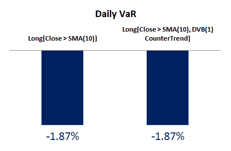
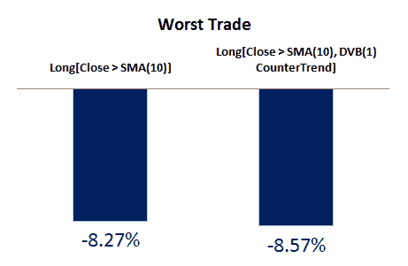
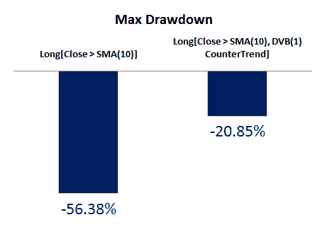

<!--yml

分类：未分类

日期：2024-05-12 18:09:09

-->

# 通过逆趋势入场提高趋势跟随策略的效果 | CSSA

> 来源：[`cssanalytics.wordpress.com/2011/07/29/improving-trend-following-strategies-with-counter-trend-entries/#0001-01-01`](https://cssanalytics.wordpress.com/2011/07/29/improving-trend-following-strategies-with-counter-trend-entries/#0001-01-01)

有可能对策略进行微调，既能提高其回测表现，又能减少交易的实时成本。趋势跟随者由于增加的滑点和对市场影响的成本，始终会支付更高的入场费用。在现代时代，所有市场上的进一步“税收”是短期均值回归的影响——由于市场不再频繁地跟随，趋势交易往往在短期的高点或低点被触发。这导致了不佳的入场，限制了交易盈利的潜力。这个问题明显的解决方案是在给定的趋势跟随策略中纳入一个短期逆趋势/均值回归的入场和出场。关键是要使用一个足够频繁的发生入场，以避免错过交易并尽快进入。对于出场，快速和及时的信号很重要，同时保留趋势跟随策略的性质，即减少尾风险，也至关重要。换句话说，我们不想创建一个可能永远不会成交的强势出场，让交易者面临显著的回撤。

逆趋势入场退场最大的影响通常是在与短期移动平均结合时发现的。提高短期趋势信号性能的价值无法过分强调，因为它让你能更好地跟踪基础资产的趋势，同时滞后程度大幅降低。自 1998 年以来，SPY/S&P500 已经基本呈现出均值回归的特征，大多数交易者已经转而使用较长周期的移动平均和趋势过滤器，如 200 周期移动平均或金叉。问题是，在当今市场——充斥着意外反弹的市场——长期移动平均以上的尾风险已经变得更高。滞后成本可能导致可怕的回撤，正如今年大多数趋势跟随者所经历的那样。如果你能更准确地跟随短期趋势，你可以大幅降低这种风险。让我们看看短期趋势策略的表现——当收盘价高于 10 日简单移动平均时买入，当收盘价低于 sma 时卖出。“均值回归税”非常明显，而且实际交易成本（包括滑点和佣金）甚至还没有考虑在内：

现在让我们看看同样的策略上的逆趋势重叠。在这种情况下，我们将研究一个短期范围均值回归指标——DVB，并将其设置为最大响应的最短周期，即一个周期。该指标进行了归一化处理，使得入口/出口的频率保持稳定，与 RSI 相比，DVB 改变值所需的真正均值回归要少得多。在这种情况下，我们将使用四分之一最低值作为入口，四分之一最高值作为出口。因此，策略将是当收盘价>10sma 但仅当 DVB1<25 时进入，而当收盘价<10sma 但仅当 DVB1>75 时退出。有效地，我们在新的短期趋势出现的第一个弱点时买入，在该趋势结束时的第一个强度时卖出。令人惊讶的是，这使得跟随 10sma 的失败策略变得有盈利的可能性：显然是一个显著的改进——不性感，但能完成工作。这种策略最有益的地方是，它非常快地抓住反弹并退出弱点，同时将盈利的交易比例从 33%提高到 41%，并将平均交易额从-0.09%提高到 0.73%。两种回测之间的差异在现实世界的交易成本中会更加极端。但是关于尾风险呢？让我们仔细看看是否有所增加：

似乎在价值风险（每日回报的第五个百分位）方面几乎没有区别，逆趋势交易的最坏情况略高一些。观察回撤，我们发现趋势跟踪在震荡中真正具有风险，而传统策略的回撤几乎是三倍高。这种方法对移动平均线长度具有鲁棒性，并且似乎普遍提高性能。虽然这里没有展示，即使是 200sma 策略，通过入口和出口的微小变化也显著改善。
