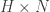

<!--yml

category: 未分类

date: 2024-05-18 13:50:11

-->

# 在 R 中：横截面波动性 | Quantivity

> 来源：[`quantivity.wordpress.com/2011/03/07/code-r-cross-sectional-volatility/#0001-01-01`](https://quantivity.wordpress.com/2011/03/07/code-r-cross-sectional-volatility/#0001-01-01)

阅读《[横截面波动性](https://quantivity.wordpress.com/2011/03/02/cross-sectional-volatility/)》的读者就实现从 *横截面波动性* 派生的交易信号提出了许多问题。为了探索和可视化这些问题，在这里考虑了在 R 中的实现。

首先假定存在名为 `ret` 的框架，其中包含一系列对数收益率（列为股票，行为秒），以秒为间隔测量，共有  次观察。为关键模型常数定义值：

```

N <- 5		# number of stocks
T <- 50		# number of seconds in &quot;past&quot;
H <- 60		# number of seconds in &quot;future&quot;
k <- 4		# number of PCA eigenvectors to use

```

为了模拟，可以构造来自 *正态分布* 的合适值：

```

ret <- data.frame(replicate(N, log(1 + rnorm(T + H)/100)))

```

给定 `ret` 中的收益率，构建 、、，参见第 26 页；`X` 是计算主成分的 “过去” 收益率，长度为 `T`（）；`future` 是生成预测的 “未来” 收益率，长度为 `H`（）；`M` 是每支股票的平均收益率（），`Y` 是去均值的 “过去” 收益率（）：

```

N <- length(ret)
X <- as.matrix(ret[1:T,])
future <- ret[(T+1):(T+H),]
M <- colMeans(X)
Y <- scale(X, scale=FALSE)

```

通过绘制以下内容来可视化对数收益率和累积对数收益率：

```

plot.ts(X)
par(mfrow=c(3,2))
for (i in c(1:N)) { 
  lab <- paste('X', i);
  plot(cumsum(X[,i]), type='l', main=lab, ylab='', xlab='') 
}

```

提供看起来像熟悉的中频股票的图表：

接下来，执行 PCA 并从  中投影到  的前  个特征向量构建 ，通过 [SVD](http://en.wikipedia.org/wiki/Singular_value_decomposition)（如第 58 页提出）。请注意特征向量是 `rotation` 中的 *列*，因此 `[,c(1:k)]` 选择了前  个：

```

phi <- prcomp(X)$rotation[,c(1:k)]
D <- Y %*% phi

```

对 `prcomp(X)` 的 `summary` 显示：

```
Importance of components:
                           PC1      PC2      PC3      PC4      PC5
Standard deviation     0.01137 0.009963 0.009274 0.008849 0.008132
Proportion of Variance 0.28177 0.216240 0.187370 0.170580 0.144040
Cumulative Proportion  0.28177 0.498010 0.685380 0.855960 1.000000 
```

因此，前  个主成分解释了 85.6% 的方差，剩余的 14.4% 用于去噪。

给定 ，计算从长期回归  到  的矩阵（即 ），迭代每支股票的长期回归求和，从  到 ，参见第 28 页（由于缺乏严谨性，有几种可能的解释）：

```

B <- c()
for (i in c(1:N))    # iterate over stocks
{
  hsum <- future[1,i]
  Dsum <- D[T,]
  for (j in c(2:H))&nbsp;&nbsp;&nbsp;# generate rows by walking up the horizon
  {
    hsum <- rbind(hsum, sapply(data.frame(future[c(1:j),i]), sum))
    Dsum <- rbind(Dsum, sapply(data.frame(D[c((T-j+1):T),]), sum))
  }
  B <- cbind(B, lm(hsum ~ Dsum)$coefficient[c(1:k+1)])
}

```

为给定股票绘制 `hsum` 和 `Dsum` 图：


通过：

```

par(mfrow=c(3,3))
plot(hsum, type='l')
for (i in c(1:k)) {
  lab=paste("Dsum[",i,"]");
  plot(Dsum[,i], type='l', ylab=lab)
}

```

所有 N 只股票的 OLS 残差（这些股票表现出序列相关性，但看起来主要是稳定的）：


生成累积估计  和实际回报 ，使用  和  (第 29 页)：

```

Dhat <- colSums(D[c((T-H):T),])
S <- Dhat %*% B
Shat <- as.vector(S + M)
R <- as.vector(colSums(future))

```

其中每个都是一个向量，每个股票有一个累积前景估计。估计值与实际值的不等比较产生了交易信号：

```

signal <- R > Shat
cat('Shat:',  Shat, "\n")
cat('R:', R, "\n")
cat(ifelse(signal==TRUE, 'SELL', 'BUY'))

```

结果为：

`Shat: 0.02340865 -0.00604718 -0.03142925 0.02960236 0.04318216

R: 0.04080749 -0.002699089 -0.05541317 0.02654577 0.04163165

信号：卖出 卖出 买入 买入 买入`

因此，当前秒的信号：卖出股票 1 和 2；买入股票 3、4 和 5。
