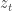

<!--yml

category: 未分类

date: 2024-05-18 13:46:43

-->

# Index Return Decomposition | Quantivity

> Source: [`quantivity.wordpress.com/2011/12/14/index-return-decomposition/#0001-01-01`](https://quantivity.wordpress.com/2011/12/14/index-return-decomposition/#0001-01-01)

将一个现象  分解为其组成部分 ，通过 *功能分解* ，这是数学的伟大之美之一：

这种技术在量化模型中经常被惊人地使用。

根据以 [Proxy / Cross Hedging](https://quantivity.wordpress.com/2011/10/02/proxy-cross-hedging/) 开头的系列的进行的基于代理对冲的持续分析和交易，表明了基于股票  和其相应指数  之间关系的股票分解模型的潜力：

![r_t = s_t \left[ \alpha_t | z_t | + (1 - \alpha_t) \beta | i_t | \right] + \epsilon_t ](img/031d799b8df5320f04bc3fef04370113.png)

要解释这个模型，让我们从直觉上构建它。

首先，考虑一个交易观察：个股的日间收益与其相应指数之间存在微妙的关系。在某些日子里，给定股票的回报遵循其指数；在其他日子里，股票和指数的回报明显发散。这种行为上的区别通常归因于特定于股票的“新闻”，广义上解释——无论是公开已知还是仅私下知晓。

这种直觉可以形式化为两种状态的制度：

+   **无信息制度**：股票收益  遵循一个指数 ，通过一个比例因子  进行缩放

+   **知情制度**：股票收益  遵循特定于个股的路径 ，在条件上独立于其指数

制度之间的关系可以通过  以两种方式建模。当制度是二进制的时，出现切换模型： 。当制度是平稳的时，出现集成模型： ![\alpha \in [ 0, 1 ]](img/36b28f10b2458c68b27ddc0dba545e36.png)。对于后者， 可以被理解为各自回报序列的比例分解权重，因此可以在制度之间提供平滑混合。最后，回报的符号明确地被分解为 ，承认了绝对值回报序列的更大规律性。

值得注意的是以下这些都是*潜在*变量：从有信息状态的个体路径，比例因子，以及状态参数。显然，这个模型的挑战在于它们的估计。一个潜在的技巧是利用下三角关系，如下所述。

这个模型没有明确包含的一个事实是众所周知的*无信息状态的不对称性*，这是通过对市场广度进行分析得出的：股票普遍一起下跌（想想大跌的日子），但普遍一起上涨的情况要少得多（多数反弹）。不清楚这一事实是否是通过自然产生的，还是需要明确建模。

熟悉机器学习（ML）的读者可能会认识到如何将这个模型重新表述为一个*加性模型*：

其中。

这个模型可以通过多种机器学习（ML）方法来解释，具体取决于期望达到的目标。例如，可以将和理解为基函数。另外，通过将它们理解为弱分类器，也可以应用提升。通过在、和之间引入条件依赖关系，还可以应用图形模型。当和进一步被功能分解时，层次模型和决策树就自然而然地产生了。

考虑到这个模型，一个有趣的问题是怎样用它进行*预测*——无论是方向性的还是非方向性的。例如，结合两种共享一个共同指数的股票模型，引入在联合上的股权三角形套利概念。
