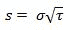

<!--yml

category: 未分类

date: 2024-05-18 08:09:54

-->

# 积分、辛普森法则和 QuantLib | Quant Corner

> 来源：[`quantcorner.wordpress.com/2011/02/14/integration-the-simpson%c2%b4s-rule-and-quantlib/#0001-01-01`](https://quantcorner.wordpress.com/2011/02/14/integration-the-simpson%c2%b4s-rule-and-quantlib/#0001-01-01)

***QuantLib**提供了许多数学和相关功能工具，并与**Boost**库紧密合作。*

*在这里，我们处理**积分**。更具体地说，我们实现了著名的**辛普森积分**。通过计算看涨期权的积分表示的值，我们保持了事物的具体性。

函数的积分是曲线与 x 轴之间的面积。可以通过定义界限，得到一个**定积分**。因此，积分将通过将 x 轴和曲线与 x 轴之间的区域划分为上限和下限之间的部分来计算。

我们可以写成：


其中**a**为下限，**b**为上限。

期权的积分表示为


其中 f(x)是**对数正态密度**，**均值** [](https://quantcorner.wordpress.com/wp-content/uploads/2011/02/integral_call.jpg)****

以及**标准差

******

**辛普森法则**用于计算定积分的数值近似

**

*我们的代码使用了**boost::bind**类，这是一个预定义的元函数。请参考 Boost 文档。

**a**下限是执行价，**b**上限是任意较高的值。在此情况下，10 倍**a**。

```
#include<ql\quantlib.hpp>
#include <boost/math/distributions.hpp>
#include<math.h>

using namespace QuantLib;

Real callOptionFunction(
	Real underlying,
	Real strike,
	Rate riskFreeInterestRate,
	Volatility volatility,
	Time tau,
	Real x){
		Real mean = log(underlying) + (riskFreeInterestRate
			- 0.5 * volatility * volatility) * tau ;

		Real standardDeviation = volatility * sqrt(tau);

		boost::math::lognormal_distribution<>d(mean, standardDeviation);
		return (x - strike) * pdf(d,x) * exp (-riskFreeInterestRate * tau);
}

int main(int, char*[]){

	//option parameters
	Real underlying = 30;
	Real strike = 36;
	Rate riskFreeInterestRate = 0.06;
	Time tau = 0.5; // 0,5 year
	Volatility volatility = 0.20;

	//Integration parameters : absolute accuracy
	//and maximum number of evaluations
	Real absoluteAccuracy = 1e-4;
	Size maxEvaluations = 1e3;

	boost::function<Real(Real)> ptrF;
	ptrF = boost::bind(
		&callOptionFunction,
		underlying,
		strike,
		riskFreeInterestRate,
		volatility,
		tau,
		_1);

	SimpsonIntegral numInt(
		absoluteAccuracy,
		maxEvaluations);

	std::cout << "Call option value : " << numInt(
		ptrF,
		strike,/*lower limit a*/
		10*strike)/*upper limit b*/ << std::endl;

	return 0;
}
```**
