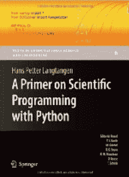
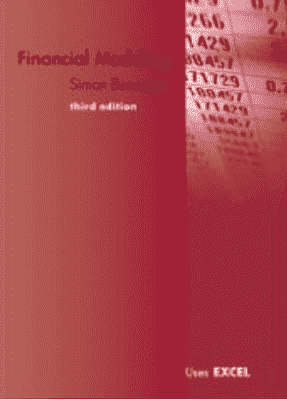

→yml

类别：未分类

日期：2024-05-18 04:46:39

→

# 智能交易：遗传算法系统交易开发——第三部分（Python/VBA）

> 来源：[`intelligenttradingtech.blogspot.com/2010/02/genetic-algorithm-systematic-trading_20.html#0001-01-01`](http://intelligenttradingtech.blogspot.com/2010/02/genetic-algorithm-systematic-trading_20.html#0001-01-01)

如先前的文章所述，无法使用标准的 Weka GUI 实例化遗传算法，除了用于特征选择。部分原因是没有通用的算法来实例化适应度函数。正是这种灵活性允许了无限可能的适应度范围，同时也需要自定义脚本。尽管可以为 Weka/JAVA 编写一个自定义类，但我选择在这个例子中使用 Python，同时还用了一个我为后端结果总结开发的较老的 VBA 工具。希望你会看到有很多工具可以用来原型化各种系统并增强开发过程。

基本的遗传算法使用 17 位字符串长度来编码以下规则：

如果 ma(m)二进制操作 ma(n)那么买入

前 8 位用于编码第一个 ma 值。如先前的文章所述，有 2^n=2⁸=256 个可能的十进制值可以用于参数论点。第 9 位是一个两位的二进制运算符>或<的编码值。最后 8 位用于第二个移动平均参数值。本例中使用简单的净美元回报作为适应度（注意夏普比率和其他适应度指标本可以被使用）。输入序列是 SPY，使用 1993-2005 日期的数据进行优化。

该 Python 脚本基本上设置运行一个大小为 20 的种群，使用精英主义和锦标赛选择，进行 40 代。虽然这绝不是最优的（它相当小），但设置这些值是为了说明目的。当你看视频时，你会看到每次迭代时种群的初始二进制编码字符串。此外，每次选择变化都会显示解码的移动平均规则。虽然视频为了简洁被截断了，但你应该注意到每一代适应度数都在提高。最终解决方案设计在连续五代适应度没有提高后停止。此外，你可以看到最终的编码结果和适应度收敛的图表。

参数名称“movie”的值为“http://www.youtube.com/v/Fw8TFDKk92Q&hl=en&fs=1”（允许全屏播放的参数值已设置为 true）

视频 1. 使用 Python GA 优化 MA 参数

图 1. 最终适应度结果输出到控制台

在图 1 中，我们看到的最终规则收敛到了 {if ma(220) > ma(221) then Buy}。

此外，最终的二进制字符串还显示了最终的适应度值。

我们可以相对容易地解码这个二进制字符串。

[110110111110111100] 是表示最优适应度的 17 位二进制字符串。

ma1 是前 8 位二进制数 = 11011011 = 219 十进制。使用了 +1 的偏移量（这样就不会有 0 的移动平均值）来得到一个结果参数 220。

下一个位是 = 1，对应于“大于”。

最后的 8 位二进制数代表了 221 参数，推理方式与第一个类似。

所以，具有参数的结果规则是：

如果 ma(220) > ma(221)，则买入。

fitness = net$gain = $316.12

图 3. 回测结果总结

上面是使用回测程序捕获的摘要统计信息。总净盈利略高于 Python 结果。这是由于 Python 模拟器截断了移动平均数据的序列长度，以避免前导零填充值，而 Excel 程序没有。然而，它们仍然非常接近。通常，使用几种不同的程序来迫使自己再次核对结果是非常有用的。

现在，一个敏锐的评论者已经指出...这种方法确实是在曲线拟合。我们发现的是我们想要研究的特定规则集的最佳可能参数对（至少是最好的之一；有更优秀的参数，但我没有运行太长时间的例子生成集）。或者如我在第一个帖子中提到的，我们集中在分布曲线最有利于盈利候选项的区域。现在，对于那些不熟悉曲线拟合的人来说，这个概念在开发者中并不受欢迎。事实上，它几乎和我之前提到的挑例子一样，有着同样严重的弊端。

然而，这样做并非徒劳。我们在这里的目标是量化增强常见开发（即创建和验证）工具，而不仅仅是猜测、直觉和挑挑拣拣。首先，这种特定的规则集在样本外可能不会表现得那么好，这是真的。然而，同样地，我们不能仅仅因为一个挑出来的例子就轻率地断定，我们还需要评估事物在样本外的实际表现。我说这话是因为我曾经使用过一些看起来非常不错的类似技术，确实在样本外表现非常好，持续了好几个时期。通过精细挑选最佳候选项，我们有助于缩小值得进行样本外研究的候选项集合。还有其他一些额外的技术（前面提到过的一些，比如集成方法、不同的目标/适应度函数，甚至不同的优化标准）可以用来增强这种方法，并且验证样本外的鲁棒性。

编辑：为了娱乐，我决定实际运行一下这个在样本内训练后优化的规则的样本外性能。下面的图表说明了他'样本外'在 2005 年至今（2010 年）的表现。

图 4。优化训练规则参数的样本外测试性能。

对于这个在近期历史上最糟糕的崩盘期间进行曲线拟合的简单系统来说，表现不算太差，对吧（对心灵来说要容易得多）？

坦白说，我对简单的 SMA 系统进行了如此多的评估，以至于我认为它们并不是最值得优化的参数。显然，这真的取决于你的目标。有一些长期的研究表明，使用减少波动性的适应度目标作为这种简单规则集的目标是非常有益的（你可以验证，这个简单的系统在熊市期间比实际市场——样本内和样本外——的波动性要小得多）。找到那些值得进一步优化的参数取决于你自己。见

[《战术资产配置的量化方法》评论](http://blog.fosstrading.com/2010/02/updated-tactical-asset-allocation.html)

作为相关示例。

如往常一样，在做出任何交易决策之前，请务必做好自己的尽职调查。

请继续向我们反馈你喜欢或不喜欢的部分以及你想要探索的领域。

---------------------------------------------------------------------------------

如果你刚接触 Python 并且想订购一本出色的教科书，我强烈推荐以下这本（应用方向稍偏向科学和工程）：

[Python 科学编程入门](http://www.amazon.com/Scientific-Programming-Computational-Science-Engineering/dp/3642024742/ref=sr_1_26?ie=UTF8&s=books&qid=1266694073&sr=8-26)  [链接](https://blogger.googleusercontent.com/img/b/R29vZ2xl/AVvXsEgbuSOutut7UL6Y3q4Bxhvs9sof5DoY020Z8KiIJsCnHpXRuRrZklXYQfJKCuH_TEJpU5VPgohqqOZ1n22Z0UiXOjHPz4-2J2f91T4LcJIRwLdK8q3ILkdJLpxmWfFj0bjhQMCtqeNSKxE/s1600-h/pythonad.jpg)

此外，对学习更多关于 VBA 并且偏向金融方向的读者会在书中找到很好的实践示例：

[《金融建模，第三版》](http://www.amazon.com/Financial-Modeling-3rd-Simon-Benninga/dp/0262026287/ref=sr_1_1?ie=UTF8&s=books&qid=1266694665&sr=1-1)  [链接](https://blogger.googleusercontent.com/img/b/R29vZ2xl/AVvXsEjXH-pisfW312Ck27Z04lequdoNSbAC7VqecTAk16LmLSyfJVV3sn1_JTQlwmgt0EZUK1dKPpvPqQ-ZBGWchS4sWjsKyYZwpJzdBk3ZZer8nKYYxf_BDU-AW2BzimJJWFDDGFC3wUqmS5I/s1600-h/finanialmodellingad.jpg)
