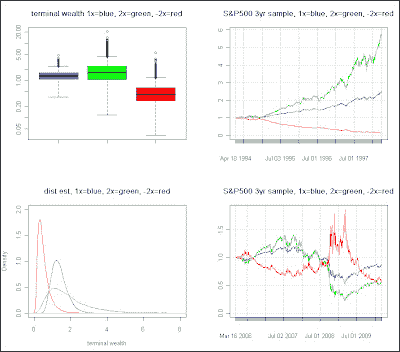

<!--yml

类别：未分类

日期：2024-05-18 04:45:50

-->

# 智能交易：为什么我的 2X 超额 ETF 没有跟上市场步伐，路径不对称（R ex）是什么？第二部分

> 来源：[`intelligenttradingtech.blogspot.com/2010/04/why-isnt-my-2x-ultra-etf-keeping-pace.html#0001-01-01`](http://intelligenttradingtech.blogspot.com/2010/04/why-isnt-my-2x-ultra-etf-keeping-pace.html#0001-01-01)

我创建了一个示例，展示了第一部分理论可能如何使用 S&P500 作为绩效代理应用。以防任何查看的人对终端财富不熟悉，它是指账户的最终（通常是复利的）结束价值（因此称为终端）。

图 1. 示例 S&P 500 和使用 GBM 蒙特卡洛模拟的终端财富

使用历史每日变化参数（均值，标准差）进行了 10,000 次迭代的 GBM 蒙特卡洛模拟的时间序列长度=1000。这个长度被选择来大致约当于终端财富的总结统计数（市场时机的好近似）的约 3 年切片。我还使用了该系列的长期历史均值和标准差，尽管它可能有点偏向于更长的期限。也许，我可以生成更贴近的 3 年抽样分布 N(u,std)，以增加相关性，但现在我们假设长期参数是很好的近似。

图形化的总结统计数据使用箱形图和密度估计显示了蒙特卡洛模拟的结果。一眼看上去，令我印象最深的是，-2x 仪器在大多数情况下表现得一团糟，这加剧了市场有上升趋势的普遍认识。如果你被困在一个位置，只希望它不是空头（我们都有过在聚光灯下的鹿的经历）；从统计学上讲，长时间持有任何杠杆较大的头寸都不是最佳选择。

然而，一个更有趣的观察是，简单的 1X 基础工具模式在所有密度估计的右侧。此外，使用正（和负）杠杆的 2x 工具承担了更宽的方差/风险。从本质上讲，你在这里看到了一些凯利原则的实际应用。承担 2X 风险，虽然你有更大的收益机会，但从统计学上讲，你不太可能比 1x 做得更好，同时在负方面承担了更大的风险。

最后，展示了使用任意绩效周期的实际结果的两个样本切片。很明显，在长期趋势期间，我们 2X 工具的增长要好得多，不幸的是，我们不知道这些趋势会在什么时候发生，其次，根据蒙特卡洛模拟，它们发生的可能性并不高。

最近的表现，如所示，是一个完美例子，表明在这组系列中，2X 工具的表现不如底层，如第一部分所解释。

以下是三个系列摘要，ser(1X)，ser2pos(+2X)，ser2neg(-2X)

> summary(ser)

最小值 第一四分位数 中位数 平均值 第三四分位数 最大值

0.3613 1.0800 1.3290 1.3870 1.6250 4.7460

> summary(ser2pos)

最小值 第一四分位数 中位数 平均值 第三四分位数 最大值

0.1178 1.0630 1.6100 1.9180 2.4070 20.5700

> summary(ser2neg)

最小值 第一四分位数 中位数 平均值 第三四分位数 最大值

0.0337 0.2859 0.4279 0.5173 0.6483 5.6480

注意，+2X 的中位数远非底层数据的两倍。尽管 2X 有一些惊人的异常值，但你不应该从统计学上期望它们。

这有点像抛一枚硬币，并且全额复合，这样，你在获胜的结果上得到一个惊人的结果，不幸的是，破产的概率有 75%（也许我下次再解释那个）。

最后一点是，蒙特卡洛模拟使用了 GBM，而更可能的跳跃扩散过程会产生更宽的尾巴，这意味着相对于 2X 工具潜在的美好收益，负面尾部风险更大。
