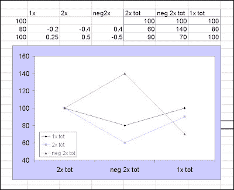

<!--yml

分类：未分类

日期：2024-05-18 04:45:57

-->

# 智能交易：我的 2X 超短 ETF 为什么跟不上市场步伐？路径不对称是什么？（R ex）

> 来源：[`intelligenttradingtech.blogspot.com/2010/03/why-isnt-my-2x-etf-keeping-pace-with.html#0001-01-01`](http://intelligenttradingtech.blogspot.com/2010/03/why-isnt-my-2x-etf-keeping-pace-with.html#0001-01-01)

我最近读了几篇文章，批评超短 ETF 未能跟上市场步伐，并将问题归咎于奇怪且无法解释的原因，如投资组合衍生品重新平衡和负漂移。我想重新审视一下路径不对称的概念。尽管价格不对称有多种定义（例如，计量经济学），在此情况下，我仅仅指的是百分比价格变动与美元变动的不对称性质以及给定任意路径的最终累计结果。

图 1. 2X 超短 ETF 和路径不对称的示例

许多人似乎觉得（如果不是令人反感的话）一个基础序列可能会朝某个方向移动，然而，无论是超短还是超长序列，在长期内最终都低于基础资产。路径不对称到底是什么？一些交易员可能熟悉这样一个观念，如果你账户损失了一定的百分比，比如 50%，那么你需要超过 50%的收益来弥补损失。这是路径不对称的一个例子（我应该指出，也有人提到这是西格尔悖论的例子）。

让我们通过一个简单的例子来看看这可能会如何影响一只股票及其 2X 对应产品。假设一只股票从 100 美元跌至 80 美元，然后再涨回 100 美元——打平。从 100 美元跌至 80 美元，在百分比基础上，是 20%的损失。然而，要弥补这个数额，我们需要解方程 80*(1+x)=100；答案是 25%，不是 20%。这意味着尽管美元金额对两者（20 美元的下跌和上涨）来说相同，但百分比金额并非如此。这是路径不对称的一个例子。这对 2X 超杠杆 ETF 有何影响？嗯，由于每个 ETF 旨在跟踪基础资产的两倍日变动，+2xETF 将下跌 40%，然后回升 50%，净美元结束价值为 90 美元。而-2xETF 将上涨 2x 或 40%至 140，然后回撤-50%，仅剩下 70 美元。注意，在这两种情况下，每个超 ETF 最终都低于基础价格。正是路径依赖和不对称的简单机制导致了这一点，即使是在完美的 2X 杠杆下。在处理任何杠杆产品时，包括对冲，都要考虑到路径依赖是非常重要的。

现   现在要记住，这些产品存在额外的拖累，因为基金费用，这确实对原问题增加了合理性。更多相关内容在这篇文章中得到了简明扼要的解释，

现在要记住，这些产品存在额 icle/35789-the-case-against-leveraged-etfs)的文章中简明扼要地解释了。

。
