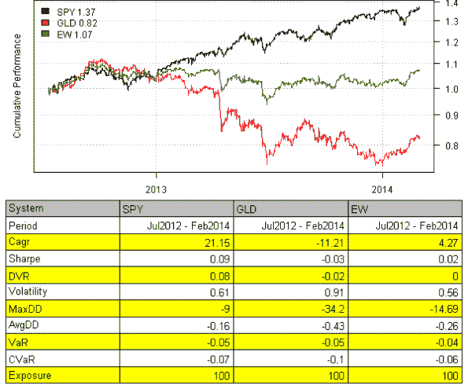

<!--yml

类别：未分类

日期：2024-05-18 14:30:48

-->

# Intraday 数据 | Systematic Investor

> 来源：[`systematicinvestor.wordpress.com/2014/03/10/intraday-data/#0001-01-01`](https://systematicinvestor.wordpress.com/2014/03/10/intraday-data/#0001-01-01)

在[Intraday Backtest](https://systematicinvestor.wordpress.com/2012/04/23/intraday-backtest/)文章中，我展示了一个加载和处理来自[FXHISTORICALDATA.COM](http://www.fxhistoricaldata.com/)的 Forex Intraday 数据的示例。最近，我在[Bonnot Gang](http://thebonnotgang.com/tbg/historical-data/)网站上发现了一个关于 Intraday 数据的有趣来源。请注意，您必须注册才能获取 Intraday 数据；注册是免费的。

今天，我想检查[Bonnot Gang](http://thebonnotgang.com/tbg/historical-data/)的 Intraday 数据质量，并展示如何将其整合到 Backtest 中使用[Systematic Investor Toolbox](https://systematicinvestor.wordpress.com/systematic-investor-toolbox/)。对于下面的示例，首先下载并保存 SPX 和 GLD 的 1 分钟 Intraday 历史数据。接下来让我们加载并绘制 SPX 的时间序列。

```

###############################################################################
# Load Systematic Investor Toolbox (SIT)
# https://systematicinvestor.wordpress.com/systematic-investor-toolbox/
###############################################################################
con = gzcon(url('http://www.systematicportfolio.com/sit.gz', 'rb'))
    source(con)
close(con)

	#*****************************************************************
	# Load historical data
	#****************************************************************** 
	load.packages('quantmod')	

	# data from http://thebonnotgang.com/tbg/historical-data/
	spath = 'c:/Desktop/'
	# http://stackoverflow.com/questions/14440661/dec-argument-in-data-tablefread
		Sys.localeconv()["decimal_point"]
		Sys.setlocale("LC_NUMERIC", "French_France.1252")

	data <- new.env()
	data$SPY = read.xts(paste0(spath,'SPY_1m.csv'), 
		sep = ';', date.column = 3, format='%Y-%m-%d %H:%M:%S', index.class = c("POSIXlt", "POSIXt"))

	data$GLD = read.xts(paste0(spath,'GLD_1m.csv'), 
		sep = ';', date.column = 3, format='%Y-%m-%d %H:%M:%S', index.class = c("POSIXlt", "POSIXt"))

	#*****************************************************************
	# Create plot for Nov 1, 2012 and 2013
	#****************************************************************** 
	layout(c(1,1,2))		
	plota(data$SPY['2012:11:01'], type='candle', main='SPY on Nov 1st, 2012', plotX = F)
	plota(plota.scale.volume(data$SPY['2012:11:01']), type = 'volume')	

	layout(c(1,1,2))		
	plota(data$SPY['2013:11:01'], type='candle', main='SPY on Nov 1st, 2013', plotX = F)
	plota(plota.scale.volume(data$SPY['2013:11:01']), type = 'volume')	

```


立即发现数据提供者更改了时间刻度，2012 年的数据是从 9:30 到 16:00 记录的，而 2013 年的数据是从 13:30 到 20:00 记录的。

接下来，让我们检查 Intraday 系列中是否有任何大缺口。

```

	#*****************************************************************
	# Data check for Gaps in the series Intraday
	#****************************************************************** 
	i = 'GLD'
	dates = index(data[[i]])
	factor = format(dates, '%Y%m%d')
	gap = tapply(dates, factor, function(x) max(diff(x)))

	gap[names(gap[gap > 4*60])]
	data[[i]]['2013:02:19']

	i = 'SPY'
	dates = index(data[[i]])
	factor = format(dates, '%Y%m%d')
	gap = tapply(dates, factor, function(x) max(diff(x)))

	gap[names(gap[gap > 4*60])]
	data[[i]]['2013:02:19']	

```

请查看下面 GLD 存在 4 分钟以上缺口的日期

```

20120801   12
20121226   22
20130219   48
20130417    6
20130531    6
20130705    8
20131105    4
20131112    4
20140124   14
20140210   22
20140303    6

```

详细查看 2013 年 2 月 19 日，14:54 和 15:42 之间存在 48 分钟的缺口

```

> data[[i]]['2013:02:19 14:50::2013:02:19 15:45']
                        open    high      low   close volume
2013-02-19 14:50:54 155.3110 155.315 155.3001 155.315   8900
2013-02-19 14:51:56 155.3100 155.310 155.3100 155.310 119900
2013-02-19 14:52:52 155.3100 155.330 155.3000 155.305 354600
2013-02-19 14:53:55 155.2990 155.300 155.2800 155.280      0
2013-02-19 14:54:54 155.2900 155.290 155.2659 155.279  10500
2013-02-19 15:42:57 155.3400 155.360 155.3400 155.350 587900
2013-02-19 15:43:57 155.3501 155.355 155.3300 155.332   8300
2013-02-19 15:44:59 155.3395 155.340 155.3200 155.340  10700
2013-02-19 15:45:55 155.3300 155.340 155.3300 155.340   5100

```

因此，当时数据采集肯定有问题。

接下来，让我们比较 Intrada 数据和日数据：

```

	#*****************************************************************
	# Data check : compare with daily
	#****************************************************************** 
	data.daily <- new.env()
		quantmod::getSymbols(spl('SPY,GLD'), src = 'yahoo', from = '1970-01-01', env = data.daily, auto.assign = T)   

	layout(1)		
	plota(data$GLD, type='l', col='blue', main='GLD')
		plota.lines(data.daily$GLD, type='l', col='red')
	plota.legend('Intraday,Daily', 'blue,red')	

	plota(data$SPY, type='l', col='blue', main='SPY')
		plota.lines(data.daily$SPY, type='l', col='red')
	plota.legend('Intraday,Daily', 'blue,red')		

```


Intraday 数据与日数据非常吻合。

请注意，原始的 Intraday 数据带有秒时间戳，为了回测目的，我们还需要将日期时间四舍五入到最近的分钟，这样我们就可以合并 Intraday 数据系列，而不会引入同一分钟的多个条目。例如：

```

	#*****************************************************************
	# Round to the next minute
	#****************************************************************** 
	GLD.sample = data$GLD['2012:07:10::2012:07:10 09:35']
	SPY.sample= data$SPY['2012:07:10::2012:07:10 09:35']

	merge( Cl(GLD.sample), Cl(SPY.sample) )

	# round to the next minute
	index(GLD.sample) = as.POSIXct(format(index(GLD.sample) + 60, '%Y-%m-%d %H:%M'), format = '%Y-%m-%d %H:%M')
	index(SPY.sample) = as.POSIXct(format(index(SPY.sample) + 60, '%Y-%m-%d %H:%M'), format = '%Y-%m-%d %H:%M')

	merge( Cl(GLD.sample), Cl(SPY.sample) )

```

```

> merge( Cl(GLD.sample), Cl(SPY.sample) )
                       close close.1
2012-07-10 09:30:59 155.0900 136.030
2012-07-10 09:31:59 155.1200 136.139
2012-07-10 09:32:58 155.1100      NA
2012-07-10 09:32:59       NA 136.180
2012-07-10 09:33:56 155.1400      NA
2012-07-10 09:33:59       NA 136.100
2012-07-10 09:34:59 155.0999 136.110
2012-07-10 09:35:59 155.0200 136.180

> merge( Cl(GLD.sample), Cl(SPY.sample) )
                       close close.1
2012-07-10 09:31:00 155.0900 136.030
2012-07-10 09:32:00 155.1200 136.139
2012-07-10 09:33:00 155.1100 136.180
2012-07-10 09:34:00 155.1400 136.100
2012-07-10 09:35:00 155.0999 136.110
2012-07-10 09:36:00 155.0200 136.180

```

我觉得这些 Intraday 数据并不是真的很真实，而是通过运行报价的 Intraday 快照收集的，后来处理以创建一分钟条形图。但我可能错了。

接下来，让我们通过删除时间超过 4 分钟的任何一天来清理 Intraday 数据，并将所有时间四舍五入到最近的分钟：

```

	#*****************************************************************
	# Clean data
	#****************************************************************** 
	# remove dates with gaps over 4 min
	for(i in ls(data)) {
		dates = index(data[[i]])
		factor = format(dates, '%Y%m%d')
		gap = tapply(dates, factor, function(x) max(diff(x)))
		data[[i]] = data[[i]][ is.na(match(factor, names(gap[gap > 4*60]))) ]
	}		

	common = unique(format(index(data[[ls(data)[1]]]), '%Y%m%d'))
	for(i in ls(data)) {
		dates = index(data[[i]])
		factor = format(dates, '%Y%m%d')	
		common = intersect(common, unique(factor))
	}

	# remove days that are not present in both time series
	for(i in ls(data)) {
		dates = index(data[[i]])
		factor = format(dates, '%Y%m%d')
		data[[i]] = data[[i]][!is.na(match(factor, common)),]
	}

	#*****************************************************************
	# Round to the next minute
	#****************************************************************** 
	for(i in ls(data))
		index(data[[i]]) = as.POSIXct(format(index(data[[i]]) + 60, '%Y-%m-%d %H:%M'), tz = Sys.getenv('TZ'), format = '%Y-%m-%d %H:%M')

```

一旦 Intraday 数据准备就绪，我们可以测试一个简单的等权重策略：

```

	#*****************************************************************
	# Load historical data
	#****************************************************************** 
	bt.prep(data, align='keep.all', fill.gaps = T)

	prices = data$prices   
	dates = data$dates
		nperiods = nrow(prices)

	models = list()

	#*****************************************************************
	# Benchmarks
	#****************************************************************** 							
	data$weight[] = NA
		data$weight$SPY = 1
	models$SPY = bt.run.share(data, clean.signal=F)

	data$weight[] = NA
		data$weight$GLD = 1
	models$GLD = bt.run.share(data, clean.signal=F)

	data$weight[] = NA
		data$weight$SPY = 0.5
		data$weight$GLD = 0.5
	models$EW = bt.run.share(data, clean.signal=F)

    #*****************************************************************
    # Create Report
    #******************************************************************    
    strategy.performance.snapshoot(models, T)	

```



在这篇文章中，我试图概述如果你打算使用新的数据源需要采取的基本步骤。接下来，我计划通过更多示例来介绍测试日内策略。

要查看此示例的完整源代码，请查看[github 上 bt.intraday.thebonnotgang.test()函数的 bt.test.r 文件](https://github.com/systematicinvestor/SIT/blob/master/R/bt.test.r)。
