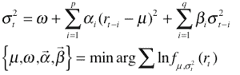
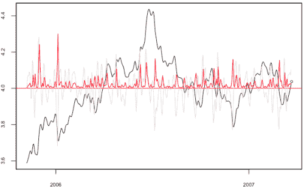

<!--yml

分类：未分类

日期：2024-05-18 15:39:06

-->

# 日内波动预测与估计 | Tr8dr

> 来源：[`tr8dr.wordpress.com/2009/10/30/intraday-volatility-prediction-and-estimation/#0001-01-01`](https://tr8dr.wordpress.com/2009/10/30/intraday-volatility-prediction-and-estimation/#0001-01-01)

2009 年 10 月 30 日 · 8:21 pm

GARCH 已经被证明是日收益或更长期收益方差的合理估计器。有些人将 GARCH 适应于日内收益以改善日收益。然而，GARCH 在估计日内方差方面表现非常糟糕。

GARCH 模型是基于低频（如日频）收益的平方值存在强烈的自相关的经验观察。这一点可以通过观察许多资产的日收益的平方值呈现聚类和“平滑”衰减趋势轻易看出。

第二个方程式是参数的最大似然估计。

以下是加拿大 2 年期 CMT 收益的日例。红色是 GARCH(1,1)方差，黑色是序列，灰色是对数收益，绿色圆圈是下一期的预测方差：

如果您想要上述内容的 R 源代码，请与我联系。

然而，日内平方收益存在许多跳跃，几乎不存在自相关的衰减模式。以 EUR/USD 系列为例，其平方收益的跳跃将最大似然估计（ML）降低到 GARCH 参数估计无法收敛的程度。尽管如此，似乎还是存在一种更长期的模式，这使得可以构建一种模型，尽管不是 GARCH 模型。

随着计算能力的提升和逐笔数据的普及，研究已经开始集中于日内方差估计。特别是，将方差用价格持续时间来表示已经成为一个新兴的主题。安徒生（Andersen）、多布雷夫（Dobrev）和舒姆堡（Schaumburg）等越来越多的研究群体正在以新的方向发展这一模型。

至此，我已经排除了 GARCH 作为我日内策略的有用指标，但计划用于日策略。我正在研究一种基于持续时间的日内波动度量公式。
