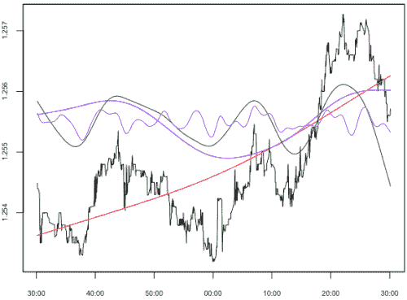
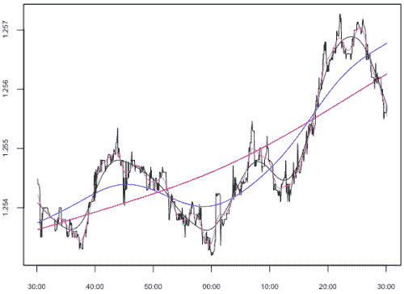
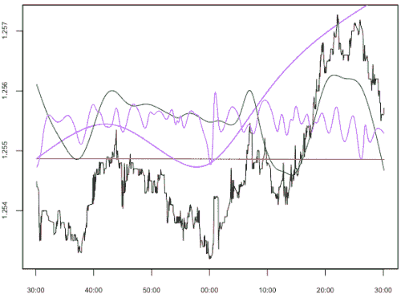
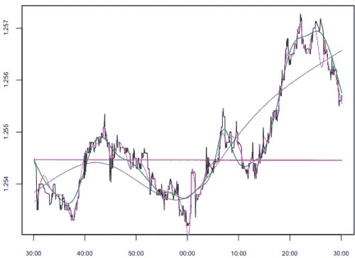

<!--yml

类别：未分类

日期：2024-05-18 15:38:54

-->

# 固有模式函数（基分解）| Tr8dr

> 来源：[`tr8dr.wordpress.com/2009/11/04/intrinsic-mode-function-basis-decomposition/#0001-01-01`](https://tr8dr.wordpress.com/2009/11/04/intrinsic-mode-function-basis-decomposition/#0001-01-01)

几个月前，Norden Huang 在 CERN 做了一次非常有趣的报告 “[非线性和非平稳时间序列分析的新方法：希尔伯特谱分析](http://videolectures.net/cern_huang_nmnntsa/)“。 我是通过 Max Dama 的[博客](http://www.maxdama.com/)得知这个报告的（谢谢）。

黄提出了一个针对非线性、非平稳信号的新信号分解方法。 在演讲中，他详细介绍了傅里叶、小波和庞加莱分析的问题。 这些方法中的每一个要幺在时域中丢失动态（傅里叶、庞加莱），要幺在频域中丢失特征（小波）。 他进一步指出，尽管希尔伯特空间分析同时呈现时域和频域，但结果受到非平稳性的影响。

**我的方法**在我详细介绍黄的方法之前，让我先详细介绍一下我一直使用的方法。 我几年前曾经研究过小波，并意识到了它们的局限性。 正交基小波由于信号的 2^n 划分而丢失时间序列中的特征。 那些与 2^n 划分中心的特征最准确地被捕获，而边缘的特征则准确性降低（或根本不捕获）。 为此，我设计了一种经验基函数：

```
let X <- <signal vector>
let residual <- X
for (n,rho) in <successive values approximating frequencies 2^n>
{
    # compute data derived basis function
    basis[n] <- <penalized least squares spline> (residual, rho)
    # compute residual
    residual <- residual - basis[n]
}
```

上述方法使用带有惩罚的最小二乘法作为（近正交）基函数，在连续频率下分解信号。 这种分解交叉相关性很小，因此在大多数情况下接近正交。

基础函数在我的方法中：



重新组合的不同阶段：



每个基函数都是最优最小二乘拟合，几乎没有任何伪影。 这种基函数的缺点是非局部性，即信号的早期部分会影响基函数的后期部分（通常以非侵入式的方式），在计算高频率时成本较高。

**HHT（希尔伯特-黄变换）**

黄的方法非常聪明，而且重要的是，它很简洁。 这种方法的动机是处理非平稳时间串行时希尔伯特变换遇到的问题。 如果我们能创建一个经验基函数，它生成的基函数围绕极大值/极小值中心，并代表模式。 算法如下：

```
let X <- <signal vector>
decomp[1] <- X
for (i in 2:<maximum bases for this signal>)
{
    # determine local maxima and minima in current component
    maxima <- <locate maxima> (decomp[i-1])
    minima <- <locate minima> (decomp[i-1])

    # compute splines through maxima & minima
    maxspline <- spline (maxima)
    minspline <- spline (minima)

    # compute basis function
    mean[i] <- (minspline + maxspline) / 2
    decomp[i] <- decomp[i-1] - mean
}
```

黄方法中的基础函数：



使用黄方法重新组合的不同阶段：



得到的基函数具有一些有趣的特性，例如这些函数以零为中心，长期平均值趋近于零，并且具有局部性。   HHT 特别擅长捕捉非平稳的高频振荡，并且精确度高。

然而，由于自然样条方法，存在一些明显的伪影（注意曲线在价格急剧变动附近夸大的扰动）。   与我之前使用的方法相比，这种方法在处理急剧的移位和时间序列边界时表现较差。

尽管如此，这种方法有几个方面可能使其在分析均值时有用。   关于这一点稍后再详细介绍。
