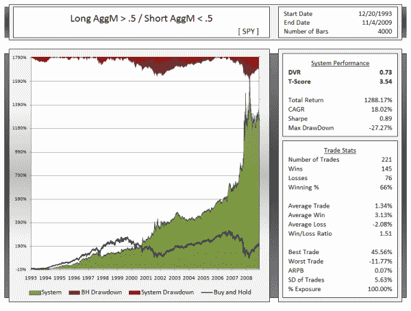

<!--yml

类别：未分类

日期：2024-05-12 18:43:25

-->

# 介绍综合均值回归和趋势跟踪指标：聚集“M”指标 | CSSA

> 来源：[`cssanalytics.wordpress.com/2009/11/05/trend-or-mean-reversion-why-make-a-choice-the-simple-aggregate-m-indicator/#0001-01-01`](https://cssanalytics.wordpress.com/2009/11/05/trend-or-mean-reversion-why-make-a-choice-the-simple-aggregate-m-indicator/#0001-01-01)

**注意：***显然有些人对如何计算聚集 M 有些疑问，请通过* *dvindicators@gmail.com* *在本周末稍后收到电子表格。请注意我们使用的是比雅虎财经调整了分股和分红数据的更清洁版本，并经过了验证的收盘价。我了解到使用雅虎财经进行回测的结果与我们不同（注意我们使用了与我们的读者相同的雅虎财经数据计算相同的值），那是因为他们的数据并不完全准确。*

**聚集 M 指标**是基于这样一个概念：从长期来看，市场趋势存在，而在短期内，市场则充满噪音，倾向于均值回归。为什么不将这两个概念结合起来，让生活变得更简单呢？聚集 M 指标应该反映一个经过短期噪音过滤调整后的中位数。中位数是衡量中心趋势远比简单平均更准确的一个指标，尤其是在噪音数据的情况下。采用一种优越的趋势度量，并通过调整短期均值回归来过滤掉一些噪音，可以创造出更加优秀的中位数。聚集 M 指标现在集趋势和均值回归于一体。在下面的示例中，聚集 M 仅仅是 1) 252 天的高、低和收盘价**百分排名**的平均值和 2) 10 天的高、低和收盘价**（1-百分排名）**的平均值。这个平均值通过今天赋予 0.6 的权重，昨天赋予 0.4 的权重来进行平滑处理。这个方法健壮吗？标普 500 过去 4000 根 K 线的结果不言而喻——高准确性，良好的每笔交易收益和漂亮的权益曲线。在另一个独立的多市场测试中，从 1984 年到现在，20 个市场中的聚集 M 指标实现了 27%的复合年增长率。这是最好的方法吗……可能不是——我昨天才想出这个方法，当然没有花时间进行优化或研究。此外，结构还可以有很大的改进。但对于两个常识参数来说，已经相当不错了！

](https://cssanalytics.files.wordpress.com/2009/11/spyaggm5050.png)
