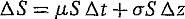
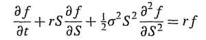
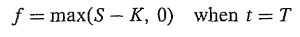
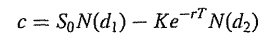
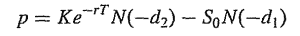
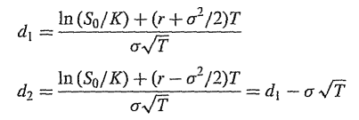
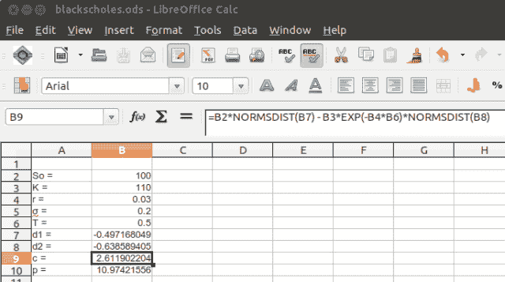

<!--yml

类别：未分类

日期：2024-05-18 06:46:11

-->

# 介绍 QuantLib：布莱克-斯科尔斯和希腊字母 | 金融与科技的一切...

> 来源：[`mhittesdorf.wordpress.com/2013/07/29/introducing-quantlib-black-scholes-and-the-greeks/#0001-01-01`](https://mhittesdorf.wordpress.com/2013/07/29/introducing-quantlib-black-scholes-and-the-greeks/#0001-01-01)

当我写下这篇文章的标题时，我忍不住想起了经典的艾尔顿·约翰的歌曲《本尼和喷气机》（播放音乐...）本尼..本尼..本尼和喷气机。艾尔顿·约翰的热门歌曲是在 1973 年 5 月录制的。布莱克-斯科尔斯模型是在 1973 年的一篇名为“期权定价和公司负债”的论文中首次发表的。艾尔顿·约翰后来成为了一位国际流行音乐巨星，而布莱克-斯科尔斯方程的另一位关键贡献者，罗伯特·莫顿，后来获得了诺贝尔经济学奖。也许有些擅长音乐的期权量化分析师能想出一些愚蠢的恶搞，比如“布莱克-斯科尔斯..布莱克-斯科尔斯..布莱克-斯科尔斯和极客”。

玩笑 aside，毫无疑问，布莱克-斯科尔斯方程革新了衍生品定价，将菲舍尔·布莱克、莫伦·斯科尔斯和罗伯特·莫顿确立为现代金融的“摇滚巨星”。

### 布莱克-斯科尔斯方程

那么让我们仔细看看布莱克-斯科尔斯方程。首先，理解布莱克-斯科尔斯模型的基本假设是非常重要的，这些假设来自于约翰·赫尔 excellent 的书《期权、期货和其他衍生品》（[Options, Futures and Other Derivatives](http://www.amazon.com/Options-Futures-Other-Derivatives-6th/dp/0131499084/ref=sr_1_3?s=books&ie=UTF8&qid=1375158629&sr=1-3&keywords=options+futures+and+other+derivatives)》）：

+   基础资产价格遵循一种称为几何布朗运动的过程的“随机游走”：

+   允许空头交易

+   不产生交易成本

+   在期权到期前不支付股息

+   证券交易是连续的，基础资产价格没有跳跃

+   无风险利率 r 是常数

第一个假设导致了一种股票价格行为的模型，我在上篇文章中简要提到了这个模型，在这个模型中，基础资产的回报被假设为常数且服从正态分布，资产的价格服从对数正态分布，其波动率是常数。股票价格的对数正态模型的离散时间版本由下面的方程描述，这也是布莱克-斯科尔斯微分方程推导的起点，其中 delta S 是股票价格在瞬间时间 t 内的变化，mu 表示基础回报，sigma 表示其波动率，delta z 是一个服从正态分布的随机（随机）变量：



下一步是应用[伊藤引理](http://en.wikipedia.org/wiki/It%C5%8D%27s_lemma)，它描述了函数 f，关于基础资产 S 和时间 t 如何与 S 和 t 的变化相关。然后形成一个“无风险”的投资组合，该组合包括对衍生品的长期头寸和“delta”单位基础资产的空头头寸（我稍后会解释 delta 的含义）。这有效地抵消了基础随机过程的随机性，并创建了一个瞬间无风险的位置。该位置只在瞬间无风险，因为市场变动，f，S 和 t 之间的关系不断变化。我不会详述所有数学公式，这超出了本篇文章的范围，但最终结果是布莱克-斯科尔斯微分方程：

：

最后，为了解决看涨和看跌期权的价值，必须使用适当的边界条件，这应该与我上篇文章中的看涨和看跌期权的*收益*函数熟悉。

对于看涨期权，边界条件是：

：

对于看跌期权，边界条件是：

：

这导致了看涨期权的以下价值方程：

：

：

其中 d1 和 d2 定义如下：

：

其中 N 是正态累积概率密度函数。因此，N(x)是正态分布的随机变量小于 x 的概率。

为了说明这些方程如何在实践中用于计算看涨和看跌期权的价值，我已经将一个电子表格上传到我的 Box 账户中[`app.box.com/s/iqekbg6phhf9m23tuzki`](https://app.box.com/s/iqekbg6phhf9m23tuzki)。下面是屏幕快照：

：

注意 N(x)在 LibreOffice（以及 Excel）中作为函数*normsdist*实现。你也可以看到看涨和看跌价值与我在 previous post 中的值一致。

### 希腊字母：

那么让我们继续这篇文章的第二部分，我将介绍并展示如何计算*希腊字母*。在期权估值的背景下，希腊字母指的是期权敏感度的一组标准度量。它们包括：

+   Delta（df/dS）- 标的资产价格（S）变化一个点时，期权价值（f）的变化。Delta 定义为 f 关于 S 的一阶导数。

+   Gamma（d2f/d2S）- 标的资产价格（S）变化一个点时，期权 delta 的变化。Gamma 定义为 f 关于 S 的二阶导数。

+   Theta（df/dt）- 期权到期时间（t）减少一天时，期权价值（f）的变化。Theta 通常被称为期权的衰减速率。它定义为 f 关于 t 的一阶导数。

+   Vega（df/dsigma）- 波动率（sigma）变化一个点时，期权价值（f）的变化。Vega 定义为 f 关于 sigma 的一阶导数。

+   Rho（df/dr）- 标的资产价格（S）不变，无风险利率（r）变化一个基点时，期权价值（f）的变化。Rho 定义为 f 关于 r 的一阶导数。

在期权交易中，希腊字母对于管理期权投资组合的风险至关重要。例如，vega 可以用来衡量市场波动率变化对 PnL 的影响。

此外，由于大多数期权交易者寻求限制他们对标的资产波动的暴露，期权的 delta 被用作对冲比率。为了实现 delta 中性的头寸，如果交易者的期权 delta 为负（正），交易者必须通过购买（卖出）标的资产的 delta 单位来抵消他的 delta。

同样，由于 delta 和 gamma 是期权估值函数（f）关于 S 的一阶和二阶导数，可以通过[泰勒级数展开](http://en.wikipedia.org/wiki/Taylor_expansion)来估算期权的新的价值。因此，在固定收益领域，delta 和 gamma 在很多方面与持续期和凸性相似（参见我 2013 年 3 月的帖子，《介绍 QuantLib：持续期和凸性》）。

既然我们已经涵盖了与 Black-Scholes 模型期权估值和期权价格敏感性测量相关的所有关键背景概念，我将展示如何使用[BlackScholesCalculator](http://quantlib.org/reference/class_quant_lib_1_1_black_scholes_calculator.html)类在 QuantLib 中轻松估值一个期权。这个类，与上述 Black-Scholes 假设一致，需要输入一个常数波动率（sigma）和利率（r），以及标的资产的价格（S）、期权的执行价格（K）和期权的到期时间（t）。

与原始的经典 Black-Scholes 模型不同，QuantLib BlackScholesCalculator 还支持可选的股息收益率。另外，要注意 BlackScholesCalculator 实现的一个微妙的怪癖是，构造函数期望 sigma 乘以时间的平方根。

```
 #include <iostream>
#include <cstdlib>
#define BOOST_AUTO_TEST_MAIN
#include <boost/test/unit_test.hpp>
#include <boost/detail/lightweight_test.hpp>
#include <ql/quantlib.hpp>
#include <boost/format.hpp>

namespace {

using namespace QuantLib;

BOOST_AUTO_TEST_CASE(testBlackScholes) {
Real strike = 110.0;
Real timeToMaturity = .5; //years
Real spot = 100.0;
Rate riskFree = .03;
Rate dividendYield = 0.0;
Volatility sigma = .20;

//QuantLib requires sigma * sqrt(T) rather than just sigma/volatility
Real vol = sigma * std::sqrt(timeToMaturity);

//calculate dividend discount factor assuming continuous compounding (e^-rt)
DiscountFactor growth = std::exp(-dividendYield * timeToMaturity);

//calculate payoff discount factor assuming continuous compounding 
DiscountFactor discount = std::exp(-riskFree * timeToMaturity);

//instantiate payoff function for a call 
boost::shared_ptr<[PlainVanillaPayoff](http://quantlib.org/reference/class_quant_lib_1_1_plain_vanilla_payoff.html)> vanillaCallPayoff = 
    boost::shared_ptr<PlainVanillaPayoff>(new PlainVanillaPayoff(Option::Type::Call, strike));

BlackScholesCalculator bsCalculator(vanillaCallPayoff, spot, growth, vol, discount);
std::cout << boost::format("Value of 110.0 call is %.4f") % bsCalculator.value() << std::endl;
std::cout << boost::format("Delta of 110.0 call is %.4f") % bsCalculator.delta() << std::endl;
std::cout << boost::format("Gamma of 110.0 call is %.4f") % bsCalculator.gamma() << std::endl;
std::cout << boost::format("Vega of 110.0 call is %.4f") % bsCalculator.vega(timeToMaturity)/100 << std::endl;
std::cout << boost::format("Theta of 110.0 call is %.4f") % (bsCalculator.thetaPerDay(timeToMaturity)) << std::endl;

Real changeInSpot = 1.0;
BlackScholesCalculator bsCalculatorSpotUpOneDollar(Option::Type::Call, strike, spot + changeInSpot, growth, vol, discount);
std::cout << boost::format("Value of 110.0 call (spot up $%d) is %.4f") % changeInSpot % bsCalculatorSpotUpOneDollar.value() << std::endl;
std::cout << boost::format("Value of 110.0 call (spot up $%d) estimated from delta is %.4f") % changeInSpot % (bsCalculator.value() + bsCalculator.delta() * changeInSpot) << std::endl;

//use a Taylor series expansion to estimate the new price of a call given delta and gamma
std::cout << boost::format("Value of 110.0 call (spot up $%d) estimated from delta and gamma is %.4f") % changeInSpot % (bsCalculator.value() + (bsCalculator.delta() * changeInSpot) + (.5 * bsCalculator.gamma() * changeInSpot)) << std::endl;

//calculate new price of a call given a one point change in volatility
Real changeInSigma = .01;
BlackScholesCalculator bsCalculatorSigmaUpOnePoint(Option::Type::Call, strike, spot, growth, (sigma + changeInSigma) * std::sqrt(timeToMaturity) , discount);
std::cout << boost::format("Value of 110.0 call (sigma up %.2f) is %.4f") % changeInSigma % bsCalculatorSigmaUpOnePoint.value() << std::endl;

//estimate new price of call given one point change in volatility using vega
std::cout << boost::format("Value of 110.0 call (sigma up %.2f) estimated from vega) is %.4f") % changeInSigma % (bsCalculator.value() + (bsCalculator.vega(timeToMaturity)/100)) << std::endl;
}}
```

当运行代码时，会产生以下输出：

`110.0 看涨期权的价值为 2.6119

110.0 看涨期权的 Delta 为 0.3095

110.0 看涨期权的 Gamma 为 0.0249

110.0 看涨期权的 Vega 为 0.2493

110.0 看涨期权的 Theta 为-0.0160

110.0 美元看涨期权（标的资产价格上涨 1 美元）的价值是 2.9340。

110.0 美元看涨期权（从 delta 估计标的资产价格上涨 1 美元）的价值是 2.9214。

110.0 美元看涨期权（从 delta 和 gamma 估计标的资产价格上涨 1 美元）的价值是 2.9339。

110.0 美元看涨期权（波动率上升 0.01）的价值是 2.8631。

110.0 美元看涨期权（从 vega 估计波动率上升 0.01）的价值是 2.8612。

正如你所看到的，对于 Black-Scholes 输入参数的小幅变化，希腊字母可以准确估计期权的新的价格。对于参数值的大幅变化，或者需要考虑多个参数变化组合效应（通常称为*情景*）时，有必要重新评估投资组合中的所有期权。这取决于期权定价代码的性能、期权的数量和情景的复杂性，可能会非常昂贵和耗时。

在此点上，我认为我们已经涵盖了使用 QuantLib 的 BlackScholesCalculator 类计算期权价值和敏感性的所有基本内容。希望您喜欢我最新的《介绍 QuantLib》博文。下次见，祝您用 QuantLib 玩得开心！
