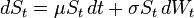
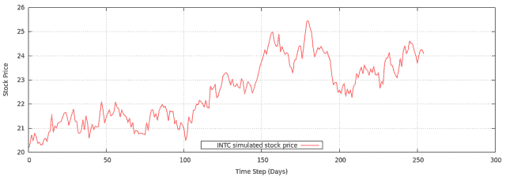
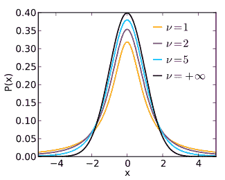

<!--yml

category: 未分类

date: 2024-05-18 06:45:28

-->

# 介绍 QuantLib：用几何布朗运动模型化资产价格 | 金融与科技的一切事物…

> 来源：[`mhittesdorf.wordpress.com/2013/12/29/introducing-quantlib-modeling-asset-prices-with-geometric-brownian-motion/#0001-01-01`](https://mhittesdorf.wordpress.com/2013/12/29/introducing-quantlib-modeling-asset-prices-with-geometric-brownian-motion/#0001-01-01)

欢迎回来！在本文中，我将展示如何使用 QuantLib 的[蒙特卡洛框架](http://quantlib.org/reference/group__mcarlo.html)中的类来模拟资产价格随一段时间内可能走过的路径，例如下面所示的一年期英特尔（INTC）股票图表。我们为什么需要资产价格模型呢？有很多很好的理由。其中之一是资产价格动态模型对于衍生品的估值是必不可少的，比如股票和指数期权。其次，这样的模型是一个强大的风险管理工具。模拟的资产价格可以用来创建一系列的假设情景，用以计算投资组合的整体市场风险敞口，如价值在风险（VaR）等指标所示。第三，符合历史资产回报参数（例如，年化平均值和标准差）的模拟价格可以作为市场数据用于回测交易策略。


所以现在既然我们已经明白了为什么，那就让我们来看看如何操作。首先，让我们简要地讨论一下资产价格动态的理论基础——随机过程。非正式地说，随机过程是一个依赖于一个或多个随时间变化的参数的函数，其中至少有一个参数是非确定性的；它的值对应于一串从选定的概率分布中独立抽取的随机变量。更精确地说，描述股票价格演化的特定随机过程被称为几何布朗运动（GBM）。

几何布朗运动可以被表述为一个形式为：



其中 *S* 是在时间 *t* 的股票价格，μ (*mu)* 表示过程的常数漂移或趋势（即年回报），而 σ (*sigma)* 表示围绕趋势的随机变化量（即对数回报的年化标准差）。直观地说，*mu* 可以被视为 GBM 随机过程的“信号”，而*sigma* 是该过程的“噪声”。这个方程告诉我们，股票价格在一个小的离散时间增量 (*dt*) 内的变化是股票回报 (*mu*) 和股票波动性 (*sigma*) 的函数，其中波动性被 Wiener 过程的输出 (*dWt*) 缩放。Wiener 过程本质上提供符合给定（通常是高斯）概率分布的随机数。关于几何布朗运动，我鼓励你查看维基百科条目[这里](http://en.wikipedia.org/wiki/Geometric_Brownian_motion)。

### 资产回报的正态分布模型

在简短地介绍了几何布朗运动理论之后，我们继续来看 QuantLib 的 C++代码。首先，我会展示实现经典模型的代码，该模型假设股票回报是正态分布的，尽管实证证据表明资产回报实际上是“厚尾”的。这意味着实际上，比严格正态分布模型所建议的更多股票市场“崩盘”和“反弹”。不久，我将展示如何将经典模型扩展到明确地考虑厚尾回报。

以下是在假设资产回报正态分布的情况下生成单个股票价格路径的 QuantLib C++代码：

```
 #include <ql/quantlib.hpp>

using namespace QuantLib;

BOOST_AUTO_TEST_CASE(testGeometricBrownianMotion) {

    Real startingPrice = 20.16; //closing price for INTC on 12/7/2012
    Real mu = .2312; //INTC one year historical annual return
    Volatility sigma = 0.2116; //INTC one year historical volatility
    Size timeSteps = 255; //trading days in a year (U.S.)
    Time length = 1; //one year

    //instantiate Geometric Brownian Motion (GBM) stochastic process
    const boost::shared_ptr<StochasticProcess>& gbm =
        boost::shared_ptr<StochasticProcess> (new GeometricBrownianMotionProcess(startingPrice, 
        mu, sigma));

    //generate a sequence of normally distributed random numbers from a
    //uniform distribution using Box-Muller transformation
    BigInteger seed = SeedGenerator::instance().get();
    typedef BoxMullerGaussianRng MersenneBoxMuller;
    MersenneTwisterUniformRng mersenneRng(seed);
    MersenneBoxMuller boxMullerRng(mersenneRng);
    RandomSequenceGenerator<MersenneBoxMuller> gsg(timeSteps, boxMullerRng);

    //generate simulated path of stock price using GBM stochastic process
    PathGenerator<RandomSequenceGenerator<MersenneBoxMuller> > gbmPathGenerator(gbm, length, 
        timeSteps, gsg, false);
    const Path& samplePath = gbmPathGenerator.next().value;

    //calculate simulated sample returns using C++11 lambda expression
    boost::function<Real, (Real, Real)> calcLogReturns = [](Real x, Real y) {return std::log(y/x);};
    std::vector<Real> logReturns;
    Path::iterator samplePathBegin = samplePath.begin();
    Path::iterator samplePathEnd = samplePath.end();
    Path::iterator endMinusOne = std::prev(samplePathEnd);
    Path::iterator beginPlusOne = std::next(samplePathBegin);

    std::transform(samplePathBegin, endMinusOne, beginPlusOne,
         std::back_inserter(logReturns), calcLogReturns);		

    //calculate some general statistics
    GeneralStatistics statistics;

    //returns statistics
    statistics.addSequence(logReturns.begin(), logReturns.end());
    std::cout << boost::format("Standard deviation of simulated returns (Normal): 
         %.4f") % (statistics.standardDeviation() * std::sqrt(255)) << std::endl;

    //price statistics
    statistics.reset();
    statistics.addSequence(samplePath.begin(), samplePath.end());
    std::cout << boost::format("Price statistics: mean=%.2f, min=%.2f, max=%.2f") %
         statistics.mean() % statistics.min() % statistics.max() << std::endl;  

    //write simulated path to a file for charting with gnuplot
    std::ofstream gbmFile;
    gbmFile.open("/tmp/gbm.dat", 
        std::ios::out);
    for (Size i = 0; i < timeSteps; ++i) {
        gbmFile << boost::format("%d %.4f") % i % samplePath.at(i) << std::endl;
    }

    gbmFile.close();

    /* gnuplot script to chart stock price path
    set key bottom center
    set key bottom box
    set xlabel "Time Step (Days)"
    set ylabel "Stock Price"
    plot "/tmp/gbm.dat" using 1:2 w lines t "INTC simulated stock price"
    */
}
} 
```

当执行此代码时，它将产生类似于以下输出，尽管每次程序运行的统计数据会有所不同：

`模拟回报的标准差（正态分布）：0.2105

价格统计：平均值=24.99，最小值=19.87，最大值=29.02`

当绘制时，生成的模拟股票价格数据将类似于以下图表：



几点说明：

代码生成一个包含 255 个每日收盘价的时间序列（美国股票市场的每个交易日都有一个），使用 QuantLib 的[PathGenerator](http://quantlib.org/reference/class_quant_lib_1_1_path_generator.html)类，这是一个 C++模板，通过一个[RandomSequenceGenerator](http://quantlib.org/reference/class_quant_lib_1_1_random_sequence_generator.html)进行参数化。RandomSequenceGenerator 需要一个随机性的来源，这由 QuantLib 的[MersenneTwisterUniformRng](http://quantlib.org/reference/class_quant_lib_1_1_mersenne_twister_uniform_rng.html)类提供。PathGenerator 还需要一个 StochasticProcess 作为其第一个构造函数参数，传递一个[GeometricBrownianMotionProcess](http://quantlib.org/reference/class_quant_lib_1_1_geometric_brownian_motion_process.html)实例的（共享）指针。该过程的起始价格是 2012 年 12 月 7 日英特尔的收盘价。*mu*参数绑定到 INTC 的年化回报，而*sigma*参数等于从 2012 年 12 月 7 日至 2013 年 12 月 7 日 INTC 的年化历史波动性。

Box-Muller 转换被用来将一系列均匀分布的随机数转换为一系列正态分布的随机数。您可以在[这里](http://en.wikipedia.org/wiki/Box_Muller)了解更多关于 Box-Muller 转换的信息。

QuantLib 的[GeneralStatistics](http://quantlib.org/reference/class_quant_lib_1_1_general_statistics.html)类被应用于收集一些过程统计数据，以测量模拟资产路径如何准确地近似 INTC 时间序列。按照设计，模拟资产路径的年化回报和波动性应分别类似于*mu*和*sigma*过程参数。对于某些应用，例如回测路径依赖的交易策略或评估某些风险管理场景，我们也希望模拟的股票价格最低值、最高值和平均值落在期望的范围内。

在列表的末尾，模拟的资产价格路径的数据点被写入一个文件，以便可以使用 gnuplot（一个开源的绘图包）进行绘图。gnuplot 脚本作为注释包含在源代码列表的末尾。

### Leptokurtic Model of Asset Returns

现在让我们重新回顾一下我之前提到的关于资产回报分布的概念。众所周知，资产回报是“厚尾”的，这是一种直观的说法，意思是实际观察到的日回报更多地出现在它们频率分布的低尾和高尾中，而不是按照正态概率分布函数（pdf）预测的那样。因此，资产回报可以被描述为*leptokurtic*，这意味着它们的频率分布与正态分布相比显示出*过度**峰度*，而正态分布的峰度值为 3。

如何改进我们的资产价格模型，以体现实际世界中资产回报的厚尾特性？本质上，我们希望模拟的资产价格路径相较于遵循经典正态分布模型的价格路径，有更多波动性更高的日子，同时实现与正态模型相同的年化波动率*。为了实现这一点，我们需要从具有超额峰度的非正态分布中抽样随机数。常用于此目的的一种分布是[t 分布](http://en.wikipedia.org/wiki/Student%27s_t-distribution)，它属于稳定分布族中的[柯西分布](http://en.wikipedia.org/wiki/Cauchy_distribution)，这种分布以均值为中心但具有“厚尾”。t 分布的形状由一个参数*v*决定，该参数定义为*自由度*。自由度数越大，t 分布越类似于正态分布，尾巴越“厚”*。

*所以让我们对上面的代码进行必要的修改，以生成符合学生 t 分布的随机数。这可以通过 QuantLib 的[InverseCumulativeRsg](http://quantlib.org/reference/class_quant_lib_1_1_inverse_cumulative_rsg.html)类实现，该类是一个由随机序列生成器和反累积分布函数参数化的模板。学生 t 分布的实现由 Boost Math 库类[boost::math::students_t_distribution](http://www.boost.org/doc/libs/1_35_0/libs/math/doc/sf_and_dist/html/math_toolkit/dist/dist_ref/dists/students_t_dist.html)提供，该类使用五个自由度实例化，因此分布的形状具有所需的“厚尾”，如下图中的浅蓝色密度所示。注意，浅蓝色密度在尾巴上的质量比黑色标准正态密度更多。



修订后的源代码如下：

```
 #include <ql/quantlib.hpp>
#include <boost/math/distributions/students_t.hpp>

Real studentTInverse(boost::math::students_t_distribution d, const Real& p) {
    return quantile(d,p)
}

using namespace QuantLib;

BOOST_AUTO_TEST_CASE(testGeometricBrownianMotionStudentT) {

    Real startingPrice = 20.16; //closing price for INTC on 12/7/2012
    Real mu = .2312; //INTC one year historical annual return
    Volatility sigma = 0.2116; //INTC one year historical volatility
    Volatility scaledSigma = std::sqrt(sigma * sigma * 3/5); //scaled by reciprocal of Student T variance (v/(v-2))
    Size timeSteps = 255; //trading days in a year (U.S.)
    Time length = 1; //one year

    //instantiate Geometric Brownian Motion (GBM) stochastic process
    const boost::shared_ptr<StochasticProcess>& gbm =
        boost::shared_ptr<StochasticProcess> (new GeometricBrownianMotionProcess(startingPrice, 
        mu, scaledSigma));

    //random sequence generator uses Mersenne Twiseter to generate uniformly distributed
    //pseudo-random numbers
    BigInteger seed = SeedGenerator::instance().get();
    MersenneTwisterUniformRng mersenneRng(seed);
    RandomSequenceGenerator<MersenneTwisterUniformRng> rsg(timeSteps, mersenneRng);

    //instantiate Student T distribution from Boost math library
    boost::math::students_t_distribution<> studentT(5); //5 degrees of freedom - want fat tails!
    boost::function<Real (Real)> icd = boost::bind(studentTInverse, studentT, _1); 

    //sample random numbers from the Student T distribution		
    InverseCumulativeRsg<RandomSequenceGenerator<MersenneTwisterUniformRng>, 
        boost::function<Real (Real)> > invCumRsg(rsg, icd);

    //generates a single path
    PathGenerator<InverseCumulativeRsg<RandomSequenceGenerator<MersenneTwisterUniformRng>, 
        boost::function<Real (Real)> > > gbmPathGenerator(gbm, length, timeSteps, invCumRsg, false);
    const Path& samplePath = gbmPathGenerator.next().value;

    //calculate simulated sample returns using C++11 lambda expression
    boost::function<Real, (Real, Real)> calcLogReturns = [](Real x, Real y) {return std::log(y/x);};
    std::vector<Real> logReturns;
    Path::iterator samplePathBegin = samplePath.begin();
    Path::iterator samplePathEnd = samplePath.end();
    Path::iterator endMinusOne = std::prev(samplePathEnd);
    Path::iterator beginPlusOne = std::next(samplePathBegin);

    std::transform(samplePathBegin, endMinusOne, beginPlusOne,
         std::back_inserter(logReturns), calcLogReturns);		

    //calculate some general statistics
    GeneralStatistics statistics;

    //returns statistics
    statistics.addSequence(logReturns.begin(), logReturns.end());
    std::cout << boost::format("Standard deviation of simulated returns (Student-T): 
         %.4f") % (statistics.standardDeviation() * std::sqrt(255)) << std::endl;

    //price statistics
    statistics.reset();
    statistics.addSequence(samplePath.begin(), samplePath.end());
    std::cout << boost::format("Price statistics: mean=%.2f, min=%.2f, max=%.2f") %
         statistics.mean() % statistics.min() % statistics.max() << std::endl;  

    //write simulated path to a file for charting with gnuplot
    std::ofstream gbmFile;
    gbmFile.open("/tmp/gbm-student.dat", 
        std::ios::out);
    for (Size i = 0; i < timeSteps; ++i) {
        gbmFile << boost::format("%d %.4f") % i % samplePath.at(i) << std::endl;
    }

    gbmFile.close();

    /* gnuplot script to chart stock price path
   set key bottom center
   set key bottom box
   set xlabel "Time Step (Days)"
   set ylabel "Stock Price"
   plot "/tmp/gbm.dat" using 1:2 w lines 
   t "INTC Normal", "/tmp/gbm-student.dat" using 1:2 w lines t "INTC Student-T"
   */
}
} 
```

当运行测试用例时，将产生如下输出，尽管如此，由于程序每次运行的统计数据都会有所不同，统计数据将会有所变化：

`模拟回报的标准差(Student-T)：0.2112

价格统计：平均值=24.94，最小值=19.44，最大值=30.24`

如下图所示，`testGeometricBrownianMotionStudentT`测试案例生成的时间序列相较于经典的正态模型具有更多的相对大幅上涨和下跌动作。然而，学生 t 时间序列的实际波动性与正态模型没有显著差异：


资产价格动态建模的内容远比我在这篇简短帖子中能呈现的要多，但我希望我已经传达了基本概念，并解释了如何使用 QuantLib 以非常小的努力实现很多功能。

此外，为了方便您，我现在已将我在《Introducing QuantLib》系列中的所有源代码放到了 GitHub 上，网址为[`github.com/mhittesdorf/allthingsfintech`](https://github.com/mhittesdorf/allthingsfintech)。我鼓励您下载并亲自实验这些代码。

感谢阅读我的博客，如往常一样，请随时在下面留下您的评论和问题。祝您使用 QuantLib 愉快！*
