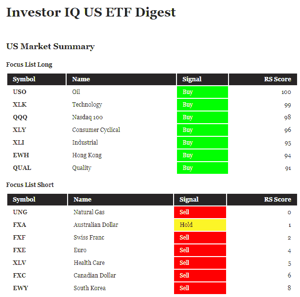

<!--yml

分类：未分类

date: 2024-05-12 17:42:17

-->

# Investor IQ: Focus List | CSSA

> 来源：[`cssanalytics.wordpress.com/2019/05/22/investor-iq-focus-list/#0001-01-01`](https://cssanalytics.wordpress.com/2019/05/22/investor-iq-focus-list/#0001-01-01)

我们每周更新的《投资者智商》(Investor IQ)出版物，在每周一下午（本博客的右上角）发布，为美国和加拿大交易所交易基金（ETFs）及个股提供基本的趋势追踪和相对强度（RS）信号。应部分读者的要求，我们最近添加了一个“关注列表”，突出需要关注的多头和空头位置。关注列表中的多头位置相对强度>90%，并根据趋势追踪和动量信号的综合判断为买入或持有。关注列表中的空头位置相对强度<10%，并根据趋势追踪和动量信号的综合判断为卖出或持有。下面的图片中有一个例子：

我们还最近添加了道琼斯 30 股和加拿大标普/TSX 60 股的信号。我们计划逐步扩大 ETF 和股票的宇宙范围。由于贸易战的影响，我们已将人民币(CYB)列入美国 ETF 的货币部分，作为一个值得关注的代码，因为它在近期一直是股市的一个早期预警信号。
