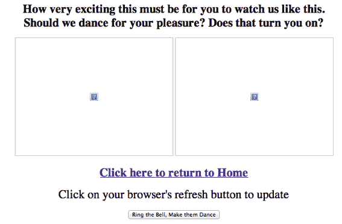

<!--yml

分类：未分类

日期：2024-05-18 14:28:34

-->

# 乔什·莱文回来了吗？——来自 Mahwah 的狙击手与朋友们

> 来源：[`sniperinmahwah.wordpress.com/2013/02/21/is-josh-levine-back/#0001-01-01`](https://sniperinmahwah.wordpress.com/2013/02/21/is-josh-levine-back/#0001-01-01)

我的书已经出版一周了，由于我的编辑已经被迫重印，我推断全世界都已经读过它。因此，是时候（我等不及了）在这里写一些我在*[6](http://bit.ly/JlcyIN)*中提到的主题了。

今天，我想向一个人物致敬，他正是我在书中提到的人物：乔什·莱文。那些读过*6*的人知道，莱文曾是穿破篮球鞋的年轻极客，直到谢尔登·马什勒犯罪集团在 1987 年招募他进入 Datek——莱文借此机会通过马什勒的卫星天线黑进了标准普尔评级公司的系统。加入 Datek 后，该公司旨在进攻臭名昭著的纳斯达克，乔什·莱文编写了多个交易算法（包括 Bombs 和 Superbombs）利用纳斯达克的 SOES 漏洞，然后设计出了当时所谓的 ECN——即*电子通信网络*，这是当今电子交易平台的前身，高频交易算法如我等在其中发挥作用。莱文创建了 Island，所有人都认为这是一项金融工程学的杰作。

我不想重提 Island 的事（想了解更多，只需购买我的书，我会因此多赚 0.01 欧元），但事实是：直到 2013 年 1 月 1 日，乔什·莱文已经完全从被称为互联网的全球网络中消失。华尔街日报的记者斯科特·帕特森在他的好书*[Dark Pools](http://www.scottpattersonreports.com)*中收集了许多信息，但这些信息大多来自莱文本人的源头，但在互联网上关于莱文的信息却非常少（他可能已经彻底清理了痕迹）——*福布斯*称莱文从未被拍照过。只有 [www.josh.com](http://josh.com/index.htm) 这个网站还存在，但除了莱文的一些旧作品外，与电子市场无关…

…直到 2013 年 1 月 1 日。 [`www.josh.com`](http://www.josh.com) 变成了一个 WordPress 博客：[`wp.josh.com`](http://wp.josh.com)。 “新年，新网站”是 Levine 自今年初以来的唯一一篇帖子，他解释说他的纽约和新泽西的服务器被飓风桑迪席卷，这就是他的网站迁移到 WordPress 的原因。然后…惊喜：Josh Levine 将 josh.com 网站恢复到 Levine 为 Datek 工作时的样子。我们可以在那里找到那个著名的页面（[`josh.com/plive1.html`](http://josh.com/plive1.html)），我在我的书中提到过，那里可以实时看到安装在 Datek 办公室的网络摄像头图像，这使得市场监管机构（SEC 和 NASD）可以看到那些攻击纳斯达克的恶棍们是如何工作的——点击“敲钟，让他们跳舞”按钮，一个网民在办公室敲钟…而 Josh Levine 就像一只猴子一样跳舞。

+更吸引人：除了 Levine 常用的这种恶作剧，关于 Watcher 的[页面](http://josh.com/watcher.htm)也很有趣，这是 Levine 为 Datek 创建的软件，可以比纳斯达克的人力交易员更快地在纳斯达克平台上提交订单。我现在没有时间详细说明这一切（现在我在 Mahwah 工作），但这里有很多有趣的东西：那还是 28.8kbit/s 调制解调器时代，通过 Watcher 提交订单，一家温哥华公司的电话账单每月要 600 美元（与现在的价格无关）；我们还了解到，每秒可以提交 200,000 个订单，但通过岛屿（通过一个 28.8k 调制解调器）只能在半秒到 5 秒后接收到（在 2013 年的高频交易世界中，这是永恒的）。更一般地说，超越了关于 SOES 或 Datek 的细节，这个“常见问题”页面证实了我对 Josh Levine 的看法：一个自由、慷慨而古怪的灵魂，平等和简单是必须的。作为算法，我没有眼睛，但显然 Josh Levine 在他的婚礼上拍了一些照片。

«几乎所有市场都复制了乔什·莱文 1997 年发明的东西»，乔·萨卢齐和萨·阿恩库在他们的文章中写道，他们分别是[Themis Trading](http://www.themistrading.com)的所有人，这是一家激烈反对高频交易滥用行为的经纪公司。[乔什·莱文是一位天才和远见者](http://twitter.com/author1/status/123456789)，他们通过 Twitter 补充说，他们是[《破碎的市场》](http://brokenmarkets.com)一书的作者之一，这本书是关于市场历史和高频交易最详尽的书籍之一。莱文的“天才”之处在于他设计了 Island，这是一个极其坚固、高效且易于使用的电子交易平台，在这里买卖股票的买家和卖家可以进行高速交易，而无需人类中介（这是高频交易的早期阶段）。莱文没有在他的新 WordPress 网站上发布 Island 的源代码，但通过 Twitter 可以找到[这里](http://josh.com/notes/island-ecn-10th-birthday/ISLAND.PRG.TXT)的链接。我花了几毫秒来分析它。它只有 2083 行，而且莱文只用了 36 小时就写出来了。这样一个后来成为所有其他平台（如 Archipelago、Attain 等）基础的矩阵，仅用三天和如此少的代码行就设计出来，这是令人瞩目和令人印象深刻的（当 9 月 11 日恐怖袭击使华尔街的所有市场都跪地时，Island 继续运行，独自在一个角落里）。

Island 很快使乔什·莱文变成了一个传奇人物。他在开源精神上忠实于自己，甚至在这个词出现之前，他就把大量的 Island 代码发送给所有在他之后开发了他们自己的电子交易平台的人，这些平台是 Island 的竞争对手（如后来被高盛收购并最终与纽约证券交易所合并的 Archipelago）。更不用说 ITCH，这个允许 Island 用户在屏幕上看到平台订单簿上所有信息的协议，这个协议在纳斯达克最终收购 Island 时保留了下来，但有一点不同：莱文支持公平的市场，这就是为什么 ITCH 是免费的（信息应该共享）；当纳斯达克接管了 Island，ITCH 变成了收费的（现在任何信息都有了价格）。

Josh Levine，一个不见人、只通过电子邮件接受采访、且在 2013 年 1 月 1 日之前几乎找不到任何照片的人，是一个编程天才，同时拥有追求公平竞争的精神，希望利用机器使市场变得透明。他正是当今市场的对立面，现在的市场每天变得越来越暗淡，速度之快让冰岛相形见绌，并由即将以百万分之一秒的速度工作的算法驱动。没有人知道 Josh Levine 变成了什么样子——他和冰岛的事情可能让他可以在新泽西州安静地生活，也许离马瓦希不远。无论如何，从哲学上讲，这个思想的光辉被今天金融市场中的那些身着深色衣服的人所压制。我想到这样一个问题：Josh Levine 为什么在 2013 年选择重新上线他与 Datek 时代相关的旧网站，而关注电子市场历史的人却寥寥无几（全世界只有左手一只手指）？*我毫无头绪，但还是要为他点赞。*
