<!--yml

category: 未分类

date: 2024-05-17 23:29:36

-->

# LSMC：快速准确广义最小二乘的需求 - HPC-QuantLib

> 来源：[`hpcquantlib.wordpress.com/2016/02/13/lsmc-need-for-fast-and-accurate-generalized-least-squares/#0001-01-01`](https://hpcquantlib.wordpress.com/2016/02/13/lsmc-need-for-fast-and-accurate-generalized-least-squares/#0001-01-01)

更新日期：2026 年 2 月 21 日：添加了 QR 分解与枢轴和 QuantLib 性能改进的值。

最小二乘蒙特卡罗模拟将大部分总计算时间花费在广义最小二乘上，尤其是如果问题本身具有高维状态。解正规方程的首选技术是 QR 分解

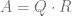

其中是正交矩阵，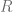是上三角矩阵，或者奇异值分解（SVD）

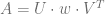

其中是列正交矩阵，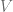是一个正交矩阵，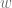是一个正半定对角矩阵。Cholesky 分解

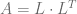

其中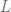是一个下三角矩阵，是最快的方法，但通常数值不稳定。作者在[1]中总结了所有方法，并概述了对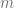个观测和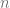个参数的计算工作量如下：

+   Cholesky 分解：成本为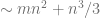 flops

+   QR 分解：成本为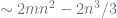 flops

+   奇异值分解：成本为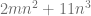 flops

对于 LSMC 模拟，我们有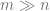，因此 QR 分解在计算上没有比 SVD 更大的优势。由于 QR 分解在是秩亏时存在数值问题，奇异值分解通常是 LSMC 模拟的选择方法。

三种分解方法在[QuantLib](http://quantlib.org/index.shtml)中都可以使用，在[LAPACK](http://www.netlib.org/lapack/)（带或不带优化的[OpenBLAS](http://www.openblas.net/)库）和英特尔的[MKL](https://software.intel.com/en-us/intel-mkl)库中也可使用。通过 LSMC 的标准摆动期权估值应作为一个测试平台，以测量带和不带列交换的 QR 分解的性能以及 SVD 算法。对于 LAPACK 和 MKL，已使用 dgels 和 dgesvd 方法来实现 SVD 和无交换的 QR 分解，而带交换的 QR 则基于 dgeqp3、dormqr 和 dtrsm。为了保持结果可比较，所有情况下都测量了单线程性能。参考价格是通过有限差分方法计算得到的，所有 LSMC 实现都导致了与参考价格相同的价格。QuantLib 1.7 中当前的 QR 实现如果在行数远大于列数时，存在性能问题。对这些测试使用了 QuantLib QR 分解的[改进](https://github.com/lballabio/QuantLib/pull/54/files)版本。

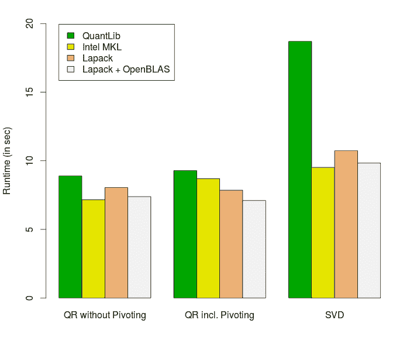：swing_perf 的图片。

正如预期，MKL 通常是速度最快的库，但 MKL 与 LAPACK 加上 OpenBLAS 之间的差异很小。

参考文献[1]：杜克·李（Do Q Lee），2012 年，《解决最小二乘问题的数值高效方法》（[Numerically Efficient Methods for Solving Least Squares Problems](http://math.uchicago.edu/~may/REU2012/REUPapers/Lee.pdf)）。
