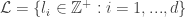
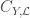
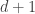
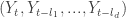
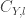
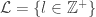
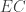
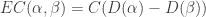
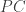
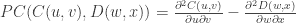

<!--yml

类别：未分类

日期：2024-05-18 13:48:06

-->

# 带有自相关的时间序列滞后动力学|量化

> 来源：[`quantivity.wordpress.com/2011/10/16/lag-dynamics-with-autocopulas/#0001-01-01`](https://quantivity.wordpress.com/2011/10/16/lag-dynamics-with-autocopulas/#0001-01-01)

**拉科诺齐等人（2010 年）** [在](http://bit.ly/qRAQsw)引入了*自相关*来描述时间序列的*滞后自相关*结构。自相关优于[自相关](http://en.wikipedia.org/wiki/Autocorrelation)的同样原因，正如[copulas](http://en.wikipedia.org/wiki/Copula_%28probability_theory%29)优于依赖点统计(*例如* [相关性](http://en.wikipedia.org/wiki/Correlation_and_dependence))。不熟悉 copulas 的读者建议回顾[经验 Copulas 和代理交叉套期保值基础风险](https://quantivity.wordpress.com/2011/10/10/empirical-copulas-and-proxy-cross-hedge-basis-risk)。将此概念推广到任意时间序列，为分析单个证券和篮子滞后动态提供了洞察力。

自相关可能适用于组合和风险管理中各种有趣的问题，例如通过考虑其适用于持续的代理/交叉套期保值系列来证明这一点。[进一步应用于生成 alpha](https://quantivity.wordpress.com/2011/10/02/proxy-cross-hedging/)相对简单，尽管留给读者作为一个练习。

首先，推广自相关—如 Rakonczai *et al.*所定义的

**定义 1**。给定一个时间序列和一个滞后集合，*自相关* 定义为在维随机向量上的 copula。

**定义 2**。*l 阶滞后自相关* 是具有滞后的自相关。

换句话说，自相关是*经验*由一个或多个滞后*相同*数据系列组成的 copula，如个人股票的纵向回报。从这个定义，我们可以定义 Rakonczai *et al.*的平稳版本，适当放松对的依赖性：

**定义 3**。*平稳自相关*是一个其时间序列是平稳的自相关。

**定义 4**。一个*平稳的 l 滞后自相关密度*是一个其时间序列平稳的 l 滞后自相关密度。

给出这些定义后，自相关密度现在可以应用于[代理/交叉对冲](https://quantivity.wordpress.com/2011/10/02/proxy-cross-hedging)。

**个体自相关密度**

以下图表展示了 CRM 日回报率与滞后 1 天、2 天、1 周和 1 个月的学生 t 自相关密度拟合结果：


这些图表展示了一个有趣的结果：在尾部的所有周期中，条件回报的强烈自相关性，在尾外部相关性较弱。换句话说，在大绝对回报之前的条件下，大绝对回报的概率很高——因此，表现出大波动的聚类时间波动性。正如 Gappy[评论](https://quantivity.wordpress.com/2011/10/16/lag-dynamics-with-autocopulas/#comments)的那样，回想一下*无条件*回报是有重尾的——正如在[前一篇帖子](https://quantivity.wordpress.com/2011/10/10/empirical-copulas-and-proxy-cross-hedge-basis-risk)中，通过低自由度的拟合 t 边际所展示的。

随着滞后增加而峰度降低表明时间依赖性随时间衰减，意味着在大绝对回报之前的条件下，大绝对回报的概率随时间降低*条件*。因此，CRM 不仅有长尾，其尾部还表现出*随时间衰减的尾部相关性*（因此，也可能具有潜在的自相似波动性）。感谢 Gappy 对绝对回报的解释。

比较上面自相关密度（ACF）与部分自相关（PACF）函数对于 CRM 绝对回报的图形直觉，它们表现出类似的时间相依性，然而却通过提供最小图形直觉的点相依统计实现：


与*非绝对*回报相比，后者表现出无此类相依性：


QQQ 相同滞后的自相关密度：


指出 QQQ 表现出类似的随时间衰减的尾部相关性，尽管与 CRM 相比，QQQ 的时间衰减要小得多——因为密度在所有滞后上始终保持高峰。

**代理自相关密度**

鉴于

首先，考虑*超额自联互换* ，这是*超额回报*的自联互换，定义为个别证券  和市场指数  之间的线性差分（非对数）回报：



下面说明了 CRM 和 QQQ 的超额自联互换：


这说明了与上面个别证券的自联自动互换在*条件*回报上有相当不同的结果：

+   **不对称尾部依赖**：滞后 1 在尾部的不对称性很强，表明逆向相关回报的尾部时间依赖性更强

+   **快速不对称尾部衰减**：尾部不对称性在滞后 2 时衰减，表明快速衰减

+   **快速依赖衰减**：时间依赖性快速衰减，在一周内（即滞后 5）相对峰值最小

将这个洞察与*超额绝对回报*的 ACF / PACF 进行比较，其行为与超额自联互换相似，但仅使用点状依赖性：


最后，对冲代理自联动态性的第二种方法是*代理自联* ，这是两个自联密度  和  的*算术差分*：



下面是 CRM/QQQ 的代理自联互换，滞后与上面相同：


说明滞后 1 的 CRM 自联自动互换具有明显较小的尾部时间依赖性，而具有略微更多的非尾部时间依赖性。此外，尾部依赖性高度不对称，对逆向相关回报的偏斜更强。换句话说，这暗示逆向回报反弹后会出现逆转。

滞后 2 显示出类似的动态，尽管不对称的尾部依赖性被颠倒，偏向于直接相关回报。


滞后 5 的动态与滞后 2 相似：


最终，在滞后 22 时，尾部相关性变得对称，但除此之外，表现出与低滞后类似的动态：


集体来看，上述代理自相关 copulas 清晰地可视化了代理绝对回报的自相关性，其时间尾部的相关性强烈衰减。

****

生成上述自相关 copula 滞后动态分析的 R 代码：

```

exploreProxyAutoCopula <- function(p)
{
  # Visualize autocopulas for two proxy instruments and excess.
  #
  # Args:
  #     p: matrix of daily instrument price data, including valid colnames
  #
  # Returns: none

  pROC <- ROC(p, type="discrete", na.pad=FALSE)
  cnames <- colnames(pROC)

  exploreMultiAutoCopula(coredata(pROC[,1]))
  exploreMultiAutoCopula(coredata(pROC[,2]))

  excess <- pROC[,1]-pROC[,2]
  colnames(excess) <- c(paste(cnames[1],"-",cnames[2]))
  exploreMultiAutoCopula(coredata(excess))  # excess returns

  absReturns <- abs(pROC[,1])
  absExcess <- abs(excess)
  acf2(absReturns,max.lag=30)
  acf2(absExcess,max.lag=30)

  plotCopulaDiff(fitAutoCopula(coredata(pROC[,1]),1), fitAutoCopula(coredata(pROC[,2]),1), xlab="", ylab="", zlab="Density Diff", main="Lag-1 Proxy Autocopula")

  plotCopulaDiff(fitAutoCopula(coredata(pROC[,1]),2), fitAutoCopula(coredata(pROC[,2]),2), xlab="", ylab="", zlab="Density Diff", main="Lag-2 Proxy Autocopula")

  plotCopulaDiff(fitAutoCopula(coredata(pROC[,1]),5), fitAutoCopula(coredata(pROC[,2]),5), xlab="", ylab="", zlab="Density Diff", main="Lag-5 Proxy Autocopula")

  plotCopulaDiff(fitAutoCopula(coredata(pROC[,1]),22), fitAutoCopula(coredata(pROC[,2]),22), xlab="", ylab="", zlab="Density Diff", main="Lag-22 Proxy Autocopula")
}

plotCopulaDiff <- function(c1, c2, n = 51, theta = 35, phi = 25, expand = 0.618, ...)
{
  # Plot difference in copula perspective for two copulas

  xis <- yis <- seq(0, 1, len = n)
  grids <- as.matrix(expand.grid(xis, yis))
  funDiff <- dcopula(c1, grids) - dcopula(c2, grids)
  zmat <- matrix(funDiff, n, n)
  persp(xis, yis, zmat, theta = theta, phi = phi, expand = expand, ...)
}

exploreMultiAutoCopula <- function(vec)
{
  # Visualize lag-1, lag-2, lag-5, and lag-22 autocopulas for a vector of 
  # data.
  #
  # Args:
  #   vec: vector of data
  #
  # Returns: empirically fitted copulas

  oldpar <- par(mfrow=c(2,2))
  cnames <- colnames(vec)

  lag1Copula <- fitAutoCopula(vec,1)
  lag2Copula <- fitAutoCopula(vec,2)
  lag5Copula <- fitAutoCopula(vec,5)
  lag22Copula <- fitAutoCopula(vec,22)

  persp(lag1Copula, dcopula, main="Lag-1 Autocopula", xlab=cnames[1], ylab="lag-1", zlab="Density", expand=1)
  persp(lag2Copula, dcopula, main="Lag-2 Autocopula", xlab=cnames[1], ylab="lag-2", zlab="Density", expand=1)
  persp(lag5Copula, dcopula, main="Lag-5 Autocopula", xlab=cnames[1], ylab="lag-5", zlab="Density", expand=1)
  persp(lag22Copula, dcopula, main="Lag-22 Autocopula", xlab=cnames[1], ylab="lag-22", zlab="Density", expand=1)

  par(oldpar)

  return (list(lag1=lag1Copula, lag2=lag2Copula, lag5=lag5Copula, lag22=lag22Copula))
}

fitAutoCopula <- function(vec, lag=1)
{
  # Analyze auto copula for a vector of data, with given lag.
  #
  # Args:
  #   vec: vector of data
  #   lag: order of lag, default to 1
  #
  # Returns: list of copula fit and empirical copula

  lagV <- lag(vec, k=lag)
  lagV <- lagV[(lag+1):nrow(lagV)]

  lagged <- cbind(vec[1:(nrow(vec)-1)],lagV)
  colnames(lagged) <- c(colnames(vec)[1], paste("lag-",lag,sep=""))

  return(fitEmpiricalCopula(lagged))
}

fitEmpiricalCopula <- function(pROC)
{
  # Fit empirical copula, given series of return data.
  #
  # Args:
  #   pROC: matrix of daily instrument return data, including valid colnames
  #
  # Returns: empirical copula

  n <- nrow(pROC)

  tau <- cor(pROC, method="kendall")[2]
  t.cop <- tCopula(tau, dim=2, dispstr="un", df=3)
  psuedo <- apply(pROC, 2, rank) / (n + 1)

  fit.mpl <- fitCopula(t.cop, psuedo, method="mpl", estimate.variance=FALSE)

  return (empiricalCopula <- tCopula(fit.mpl@estimate[1], dim=2, dispstr="un", df=fit.mpl@estimate[2]))
}

acf2 <- function(series, max.lag=NULL)
{
  # ACF function replacing broken version from stats library, fixed to
  # remove lag=0; credit to David Stoffer (http://www.stat.pitt.edu/stoffer).

  num=length(series)
  if (is.null(max.lag)) max.lag=ceiling(10+sqrt(num))
  if (max.lag > (num-1)) stop("Number of lags exceeds number of observations")
  ACF=acf(series, max.lag, plot=FALSE)$acf[-1]
  PACF=pacf(series, max.lag, plot=FALSE)$acf
  LAG=1:max.lag/frequency(series)
  minA=min(ACF)
  minP=min(PACF)
  U=2/sqrt(num)
  L=-U
  minu=min(minA,minP,L)-.01
  old.par <- par(no.readonly = TRUE)
  par(mfrow=c(2,1), mar = c(3,3,2,0.8),
    oma = c(1,1.2,1,1), mgp = c(1.5,0.6,0))
  plot(LAG, ACF, type="h",ylim=c(minu,1), 
    main=paste(deparse(substitute(series))))
    abline(h=c(0,L,U), lty=c(1,2,2), col=c(1,4,4))
  plot(LAG, PACF, type="h",ylim=c(minu,1))
    abline(h=c(0,L,U), lty=c(1,2,2), col=c(1,4,4))
  on.exit(par(old.par))  
  ACF<-round(ACF,2); PACF<-round(PACF,2)    
  return(cbind(ACF, PACF)) 
}

```
