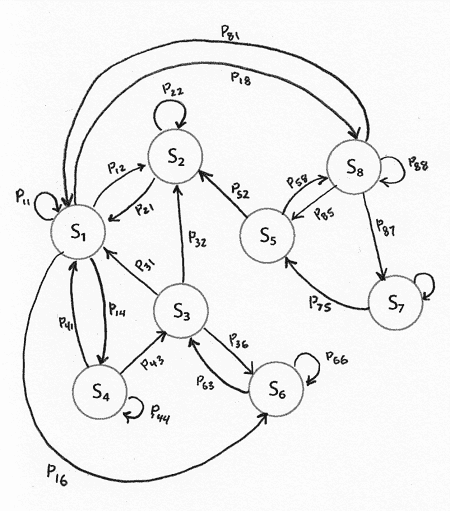
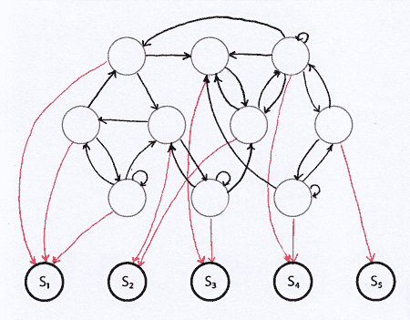
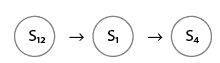
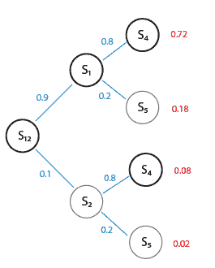

<!--yml

类别：未分类

日期：2024-05-18 15:36:12

-->

# 学习序列 | Tr8dr

> 来源：[`tr8dr.wordpress.com/2009/12/04/pattern-learning/#0001-01-01`](https://tr8dr.wordpress.com/2009/12/04/pattern-learning/#0001-01-01)

我一直在研究预测持续时间（或强度）来建模价格行为和方差估计。如前所述，文献中常见的 ACD 模型表现不佳。在转向另一个话题之前，我想重新审视这个问题，并提出一个未来的方法。

这里是一个高频率价格序列的持续时间样本：

```
9.30, 0.26, 0.28, 4.21, 0.04, 0.21, 3.23, 0.04, 2.28, ...

```

我决定，与其尝试回归特定的持续时间，理论上可能有无限多的可能值，不如将这个转化为一组符号，这样就有有限的状态，比如说：

```
S1, S2, S3, ...
```

其中 S1 可能代表[0, 0.25]内的持续时间，S8 代表[3, 3.5]内的持续时间等。以上持续时间的序列状态可能如下所示：

```
12 → 1 → 1 → 9 → 1 → 1 → 8 → 1 → 7 → 6 → 6 → 6 ...

```

这证明是有用的。

**SVM** 使用径向基核的 SVM 在预测序列中的下一个符号（持续时间）方面比 ACD 模型做得更好。然而，这仍然不是一个合适的预测水平。

SVM 和相关方法的问题在于，你需要一个问题，可以很容易地在高维线性向量空间中进行分类。这很大程度上在于找到将你的（通常是）非线性向量映射到一个线性可分空间的核。另外，SVM 在二元分类上比多元分类更适合。

**ANNs** 理论上，具有足够神经元的 ANN 可以渐进地逼近任何函数。然而，到达通用解决方案的问题有很多：

1.  校准**

    标准的反向传播技术（本质上是梯度下降）求得一个局部最优解，这取决于起始配置。然而，可以用元启发式方法如遗传算法找到全局最优解，但计算成本显著增加。

1.  **过拟合**

    提出能够泛化的网络非常困难。成功的一部分在于精心选择训练集和配置。

尽管如此，这可能是一个值得探索的方法。

**概率图模型** 由于我们的持续时间模式本质上是从一个状态到下一个状态的转换，将其建模为概率有限状态机是有吸引力的模型。这种方法的想法是：

1.  经验上观察所有长度≤最大值的一些链

1.  确定链的频率

1.  分解成最小的图，在某种误差内复制这些链

例如，这些链：


-   解决这个问题的一种初步方法是考虑是否可以作为马尔可夫状态系统进行建模。然而，状态{S1, S2, S3, …}

-   例如，P(S1|S2)是否与 P(S1|S2, {先验状态})相同？时长数据显示了除了最近的先验状态之外的依赖关系。因此，我们预计 P(S1|S2, {S5,S1})将与 P(S1|S2, {S2,S3})不同，而在马尔可夫模型中，S1 的概率可以纯粹基于先验状态进行条件化。

-   这样的马尔可夫系统可能看起来像：

-   （）

-   隐马尔可夫模型（HMM）通过假设存在一个隐马尔可夫过程（通常比观察状态系统有更多的状态）来对抗这种假设。可以很容易地证明，一个无限大小的 HMM 可以精确地模拟有限状态集合中所有可能的状态链（序列）。当然，我们感兴趣的是一个可以以有限错误复现大多数观察链的更小的模型。

-   这是一个样本结构，其中黑色线条是隐藏状态之间的边缘，红色边缘表示隐藏状态与观察状态之间的对应关系。红色边缘不被遍历：

（）

-   **混叠问题**

-   我们要记住，我们是任意地将时长（连续的）分成了 N 个离散状态。想法是，比如说 0.25 秒和 0.22 秒之间的差异对于我们来说并不重要。人们可能会认为，更细粒度的状态将允许更容易建模状态序列。

-   问题是我们正在对这些离散地进行划分。我们遇到了一个**混叠**问题，特定的时长*部分*属于由 S(i)和 S(i+1)表示的集合。例如，对于长度为 3 的序列，我们有 4 种可能的真状态路径，每种路径都有相关的概率。不进行混叠补偿，我们会天真地看到状态：

-   （）

-   在混叠的情况下，我们有以下可能性：

（）

-   当我们的路径长度接近 N 时，我们将有 2^(N-1)种可能的路径。实现此方法的一种可能是训练 M 概率最高的路径。

-   **模糊 HMM** 混叠是一种模糊集合成员资格。除了混叠之外，还有许多原因让我们考虑模糊状态成员资格：

1.  -   数据可能是嘈杂的，掩盖了模式

1.  -   离散化误差（混叠）

毫不奇怪，其他人已经在隐马尔可夫模型（HMM）的背景下考虑过模糊状态成员资格。   存在多种模糊 HMM 模型。   需要进一步研究……
