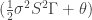
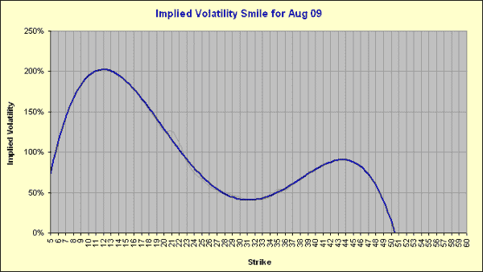
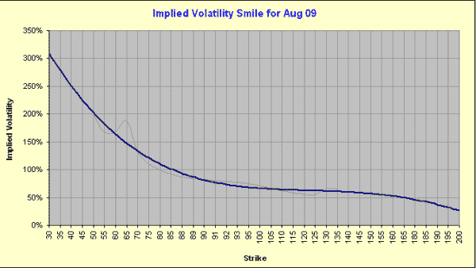

<!--yml

类别：未分类

日期：2024-05-18 13:55:41

-->

# [杠杆期权：伽马衰减与微笑曲线 | Quantivity](https://quantivity.wordpress.com/2009/08/11/lever-options-gamma-decay/#0001-01-01)

> 来源：[`quantivity.wordpress.com/2009/08/11/lever-options-gamma-decay/#0001-01-01`](https://quantivity.wordpress.com/2009/08/11/lever-options-gamma-decay/#0001-01-01)

杠杆化交易所交易基金（ETFs）是一种有趣的金融工具。本文中的*杠杆期权*（或简称为*杠杆*）作为杠杆化 ETFs 的衍生品，更加引人入胜。由于杠杆期权很可能是第一种获得实质性交易所交易量的[奇异期权](http://en.wikipedia.org/wiki/Exotic_option)，波动率交易员应该会垂涎三尺！

杠杆最有趣的一个方面是*伽马衰减*（大胆地创造术语，借鉴经典的[希腊字母](http://en.wikipedia.org/wiki/Greeks_(finance))伽马）：

> 伽马衰减是指由于基础杠杆化工具的杠杆衰减导致期权价值的衰减。

换句话说，基础资产的杠杆衰减对由伽马衰减捕捉的衍生品直接产生影响。伽马衰减与标准[BSM](http://en.wikipedia.org/wiki/Black%E2%80%93Scholes)假设下的[维纳过程](http://en.wikipedia.org/wiki/Wiener_process)有实质性差异。注意伽马衰减与漂移和波动性的线性缩放虽然类似但有所不同。

从根本上讲，随着伽马和 theta 的衰减，伽马衰减应该让我们重新评估经典的 BSM 伽马-theta 交易策略： 。

对 8 月份到期的[SSO](http://finance.yahoo.com/q?s=SSO)和[UPRO](http://finance.yahoo.com/q?s=UPRO)的微笑曲线进行快速扫描表明，市场制造商（MMs）可能仍在使用经典的 BSM 模型进行定价。SSO 的多项式微笑曲线（蓝色为拟合，灰色为未拟合），假设连续收益率为 1.24%且无风险：

假设连续收益率为 0%且无风险，UPRO 的微笑曲线与此类似：

后续文章将继续分析杠杆，因为它们是一个丰富的研究领域。
