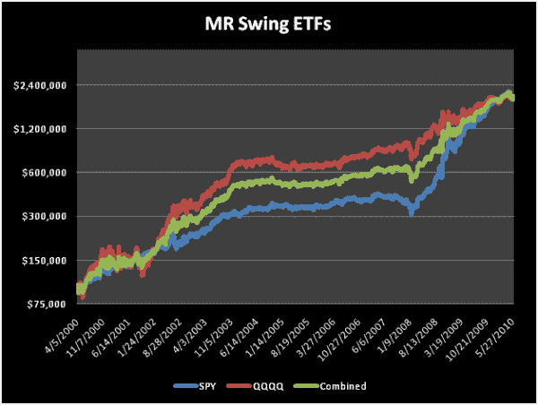
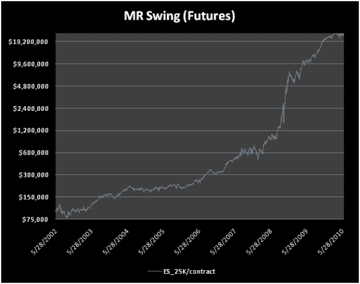

<!--yml

类别：未分类

日期：2024-05-12 18:23:28

-->

# 斯温格 MR 交易法：市场体制下的均值回归与摇摆交易 | CSSA

> 来源：[`cssanalytics.wordpress.com/2010/06/17/mr-swing-mean-reversion-and-swing-trading-in-market-regimes/#0001-01-01`](https://cssanalytics.wordpress.com/2010/06/17/mr-swing-mean-reversion-and-swing-trading-in-market-regimes/#0001-01-01)

在我涉足技术研究的早期，就很明显，没有一个简单的指标对所有市场都足够适用。我首先引入的指标——DV2——在各种 ETF 和股票上表现出色，但在波动性条件下表现最佳。无论你看的是牛市还是熊市，这一点都成立。在价格走势平稳的市场中，二元（长低于 50，短高于 50）策略经常过早退出交易，并且错误地在真正的短期高峰之前就做空。在这种情景下，将每次交易的微弱收益与佣金相抵消，会大幅削减总体收益。我们的两名研究人员独立地以一种新颖的方式解决了这个问题，通过利用适合这些不同市场条件的不同指标。大卫· Abrams 和斯科特·沃克撰写了一篇关于新定量系统的[创新论文](http://www.daveab.com/mr_swing/)，大卫在 2010 年的[NAAIM 未公开知识会议](http://www.naaim.org/annualconference.aspx)的秘密酱料交易研讨会上介绍了这个系统。这种跳出思维框的“离经叛道”思维对于创造独特的系统和投资管理工具，以获得竞争优势至关重要。

本文介绍了一种创新的新交易系统，并深入探讨了在已发布的交易系统论文中很少见的话题。它揭示了构建健壮和适应性交易系统的高级“幕后”技术。本文还展示了该系统如何补充买入持有和较长周期的趋势跟踪组合，如通过提供逆周期收益来补充常春藤投资组合。这个概念很重要，因为它突出了摇摆交易作为一种真正的分散投资和收益增强工具，主要是因为它在不利趋势跟踪的条件下有效地收获波动性。

以大学捐赠基金为模型的常春藤投资组合（Ivy Portfolio）通过一个包含非相关成分的 ETF 投资组合以及完整的交叉相关矩阵来代理。基本的长远投资组合持有一系列长期只做多 ETF，在其 10 个月移动平均线之上。然后将 MR Swing 的保守版本分配到组合的 20%。下表展示了论文中的一个关键发现，即在组合中加入 20%的 MR Swing 资产配置能显著提高收益，同时降低风险。

**2000 年 8 月 1 日至 2010 年 1 月 28 日绩效**

|  | **CAGR** | **Sharpe** | **最大回撤** |
| --- | --- | --- | --- |
| **SPY（标普 500）买入持有** | -2.48% | -0.16 | 56.49% |
| **ETF 组合买入持有** | 5.05% | 0.26 | 29.83% |
| **ETF 组合（10 个月 SMA）** | 8.45% | 0.99 | 11.65% |
| **ETF 组合（10 个月 SMA）80%分配+ MR Swing 20%** | 13.42% | 1.60 | 4.48% |

系统已在各种配置和不同资金管理的 ETF 和期货上进行了样本外的测试。

那么秘诀是什么？MR Swing 基于四个关键设计原则：

（1）**市场政权切换：** 在熊市政权中使用短期均值回归，在牛市政权中使用中期摆动交易。这利用了根据当前政权状态的市场特征变化。

（2）**非对称交易算法：** 使用混合方法而不是单一指标。MR Swing 在熊市政权中使用价值图表进行进入，使用 SVAPO 进行退出。它在熊市政权中使用 DV2 进行均值回归。

（3）**适应市场波动的波动性适应指标：** 每个组件都经过精心选择，能够稳健地处理市场波动的变化。市场政权交易通道用于减少震荡。DV2 使用经典的非参数 CSS 百分位技术标准化价格分布。适应性标准差带用于摆动交易退出的体积和价格振荡器 SVAPO。此外，价值图表进入方法中内置了动态波动单位。

（4）**对政权震荡的鲁棒性：** 而不是试图在政权模型中消除震荡，MR Swing 将每个组件结构化，使其能够承受震荡。这意味着，在摆动交易政权中的进入必须能够处理均值回归政权的改变，而不会导致系统不稳定。MR Swing 旨在解决这些情况，确保对政权变化的鲁棒性，包括震荡。

以下是结果：

| **符号** | **时间周期** | **CAGR** | **夏普比率** | **DVR** | **最大回撤** |
| --- | --- | --- | --- | --- | --- |
| SPY | 2000 年 4 月 5 日至 2010 年 6 月 14 日 | 34.41% | 1.56 | 1.34 | 27.04% |
| QQQQ | 2000 年 4 月 5 日至 2010 年 6 月 14 日 | 34.08% | 0.99 | 0.90 | 36.94% |
| 组合 SPY + QQQQ | 2000 年 4 月 5 日至 2010 年 6 月 14 日 | 34.25% | 1.36 | 0.92 | 22.23% |
| @ES 每份合约 25,000 美元 | 2002 年 5 月 28 日至 2010 年 6 月 14 日 | 98.29% | 2.06 | 1.70 | 46.59% |

在 2010 年的市场中，MR Swing 在样本外的表现仍然非常好：

| SPY | 2010 年 1 月 1 日至 2010 年 6 月 14 日 | 21.07% | 1.14 | 0.37 | 11.91% |
| --- | --- | --- | --- | --- | --- |
| QQQQ | 2010 年 1 月 1 日至 2010 年 6 月 14 日 | 8.64% | 0.41 | 0.19 | 10.55% |

以下是使用未来合约的 MR Swing 示例：

