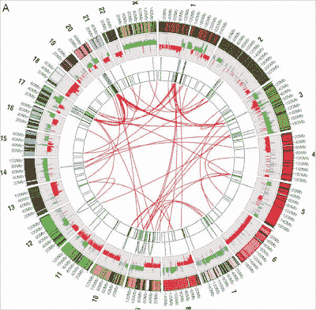

<!--yml

分类：未分类

日期：2024-05-18 04:56:50

-->

# Magmasystems Blog：用于市场流动性分析的医疗图表 ???

> 来源：[`magmasystems.blogspot.com/2008/12/medical-graphic-for-market-flow.html#0001-01-01`](http://magmasystems.blogspot.com/2008/12/medical-graphic-for-market-flow.html#0001-01-01)

图片链接

纽约时报文章

文章链接：[癌细胞内的发生](http://www.nytimes.com/2008/12/25/science/25visual.html)

这个图表让我觉得非常适合于市场流动性的分析。

（外圈将显示 sector movement 的热图，内一圈显示当前的成交量，更内圈可能会显示从一个 sector 到另一个 sector 的交易活动……）

链接：[纽约时报文章](http://www.nytimes.com/2008/12/25/science/25visual.html)

©2008 Marc Adler - 版权所有。

以下所有观点均为个人看法，与我的雇主无关。
