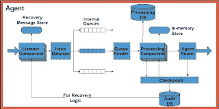

<!--yml

分类：未分类

日期：2024-05-18 04:58:35

-->

# Magmasystems Blog: 基准测试基于.NET 的事务引擎（以及伦敦证券交易所）

> 来源：[`magmasystems.blogspot.com/2008/10/benchmarking-net-based-tranaction.html#0001-01-01`](http://magmasystems.blogspot.com/2008/10/benchmarking-net-based-tranaction.html#0001-01-01)

虽然有些过时（基础设施来自 2004 年，这可以被认为是过去的几十年），但这仍然是一篇有用的阅读：

[Benchmarking a High Performance Real-Time Transaction Engine Design](http://citeseerx.ist.psu.edu/viewdoc/summary?doi=10.1.1.60.8158)

（转到页面左下角，点击名为“查看或下载”的链接）

更有趣的是

[伴随演讲的幻灯片](http://w2ks.dei.isep.ipp.pt/labdotnet/files/IVNET/keynote_s.pdf)

。幻灯片 24 至 32 页提供了关于伦敦证券交易所基于.NET 的架构的一些见解。

©2008 Marc Adler - 版权所有。

这里的所有观点都是个人观点，与我的雇主无关。
